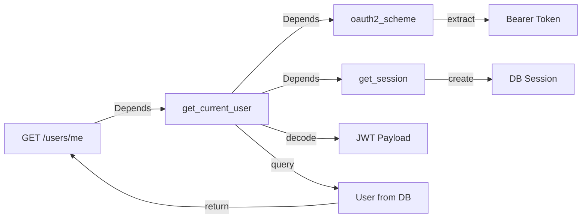

# ユーザーAPI (`/users`)

## 概要

ユーザーAPIは、認証済みユーザーの情報取得・更新機能を提供します。全エンドポイントでJWT認証が必須です。

## エンドポイント一覧

| メソッド | パス | 説明 | 認証 |
|---------|------|------|------|
| GET | `/users/me` | 現在のユーザー情報取得 | ✅ 必須 |

---

## GET /users/me

現在認証されているユーザーの情報とタグ情報を取得します。

### エンドポイント情報

- **URL**: `/users/me`
- **メソッド**: `GET`
- **認証**: ✅ Bearer Token必須
- **Content-Type**: `application/json`

### リクエストヘッダー

```
Authorization: Bearer {access_token}
```

### レスポンス

**成功 (200 OK)**:

**スキーマ**: `UserPublicWithTags`

```json
{
  "id": "3fa85f64-5717-4562-b3fc-2c963f66afa6",
  "username": "student01",
  "email": "student01@example.com",
  "kategori": "学生",
  "gakuseki_bango": "S12345678",
  "faculty": "情報学部",
  "icon_path": null,
  "tags": [
    {
      "id": 1,
      "name": "プログラミング初心者",
      "creator_id": "3fa85f64-5717-4562-b3fc-2c963f66afa6"
    },
    {
      "id": 2,
      "name": "データサイエンス履修中",
      "creator_id": "7b93c128-9876-4321-a1b2-3c4d5e6f7890"
    }
  ]
}
```

**フィールド詳細**:

| フィールド | 型 | 説明 | Nullable |
|-----------|-----|------|----------|
| id | UUID | ユーザーID | ❌ |
| username | string | ユーザー名 | ❌ |
| email | string | メールアドレス | ❌ |
| kategori | enum | ユーザーカテゴリー | ❌ |
| gakuseki_bango | string | 学籍番号（教員/事務は自動生成） | ✅ |
| faculty | string | 学部・所属 | ✅ |
| icon_path | string | アイコン画像パス | ✅ |
| tags | array | ユーザーに割り当てられたタグ一覧 | ❌ |

**tagsオブジェクト**:

| フィールド | 型 | 説明 |
|-----------|-----|------|
| id | integer | タグID |
| name | string | タグ名 |
| creator_id | UUID | タグ作成者のユーザーID |

### リクエスト例

#### curl

```bash
# 環境変数にトークンを保存
export ACCESS_TOKEN="eyJhbGciOiJIUzI1NiIsInR5cCI6IkpXVCJ9..."

# リクエスト実行
curl -X GET http://localhost:8000/users/me \
  -H "Authorization: Bearer $ACCESS_TOKEN"
```

#### Python (requests)

```python
import requests

access_token = "eyJhbGciOiJIUzI1NiIsInR5cCI6IkpXVCJ9..."
headers = {
    "Authorization": f"Bearer {access_token}"
}

response = requests.get("http://localhost:8000/users/me", headers=headers)

if response.status_code == 200:
    user = response.json()
    print(f"Username: {user['username']}")
    print(f"Email: {user['email']}")
    print(f"Tags: {[tag['name'] for tag in user['tags']]}")
else:
    print(f"Error: {response.status_code} - {response.json()}")
```

#### JavaScript (fetch)

```javascript
const getMe = async () => {
  const accessToken = localStorage.getItem('access_token');

  const response = await fetch('http://localhost:8000/users/me', {
    method: 'GET',
    headers: {
      'Authorization': `Bearer ${accessToken}`,
      'Content-Type': 'application/json',
    },
  });

  if (response.ok) {
    const user = await response.json();
    console.log('Current user:', user);
    return user;
  } else {
    const error = await response.json();
    console.error('Failed to get user info:', error);
    throw new Error(error.detail);
  }
};

// 使用例
getMe().then(user => {
  console.log(`Welcome, ${user.username}!`);
  console.log(`Your tags: ${user.tags.map(t => t.name).join(', ')}`);
});
```

#### TypeScript (axios)

```typescript
import axios, { AxiosInstance } from 'axios';

interface Tag {
  id: number;
  name: string;
  creator_id: string;
}

interface UserWithTags {
  id: string;
  username: string;
  email: string;
  kategori: '学生' | '教授' | '准教授' | '講師' | '事務';
  gakuseki_bango: string | null;
  faculty: string | null;
  icon_path: string | null;
  tags: Tag[];
}

// 認証付きAPIクライアント作成
const createApiClient = (accessToken: string): AxiosInstance => {
  return axios.create({
    baseURL: 'http://localhost:8000',
    headers: {
      'Authorization': `Bearer ${accessToken}`,
      'Content-Type': 'application/json',
    },
  });
};

// ユーザー情報取得
const getMe = async (accessToken: string): Promise<UserWithTags> => {
  const api = createApiClient(accessToken);

  try {
    const response = await api.get<UserWithTags>('/users/me');
    return response.data;
  } catch (error) {
    if (axios.isAxiosError(error)) {
      console.error('Failed to get user info:', error.response?.data);
      throw error;
    }
    throw error;
  }
};

// 使用例
const main = async () => {
  const accessToken = localStorage.getItem('access_token') || '';
  const user = await getMe(accessToken);

  console.log(`User: ${user.username} (${user.kategori})`);
  console.log(`Faculty: ${user.faculty}`);
  console.log(`Tags: ${user.tags.map(t => t.name).join(', ')}`);
};
```

### エラーレスポンス

#### 401 Unauthorized - トークン不正/期限切れ

```json
{
  "detail": "Could not validate credentials"
}
```

**HTTPヘッダー**:
```
WWW-Authenticate: Bearer
```

**発生条件**:
- トークンが含まれていない
- トークンの署名が不正
- トークンの有効期限が切れている
- トークンのペイロードが不正（`sub`フィールドが欠如）

#### 404 Not Found - ユーザーが存在しない

```json
{
  "detail": "User not found"
}
```

**発生条件**:
- トークンは有効だが、対応するユーザーがデータベースに存在しない
- ユーザーが削除された後にトークンが使用された場合

### 実装の詳細

#### 依存性注入フロー

```python
@router.get("/me", response_model=UserPublicWithTags)
async def get_current_user_info(
    current_user: User = Depends(get_current_user)
):
    return current_user
```

**依存関係グラフ**:



#### get_current_user の処理フロー

```python
async def get_current_user(
    token: str = Depends(oauth2_scheme),
    db: Session = Depends(get_session)
) -> User:
    # 1. JWTトークンをデコード
    payload = jwt.decode(token, SECRET_KEY, algorithms=[ALGORITHM])
    username: str = payload.get("sub")

    # 2. ユーザー名でデータベースを検索
    user = get_user_by_username(db, username=username)

    # 3. ユーザーが存在しない場合は401エラー
    if user is None:
        raise HTTPException(status_code=401, detail="Could not validate credentials")

    return user
```

### セキュリティ考慮事項

1. **パスワード情報の除外**: レスポンスに`hashed_password`は含まれません
2. **トークンの検証**: 全リクエストでJWTの署名と有効期限をチェック
3. **HTTPS推奨**: 本番環境ではトークンの盗聴を防ぐためHTTPSを使用

### タグ情報について

**v3仕様**:
- `tags`フィールドには、ユーザーに割り当てられた全タグが含まれます
- `creator_id`により、誰がそのタグを作成したかを追跡できます
- タグの割り当て・削除は`/tags`エンドポイントで行います（Phase 3実装予定）

### Next.js BFF統合例

フロントエンドでは、Next.js BFF（Backend for Frontend）を経由してこのAPIを呼び出すことを推奨します。

**Next.js API Route (`app/api/users/me/route.ts`)**:

```typescript
import { NextRequest, NextResponse } from 'next/server';
import { cookies } from 'next/headers';
import axios from 'axios';

export async function GET(request: NextRequest) {
  const cookieStore = cookies();
  const accessToken = cookieStore.get('access_token');

  if (!accessToken) {
    return NextResponse.json(
      { error: 'Unauthorized' },
      { status: 401 }
    );
  }

  try {
    const response = await axios.get(
      `${process.env.NEXT_PUBLIC_API_URL_SERVER}/users/me`,
      {
        headers: {
          Authorization: `Bearer ${accessToken.value}`,
        },
      }
    );

    return NextResponse.json(response.data);
  } catch (error) {
    if (axios.isAxiosError(error)) {
      return NextResponse.json(
        { error: error.response?.data },
        { status: error.response?.status || 500 }
      );
    }
    return NextResponse.json(
      { error: 'Internal Server Error' },
      { status: 500 }
    );
  }
}
```

**フロントエンドコンポーネント**:

```typescript
'use client';

import { useEffect, useState } from 'react';

export default function UserProfile() {
  const [user, setUser] = useState(null);
  const [loading, setLoading] = useState(true);

  useEffect(() => {
    fetch('/api/users/me')
      .then(res => res.json())
      .then(data => {
        setUser(data);
        setLoading(false);
      })
      .catch(error => {
        console.error('Failed to fetch user:', error);
        setLoading(false);
      });
  }, []);

  if (loading) return <div>Loading...</div>;
  if (!user) return <div>Not logged in</div>;

  return (
    <div>
      <h1>Welcome, {user.username}!</h1>
      <p>Email: {user.email}</p>
      <p>Category: {user.kategori}</p>
      {user.tags.length > 0 && (
        <div>
          <h2>Your Tags:</h2>
          <ul>
            {user.tags.map(tag => (
              <li key={tag.id}>{tag.name}</li>
            ))}
          </ul>
        </div>
      )}
    </div>
  );
}
```

### 今後の拡張予定

Phase 2以降で以下のエンドポイントを追加予定:

- `PUT /users/me`: ユーザー情報更新
- `PUT /users/me/icon`: アイコン画像アップロード
- `GET /users/{user_id}`: 他ユーザーの公開情報取得
- `GET /users`: ユーザー一覧取得（検索機能含む）
