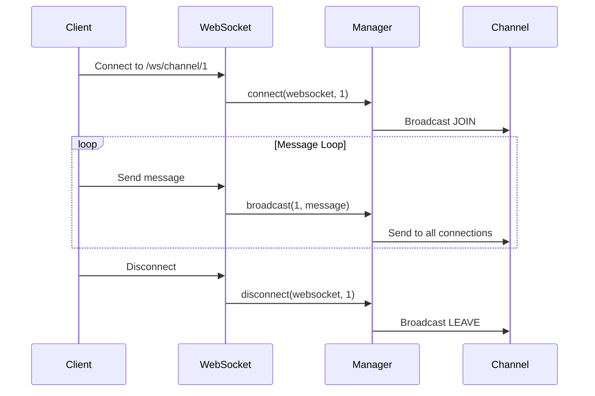

# WebSocket API (`/ws`)

## 概要

WebSocket APIは、チャンネルのリアルタイム通信機能を提供します。Phase 4で実装されました。

## エンドポイント一覧

| プロトコル | パス | 説明 | 認証 |
|-----------|------|------|------|
| WS | `/ws/channel/{channel_id}` | チャンネルリアルタイム通信 | 不要（将来的に実装予定） |

---

## WS /ws/channel/{channel_id}

チャンネルのリアルタイム通信WebSocket接続。

### エンドポイント情報

- **URL**: `ws://localhost:8000/ws/channel/{channel_id}`
- **プロトコル**: WebSocket
- **認証**: 不要（Phase 4実装、将来的にJWT認証追加予定）

### パスパラメータ

| パラメータ | 型 | 説明 |
|-----------|-----|------|
| channel_id | integer | チャンネルID |

### 接続フロー



### メッセージフォーマット

#### クライアント→サーバー

**通常メッセージ**:
```json
{
  "type": "message",
  "content": "Hello, everyone!",
  "sender_username": "student01"
}
```

**フィールド詳細**:

| フィールド | 型 | 必須 | 説明 |
|-----------|-----|------|------|
| type | string | ✅ | メッセージタイプ（"message"） |
| content | string | ✅ | メッセージ内容 |
| sender_username | string | ✅ | 送信者のユーザー名 |

#### サーバー→クライアント

**通常メッセージ**:
```json
{
  "type": "message",
  "content": "Hello, everyone!",
  "sender_username": "student01",
  "timestamp": "2025-01-10T14:30:00"
}
```

**システムメッセージ（JOIN）**:
```json
{
  "type": "system",
  "content": "A user joined channel 'general'",
  "timestamp": "2025-01-10T14:30:00"
}
```

**システムメッセージ（LEAVE）**:
```json
{
  "type": "system",
  "content": "A user left channel 'general'",
  "timestamp": "2025-01-10T14:35:00"
}
```

**エラーメッセージ**:
```json
{
  "type": "error",
  "content": "Invalid JSON format"
}
```

**フィールド詳細**:

| フィールド | 型 | 説明 |
|-----------|-----|------|
| type | string | メッセージタイプ（"message" \| "system" \| "error"） |
| content | string | メッセージ内容 |
| sender_username | string | 送信者のユーザー名（typeが"message"の場合） |
| timestamp | string | ISO 8601形式のタイムスタンプ |

---

## 接続例

### JavaScript（ブラウザ）

```javascript
const socket = new WebSocket('ws://localhost:8000/ws/channel/1');

// 接続確立
socket.addEventListener('open', (event) => {
  console.log('Connected to channel');
});

// メッセージ受信
socket.addEventListener('message', (event) => {
  const data = JSON.parse(event.data);
  console.log('Received:', data);

  switch (data.type) {
    case 'message':
      displayMessage(data.sender_username, data.content);
      break;
    case 'system':
      displaySystemMessage(data.content);
      break;
    case 'error':
      displayError(data.content);
      break;
  }
});

// メッセージ送信
function sendMessage(content) {
  const message = {
    type: 'message',
    content: content,
    sender_username: 'student01'
  };
  socket.send(JSON.stringify(message));
}

// 切断
socket.addEventListener('close', (event) => {
  console.log('Disconnected from channel');
});

// エラー処理
socket.addEventListener('error', (event) => {
  console.error('WebSocket error:', event);
});
```

### Python（websockets ライブラリ）

```python
import asyncio
import websockets
import json

async def connect_channel(channel_id: int, username: str):
    uri = f"ws://localhost:8000/ws/channel/{channel_id}"

    async with websockets.connect(uri) as websocket:
        print(f"Connected to channel {channel_id}")

        # メッセージ送信
        message = {
            "type": "message",
            "content": "Hello from Python!",
            "sender_username": username
        }
        await websocket.send(json.dumps(message))

        # メッセージ受信ループ
        async for message in websocket:
            data = json.loads(message)
            print(f"Received: {data}")

            if data['type'] == 'message':
                print(f"{data['sender_username']}: {data['content']}")
            elif data['type'] == 'system':
                print(f"[System] {data['content']}")

# 実行
asyncio.run(connect_channel(1, "student01"))
```

---

## ConnectionManager 実装詳細

### クラス構造

```python
class ConnectionManager:
    def __init__(self):
        # {channel_id: [WebSocket, WebSocket, ...]}
        self.active_connections: Dict[int, List[WebSocket]] = {}

    async def connect(self, websocket: WebSocket, channel_id: int):
        """WebSocket接続を受け入れ、チャンネルに登録"""

    def disconnect(self, websocket: WebSocket, channel_id: int):
        """WebSocket接続を切断し、チャンネルから削除"""

    async def broadcast(self, channel_id: int, message: dict):
        """チャンネルの全接続にメッセージをブロードキャスト"""

    async def send_personal_message(self, message: dict, websocket: WebSocket):
        """特定の接続にメッセージを送信"""
```

### 接続プール管理

ConnectionManagerは、チャンネルIDごとにWebSocket接続をプールで管理します：

```python
self.active_connections = {
    1: [websocket1, websocket2, websocket3],  # チャンネル1に3人接続
    2: [websocket4],                          # チャンネル2に1人接続
}
```

### 自動クリーンアップ

ブロードキャスト時に切断されたコネクションを自動的に検出し、プールから削除します：

```python
async def broadcast(self, channel_id: int, message: dict):
    disconnected = []
    for connection in self.active_connections[channel_id]:
        try:
            await connection.send_text(message_json)
        except Exception:
            disconnected.append(connection)  # 切断されたコネクションを記録

    # プールから削除
    for connection in disconnected:
        self.disconnect(connection, channel_id)
```

---

## エラー処理

### チャンネルが存在しない場合

接続試行時にチャンネルが存在しない場合、WebSocketは即座にクローズされます：

```python
channel = get_channel_by_id(db, channel_id)
if not channel:
    await websocket.close(code=1008, reason=f"Channel {channel_id} not found")
    return
```

**クローズコード**: `1008` (Policy Violation)

### 不正なJSONフォーマット

クライアントが不正なJSONを送信した場合、エラーメッセージが返されます：

```json
{
  "type": "error",
  "content": "Invalid JSON format"
}
```

### 接続切断

クライアントが切断した場合、`WebSocketDisconnect`例外がキャッチされ、LEAVE通知がブロードキャストされます。

---

## 制限事項と今後の実装

### Phase 4 実装済み

- ✅ チャンネル別WebSocket接続
- ✅ リアルタイムメッセージング
- ✅ JOIN/LEAVE通知
- ✅ ブロードキャスト機能
- ✅ エラーハンドリング

### 今後の実装予定

- ❌ JWT認証（現在は認証なし）
- ❌ メッセージのDB永続化（現在はメモリのみ）
- ❌ DMのWebSocket対応（`/ws/dm/{user_id}`）
- ❌ メッセージの既読管理
- ❌ タイピングインジケーター
- ❌ ファイル送信

---

## セキュリティ考慮事項

### 認証の必要性

Phase 4では認証を実装していませんが、本番環境では以下のいずれかの方法で認証を追加する必要があります：

**1. クエリパラメータでJWTトークンを渡す**:
```javascript
const token = localStorage.getItem('access_token');
const socket = new WebSocket(`ws://localhost:8000/ws/channel/1?token=${token}`);
```

**2. 接続後に認証メッセージを送信**:
```javascript
socket.addEventListener('open', () => {
  socket.send(JSON.stringify({
    type: 'auth',
    token: token
  }));
});
```

### XSS対策

クライアント側でメッセージを表示する際は、必ずHTMLエスケープを行ってください：

```javascript
function displayMessage(username, content) {
  const escapedContent = escapeHtml(content);
  messagesDiv.innerHTML += `<p><strong>${username}</strong>: ${escapedContent}</p>`;
}
```

---

## パフォーマンス

### 接続数の制限

現在、接続数に制限はありませんが、本番環境では以下を考慮してください：

- チャンネルあたりの最大接続数
- ユーザーあたりの最大接続数
- 全体の最大接続数

### メモリ管理

ConnectionManagerは接続をメモリに保持するため、大量の接続がある場合はメモリ使用量に注意が必要です。

### ブロードキャストの最適化

現在は全接続に対して逐次送信していますが、将来的には以下の最適化を検討：

- 非同期並列ブロードキャスト
- メッセージのバッチ送信
- Redis Pub/Subを使用した分散ブロードキャスト

---

## トラブルシューティング

### 接続できない

**原因**: チャンネルが存在しない

**解決**: 正しいチャンネルIDを使用しているか確認してください。

### メッセージが送信できない

**原因**: 不正なJSONフォーマット

**解決**: メッセージが正しいJSON形式であることを確認してください。

### メッセージが受信できない

**原因**: 接続が切断されている

**解決**: 接続状態を確認し、必要に応じて再接続してください。

---

## テスト方法

### wscat を使用したテスト

```bash
# インストール
npm install -g wscat

# 接続
wscat -c ws://localhost:8000/ws/channel/1

# メッセージ送信（接続後）
{"type": "message", "content": "Hello!", "sender_username": "tester"}
```

### ブラウザDevツールでのテスト

```javascript
// ブラウザのコンソールで実行
const ws = new WebSocket('ws://localhost:8000/ws/channel/1');
ws.onmessage = (e) => console.log(JSON.parse(e.data));
ws.send(JSON.stringify({type: 'message', content: 'Test', sender_username: 'test'}));
```

---

## クローズコード一覧

| コード | 説明 |
|-------|------|
| 1000 | Normal Closure（正常切断） |
| 1008 | Policy Violation（チャンネルが存在しない） |
| 1011 | Internal Server Error（サーバーエラー） |
