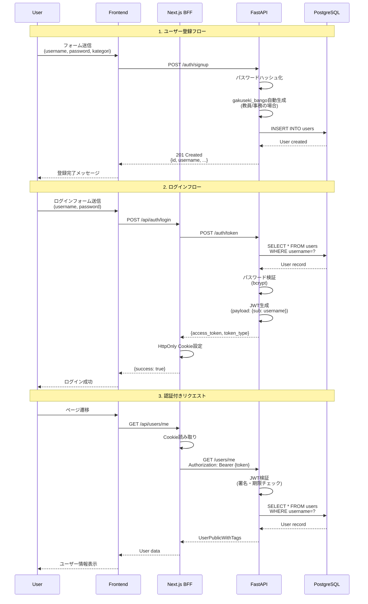
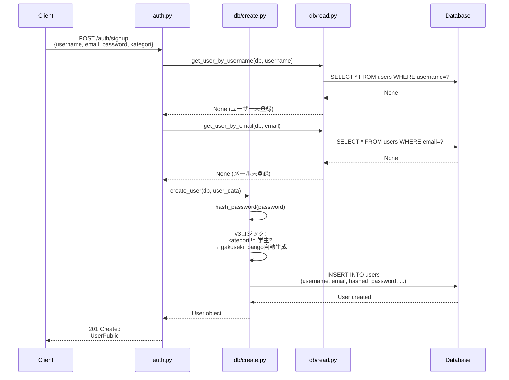
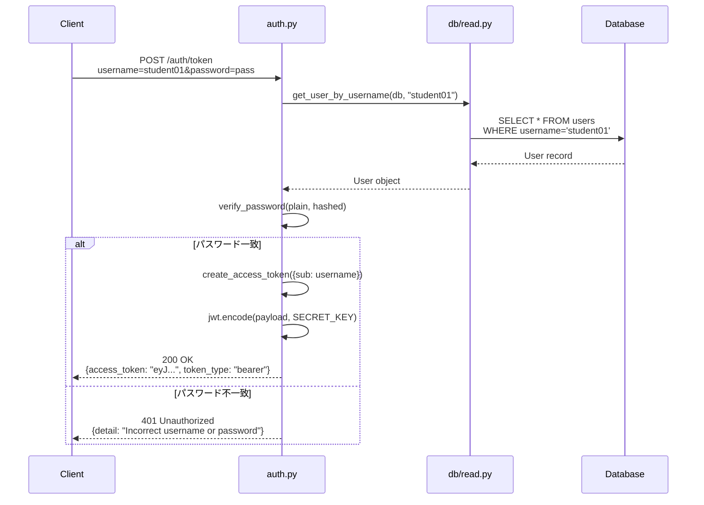
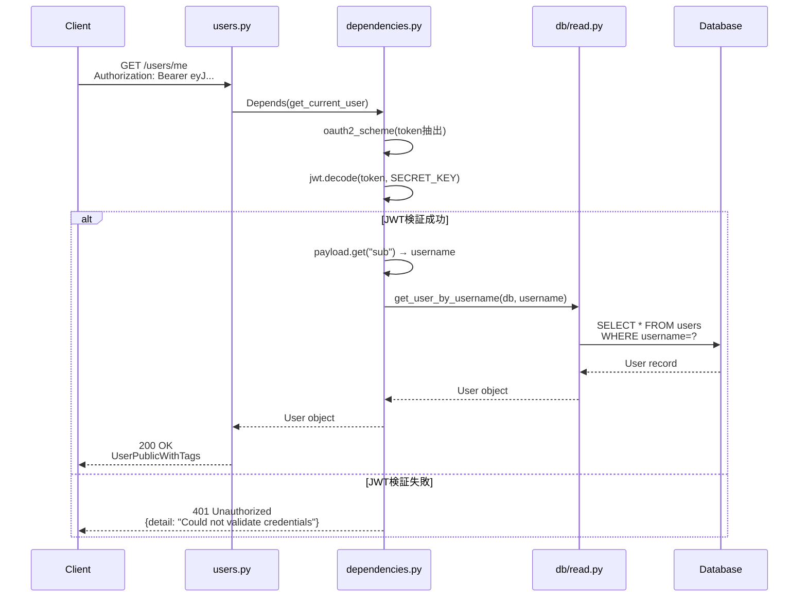
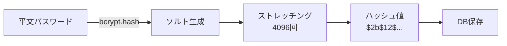
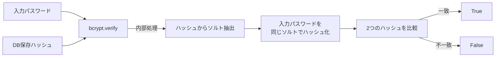
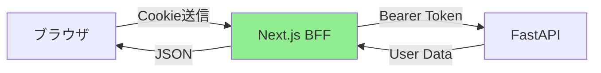

# 認証フロー詳細

## 概要

本システムは、JWT (JSON Web Token) ベースの認証を採用しています。OAuth2パスワードグラントフローに準拠しており、トークンの有効期限は60分です。

## 認証方式の選択理由

| 方式 | 採用 | 理由 |
|-----|------|------|
| JWT | ✅ | ステートレス、スケーラブル、フロントエンドとの相性が良い |
| Session Cookie | ❌ | サーバーサイドの状態管理が必要 |
| Basic Auth | ❌ | セキュリティが弱い、毎回パスワード送信 |

## 認証フロー全体像



---

## 1. ユーザー登録フロー

### シーケンス図



### ステップ詳細

**1. リクエスト受付**
```python
@router.post("/signup", response_model=UserPublic, status_code=201)
def signup(
    user_data: UserCreate,
    db: Session = Depends(get_session)
):
```

**2. ユーザー名重複チェック**
```python
existing_user = get_user_by_username(db, user_data.username)
if existing_user:
    raise HTTPException(status_code=400, detail="Username already registered")
```

**3. メールアドレス重複チェック**
```python
existing_email = get_user_by_email(db, user_data.email)
if existing_email:
    raise HTTPException(status_code=400, detail="Email already registered")
```

**4. ユーザー作成 (v3ロジック)**
```python
# app/db/create.py
def create_user(db: Session, user_data: UserCreate) -> User:
    hashed_pw = hash_password(user_data.password)

    # v3: 教員/事務の場合、gakuseki_bangoを自動生成
    gakuseki_bango = user_data.gakuseki_bango
    if user_data.kategori != UserKategori.STUDENT:
        gakuseki_bango = f"staff_{uuid.uuid4().hex[:8]}"

    db_user = User(
        username=user_data.username,
        email=user_data.email,
        hashed_password=hashed_pw,
        kategori=user_data.kategori,
        gakuseki_bango=gakuseki_bango,
        faculty=user_data.faculty
    )

    db.add(db_user)
    db.commit()
    db.refresh(db_user)

    return db_user
```

**5. レスポンス返却**
```python
return db_user  # Pydanticが自動変換
```

### エラーケース

| エラー | ステータスコード | 詳細 |
|-------|----------------|------|
| ユーザー名重複 | 400 | Username already registered |
| メールアドレス重複 | 400 | Email already registered |
| バリデーションエラー | 422 | Pydanticが自動検出 |

---

## 2. ログインフロー

### シーケンス図



### ステップ詳細

**1. OAuth2フォームデータ受付**
```python
@router.post("/token", response_model=Token)
def login(
    form_data: OAuth2PasswordRequestForm = Depends(),
    db: Session = Depends(get_session)
):
```

**2. ユーザー検索**
```python
user = get_user_by_username(db, form_data.username)
if not user:
    raise HTTPException(
        status_code=401,
        detail="Incorrect username or password",
        headers={"WWW-Authenticate": "Bearer"}
    )
```

**3. パスワード検証**
```python
if not verify_password(form_data.password, user.hashed_password):
    raise HTTPException(
        status_code=401,
        detail="Incorrect username or password",
        headers={"WWW-Authenticate": "Bearer"}
    )
```

**4. JWTトークン生成**
```python
access_token_expires = timedelta(minutes=settings.ACCESS_TOKEN_EXPIRE_MINUTES)
access_token = create_access_token(
    data={"sub": user.username},
    expires_delta=access_token_expires
)

return Token(access_token=access_token, token_type="bearer")
```

### JWTペイロード構造

**生成時のデータ**:
```python
{
    "sub": "student01",  # Subject: ユーザー名
    "exp": 1736425200     # Expiration: 有効期限（UNIXタイムスタンプ）
}
```

**JWT文字列の構造**:
```
eyJhbGciOiJIUzI1NiIsInR5cCI6IkpXVCJ9.  ← Header (Base64)
eyJzdWIiOiJzdHVkZW50MDEiLCJleHAiOjE3MzY0MjUyMDB9.  ← Payload (Base64)
SflKxwRJSMeKKF2QT4fwpMeJf36POk6yJV_adQssw5c  ← Signature (HMAC SHA-256)
```

---

## 3. 認証チェックフロー

### シーケンス図



### ステップ詳細

**1. トークン抽出**
```python
oauth2_scheme = OAuth2PasswordBearer(tokenUrl="/auth/token")

async def get_current_user(
    token: str = Depends(oauth2_scheme),  # ← ここでトークン抽出
    db: Session = Depends(get_session)
) -> User:
```

**2. JWT検証**
```python
try:
    payload = jwt.decode(
        token,
        settings.SECRET_KEY,
        algorithms=[settings.ALGORITHM]
    )
    username: str = payload.get("sub")
    if username is None:
        raise credentials_exception
except JWTError:
    raise credentials_exception
```

**3. ユーザー取得**
```python
user = get_user_by_username(db, username=username)
if user is None:
    raise credentials_exception

return user
```

**4. エンドポイントでの使用**
```python
@router.get("/me", response_model=UserPublicWithTags)
async def get_current_user_info(
    current_user: User = Depends(get_current_user)  # ← ここで自動認証
):
    return current_user
```

---

## パスワードハッシュ化の仕組み

### bcryptの特徴

- **ストレッチング回数**: 12 (2^12 = 4096回)
- **ソルト**: 自動生成・埋め込み
- **一方向性**: ハッシュから元のパスワードは復元不可

### ハッシュ化フロー



### ハッシュ値の構造

```
$2b$12$KIXg3TqWGHVbNgfT8K9Jv.abcdefghijklmnopqrstuvwxyz1234567890
 |  |  |                      |
 |  |  |                      ハッシュ値 (31文字)
 |  |  ソルト (22文字)
 |  ストレッチング回数 (2^12)
 bcryptバージョン
```

### 検証フロー



---

## Next.js BFF連携

### BFF (Backend for Frontend) の役割



### ログインフロー（BFF経由）

**Next.js API Route (`app/api/auth/login/route.ts`)**:
```typescript
import { cookies } from 'next/headers';
import axios from 'axios';

export async function POST(request: Request) {
  const { username, password } = await request.json();

  // FastAPIにログインリクエスト
  const formData = new URLSearchParams();
  formData.append('username', username);
  formData.append('password', password);

  const response = await axios.post(
    `${process.env.NEXT_PUBLIC_API_URL_SERVER}/auth/token`,
    formData
  );

  // JWTをHttpOnly Cookieに保存
  cookies().set('access_token', response.data.access_token, {
    httpOnly: true,
    secure: process.env.NODE_ENV === 'production',
    sameSite: 'lax',
    maxAge: 60 * 60,  // 1時間
    path: '/',
  });

  return Response.json({ success: true });
}
```

### 認証付きリクエスト（BFF経由）

**Next.js API Route (`app/api/users/me/route.ts`)**:
```typescript
export async function GET() {
  const accessToken = cookies().get('access_token');

  if (!accessToken) {
    return Response.json({ error: 'Unauthorized' }, { status: 401 });
  }

  const response = await axios.get(
    `${process.env.NEXT_PUBLIC_API_URL_SERVER}/users/me`,
    {
      headers: {
        Authorization: `Bearer ${accessToken.value}`,
      },
    }
  );

  return Response.json(response.data);
}
```

---

## セキュリティ考慮事項

### 実装済み対策

| 脅威 | 対策 | 実装箇所 |
|-----|------|---------|
| パスワード平文保存 | bcryptハッシュ化 | `app/db/create.py` |
| トークン改ざん | HMAC SHA-256署名 | `app/routers/auth.py` |
| トークン盗聴 | HTTPS推奨 | インフラ設定 |
| XSS攻撃 | HttpOnly Cookie | Next.js BFF |
| CSRF攻撃 | SameSite=Lax | Next.js BFF |

### 推奨される追加対策

1. **Refresh Token**: アクセストークン再発行用のリフレッシュトークン実装
2. **トークン無効化**: ログアウト時のトークンブラックリスト管理
3. **レート制限**: ログイン試行回数制限（Brute Force攻撃対策）
4. **2FA**: 二段階認証の追加
5. **パスワードポリシー**: 最低文字数、複雑さ要件の強化

---

## トラブルシューティング

### よくあるエラーと対処法

#### 401 Unauthorized

**原因**:
- トークンの有効期限切れ
- トークンの署名不正
- ユーザーが削除された

**対処**:
```python
# トークン再発行
response = requests.post("/auth/token", data={"username": "...", "password": "..."})
new_token = response.json()["access_token"]
```

#### 422 Unprocessable Entity

**原因**:
- リクエストボディのバリデーションエラー

**対処**:
```python
# エラー詳細を確認
response = requests.post("/auth/signup", json={...})
print(response.json()["detail"])
# => [{"loc": ["body", "email"], "msg": "value is not a valid email address"}]
```
