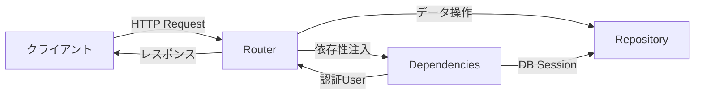
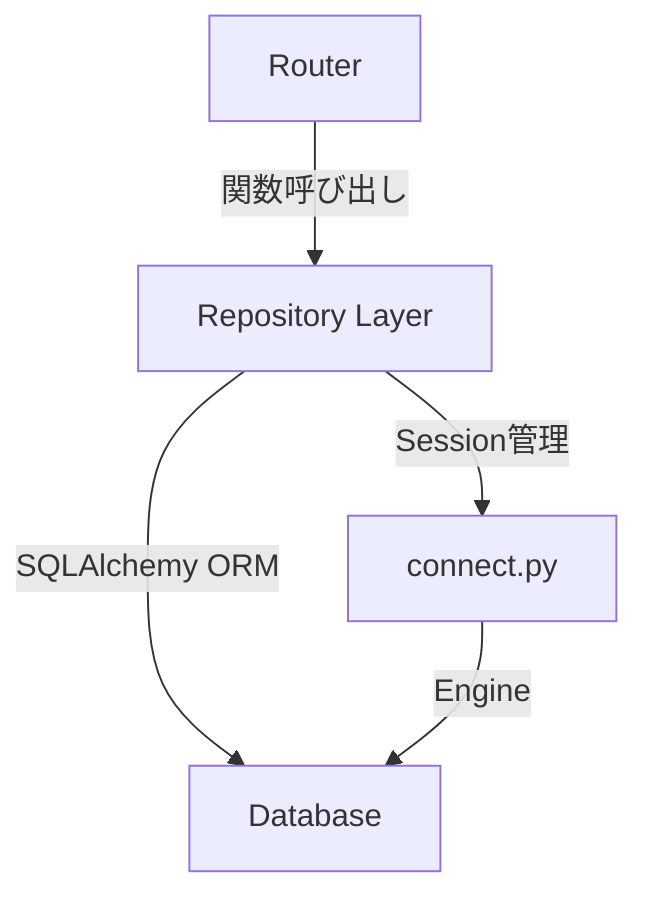
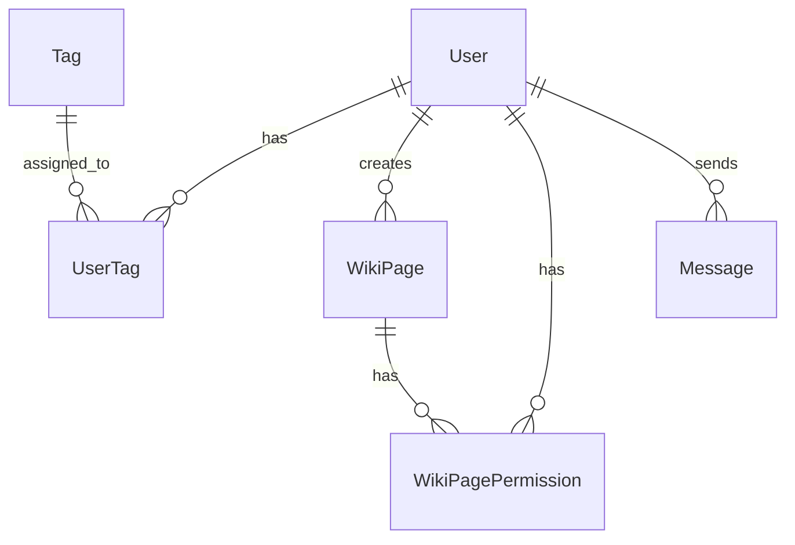
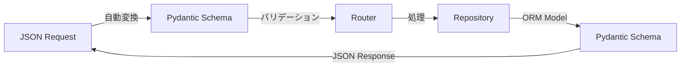
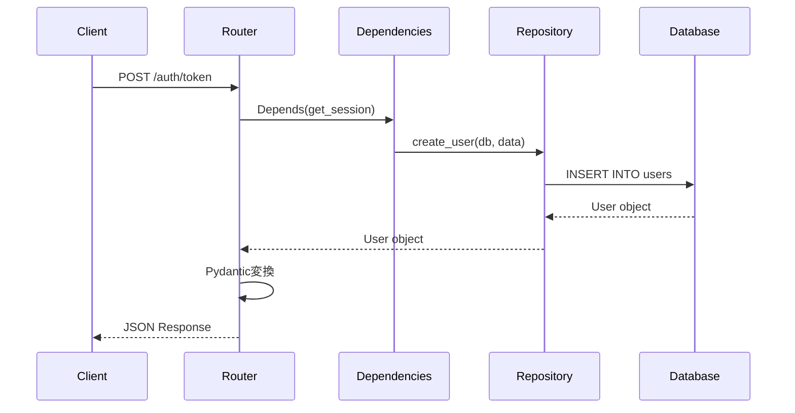
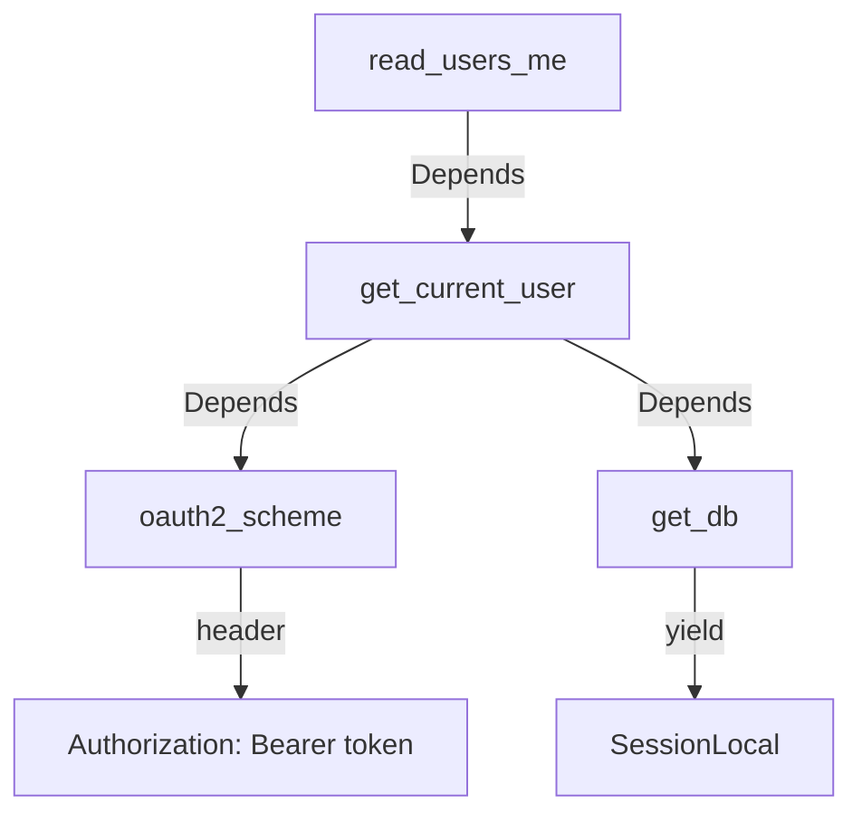
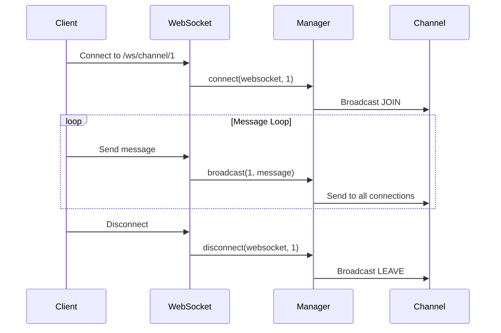

# バックエンドアーキテクチャ

## 概要

本バックエンドは、FastAPIを使用したRESTful APIとして実装されています。クリーンアーキテクチャを参考にした層構造で設計されており、責任の分離と拡張性を重視しています。

## ディレクトリ構造

```
backend/
├── app/
│   ├── core/              # 共通コンポーネント・設定
│   │   ├── __init__.py
│   │   ├── config.py      # 環境変数管理（Pydantic Settings）
│   │   ├── dependencies.py # 依存性注入（DB、認証）
│   │   └── websocket.py   # WebSocket接続管理（Phase 4）
│   ├── db/                # リポジトリ層（DB操作）
│   │   ├── __init__.py
│   │   ├── connect.py     # SQLAlchemy接続管理
│   │   ├── create.py      # CREATE操作
│   │   ├── read.py        # READ操作
│   │   ├── update.py      # UPDATE操作（未実装）
│   │   └── delete.py      # DELETE操作（未実装）
│   ├── models/            # データモデル層（SQLAlchemy ORM）
│   │   ├── __init__.py
│   │   ├── base.py        # Base クラス
│   │   ├── user.py        # User モデル
│   │   ├── tag.py         # Tag モデル
│   │   ├── channel.py     # Channel モデル
│   │   ├── message.py     # Message モデル
│   │   ├── file.py        # File モデル
│   │   └── wiki.py        # Wiki モデル
│   ├── routers/           # コントローラー層（APIエンドポイント）
│   │   ├── __init__.py
│   │   ├── auth.py        # 認証API
│   │   ├── users.py       # ユーザーAPI
│   │   ├── tags.py        # タグAPI
│   │   ├── channels.py    # チャンネルAPI（Phase 4実装済み）
│   │   ├── dm.py          # ダイレクトメッセージAPI（Phase 4実装済み）
│   │   ├── wiki.py        # WikiAPI
│   │   └── search.py      # 検索API
│   └── schemas/           # データ転送オブジェクト（Pydantic）
│       ├── __init__.py
│       ├── auth.py        # 認証スキーマ
│       ├── user.py        # ユーザースキーマ
│       ├── token.py       # トークンスキーマ
│       ├── tag.py         # タグスキーマ
│       ├── channel.py     # チャンネル/DMスキーマ（Phase 4）
│       ├── wiki.py        # Wikiスキーマ
│       └── search.py      # 検索スキーマ
├── alembic/               # DBマイグレーション
│   ├── versions/          # マイグレーションスクリプト
│   └── env.py             # Alembic設定
├── docs/                  # ドキュメント
├── main.py                # FastAPIアプリケーションエントリーポイント
├── .env                   # 環境変数（gitignore対象）
├── pyproject.toml         # 依存関係定義
└── Dockerfile             # Docker設定
```

## アーキテクチャ層の詳細

### 1. コントローラー層 (`app/routers/`)

**責務**: HTTPリクエストの受付、レスポンスの返却、バリデーション



**実装パターン**:
```python
from fastapi import APIRouter, Depends
from app.core.dependencies import get_current_user
from app.db import read

router = APIRouter(prefix="/users", tags=["Users"])

@router.get("/me")
async def get_current_user_info(
    current_user: User = Depends(get_current_user)
):
    return current_user
```

**特徴**:
- FastAPIの`Depends`を活用した依存性注入
- Pydanticによる自動バリデーション
- OpenAPI/Swaggerドキュメント自動生成
- タグによるAPIのグルーピング

### 2. リポジトリ層 (`app/db/`)

**責務**: データベース操作のカプセル化、SQL実行



**実装パターン**:
```python
# app/db/read.py
from sqlalchemy.orm import Session
from app.models.user import User

def get_user_by_username(db: Session, username: str) -> Optional[User]:
    """ユーザー名でユーザーを取得"""
    return db.query(User).filter(User.username == username).first()
```

**特徴**:
- CRUD操作を4ファイルに分割（create, read, update, delete）
- SQLAlchemyのセッションを引数で受け取る
- ビジネスロジックとデータアクセスの分離
- トランザクション管理の責任を呼び出し元に委譲

### 3. モデル層 (`app/models/`)

**責務**: データベーステーブルの定義、リレーションシップ



**実装パターン**:
```python
# app/models/user.py
from sqlalchemy.orm import Mapped, mapped_column, relationship
from app.models.base import Base

class User(Base):
    __tablename__ = "users"

    id: Mapped[uuid.UUID] = mapped_column(primary_key=True, default=uuid.uuid4)
    username: Mapped[str] = mapped_column(String(100), unique=True)

    # Relationships
    tags: Mapped[List["UserTag"]] = relationship("UserTag", back_populates="user")
```

**特徴**:
- SQLAlchemy 2.0スタイルの型ヒント（Mapped）
- 宣言的なリレーションシップ定義
- Enumによる型安全なカテゴリ管理

### 4. スキーマ層 (`app/schemas/`)

**責務**: API入出力のデータ構造定義、バリデーション



**実装パターン**:
```python
# app/schemas/user.py
from pydantic import BaseModel, EmailStr

class UserCreate(BaseModel):
    username: str
    email: EmailStr
    password: str
    kategori: UserKategori

class UserPublic(BaseModel):
    id: uuid.UUID
    username: str
    email: str
    kategori: UserKategori

    model_config = {"from_attributes": True}  # ORM変換用
```

**特徴**:
- リクエストとレスポンスで異なるスキーマ
- パスワードなどの機密情報を公開スキーマから除外
- `from_attributes=True`でSQLAlchemyモデルから変換可能

### 5. 共通コンポーネント層 (`app/core/`)

**責務**: 設定管理、依存性注入、認証

#### 5.1 設定管理 (`config.py`)

```python
from pydantic_settings import BaseSettings

class Settings(BaseSettings):
    DATABASE_URL: str
    SECRET_KEY: str
    ALGORITHM: str = "HS256"

    model_config = SettingsConfigDict(env_file=".env")

settings = Settings()
```

**特徴**:
- `.env`ファイルから自動読み込み
- 型安全な環境変数アクセス
- シングルトンパターン

#### 5.2 依存性注入 (`dependencies.py`)

```python
from fastapi import Depends
from fastapi.security import OAuth2PasswordBearer

oauth2_scheme = OAuth2PasswordBearer(tokenUrl="/auth/token")

async def get_current_user(
    token: str = Depends(oauth2_scheme),
    db: Session = Depends(get_session)
) -> User:
    # JWT検証 → ユーザー取得
    ...
```

**特徴**:
- FastAPIの`Depends`で依存関係を宣言的に定義
- 認証チェックの再利用性
- テスト時のモック化が容易

## レイヤー間のデータフロー



## 依存性注入の仕組み

### FastAPI Dependsの動作

```python
# 定義
def get_db() -> Generator[Session, None, None]:
    db = SessionLocal()
    try:
        yield db
    finally:
        db.close()

async def get_current_user(
    token: str = Depends(oauth2_scheme),
    db: Session = Depends(get_db)
) -> User:
    # トークン検証
    payload = jwt.decode(token, SECRET_KEY)
    user = get_user_by_username(db, payload["sub"])
    return user

# 使用
@router.get("/me")
async def read_users_me(current_user: User = Depends(get_current_user)):
    return current_user
```

### 依存関係グラフ



**実行順序**:
1. `oauth2_scheme`がHTTPヘッダーからトークン抽出
2. `get_db`がデータベースセッション生成
3. `get_current_user`がトークン検証とユーザー取得
4. `read_users_me`が実行
5. `get_db`が`finally`ブロックでセッションクローズ

## 環境変数の管理

### .envファイル構造

```ini
# Database
DATABASE_URL=postgresql+psycopg2://user:pass@db:5432/commu_db

# JWT
SECRET_KEY=your_secret_key
ALGORITHM=HS256
ACCESS_TOKEN_EXPIRE_MINUTES=60

# PostgreSQL（Docker Compose用）
POSTGRES_USER=fastapi_user
POSTGRES_PASSWORD=fastapi_password
POSTGRES_DB=commu_db
```

### アクセス方法

```python
from app.core.config import settings

# 使用例
engine = create_engine(settings.DATABASE_URL)
jwt.encode(data, settings.SECRET_KEY, algorithm=settings.ALGORITHM)
```

### セキュリティ対策

- `.env`ファイルは`.gitignore`に追加
- 本番環境では環境変数またはシークレット管理サービスを使用
- `SECRET_KEY`は`openssl rand -hex 32`で生成

## エラーハンドリング

### HTTPException

```python
from fastapi import HTTPException, status

# 404 Not Found
if not user:
    raise HTTPException(
        status_code=status.HTTP_404_NOT_FOUND,
        detail="User not found"
    )

# 401 Unauthorized
if not verify_password(password, user.hashed_password):
    raise HTTPException(
        status_code=status.HTTP_401_UNAUTHORIZED,
        detail="Incorrect username or password",
        headers={"WWW-Authenticate": "Bearer"}
    )
```

### グローバルエラーハンドラー（今後実装予定）

```python
from fastapi import Request
from fastapi.responses import JSONResponse

@app.exception_handler(ValueError)
async def value_error_handler(request: Request, exc: ValueError):
    return JSONResponse(
        status_code=400,
        content={"detail": str(exc)}
    )
```

## パフォーマンス最適化

### データベース接続プール

```python
engine = create_engine(
    settings.DATABASE_URL,
    pool_pre_ping=True,  # 接続の健全性チェック
    pool_size=5,         # 常時5接続を維持
    max_overflow=10      # 最大15接続まで許可
)
```

### クエリ最適化

```python
# N+1問題の回避
user = db.query(User).options(
    joinedload(User.tags),  # Eagerロード
    joinedload(User.wiki_pages)
).filter(User.id == user_id).first()
```

## テスト戦略（今後実装予定）

```python
# tests/test_auth.py
from fastapi.testclient import TestClient

def test_signup(client: TestClient):
    response = client.post("/auth/signup", json={
        "username": "testuser",
        "email": "test@example.com",
        "password": "password123",
        "kategori": "学生"
    })
    assert response.status_code == 201
```

## WebSocket実装 (Phase 4)

### WebSocket接続管理 (`app/core/websocket.py`)

**責務**: WebSocket接続のライフサイクル管理、チャンネル別接続プール、ブロードキャスト

```python
from fastapi import WebSocket
from typing import Dict, List
import json

class ConnectionManager:
    """WebSocket接続管理クラス"""

    def __init__(self):
        # {channel_id: [WebSocket, WebSocket, ...]}
        self.active_connections: Dict[int, List[WebSocket]] = {}

    async def connect(self, websocket: WebSocket, channel_id: int):
        """WebSocket接続を受け入れ、チャンネルに登録"""
        await websocket.accept()
        if channel_id not in self.active_connections:
            self.active_connections[channel_id] = []
        self.active_connections[channel_id].append(websocket)

    def disconnect(self, websocket: WebSocket, channel_id: int):
        """WebSocket接続を切断し、チャンネルから削除"""
        if channel_id in self.active_connections:
            try:
                self.active_connections[channel_id].remove(websocket)
            except ValueError:
                pass
            if not self.active_connections[channel_id]:
                del self.active_connections[channel_id]

    async def broadcast(self, channel_id: int, message: dict):
        """チャンネルの全接続にメッセージをブロードキャスト"""
        if channel_id not in self.active_connections:
            return

        message_json = json.dumps(message, default=str)
        disconnected = []

        for connection in self.active_connections[channel_id]:
            try:
                await connection.send_text(message_json)
            except Exception:
                disconnected.append(connection)

        # 切断されたコネクションをクリーンアップ
        for connection in disconnected:
            self.disconnect(connection, channel_id)
```

**特徴**:
- チャンネルIDごとに接続を管理
- ブロードキャスト時に自動的に切断されたコネクションをクリーンアップ
- JSON形式でのメッセージ送信をサポート

### WebSocketエンドポイント (`main.py`)

```python
from fastapi import WebSocket, WebSocketDisconnect
from app.core.websocket import manager

@app.websocket("/ws/channel/{channel_id}")
async def websocket_channel_endpoint(
    websocket: WebSocket,
    channel_id: int,
    db: Session = Depends(get_session)
):
    """チャンネルのWebSocket接続エンドポイント"""

    # チャンネル存在チェック
    channel = get_channel_by_id(db, channel_id)
    if not channel:
        await websocket.close(code=1008, reason=f"Channel {channel_id} not found")
        return

    # 接続受け入れ
    await manager.connect(websocket, channel_id)

    try:
        # JOIN通知を全員に送信
        await manager.broadcast(channel_id, {
            "type": "system",
            "content": f"A user joined channel '{channel.name}'",
            "timestamp": datetime.utcnow().isoformat()
        })

        while True:
            # クライアントからメッセージ受信
            data = await websocket.receive_text()

            try:
                message_data = json.loads(data)

                if message_data.get("type") == "message":
                    # 通常メッセージをブロードキャスト
                    await manager.broadcast(channel_id, {
                        "type": "message",
                        "content": message_data.get("content"),
                        "sender_username": message_data.get("sender_username"),
                        "timestamp": datetime.utcnow().isoformat()
                    })

            except json.JSONDecodeError:
                # 不正なJSON
                await manager.send_personal_message(
                    {"type": "error", "content": "Invalid JSON format"},
                    websocket
                )

    except WebSocketDisconnect:
        # 切断処理
        manager.disconnect(websocket, channel_id)

        # LEAVE通知を全員に送信
        await manager.broadcast(channel_id, {
            "type": "system",
            "content": f"A user left channel '{channel.name}'",
            "timestamp": datetime.utcnow().isoformat()
        })
```

**接続フロー**:


**メッセージフォーマット**:

クライアント→サーバー:
```json
{
  "type": "message",
  "content": "Hello!",
  "sender_username": "user123"
}
```

サーバー→クライアント:
```json
{
  "type": "message",  // "message" | "system" | "error"
  "content": "Hello!",
  "sender_username": "user123",
  "timestamp": "2025-01-10T14:30:00"
}
```
