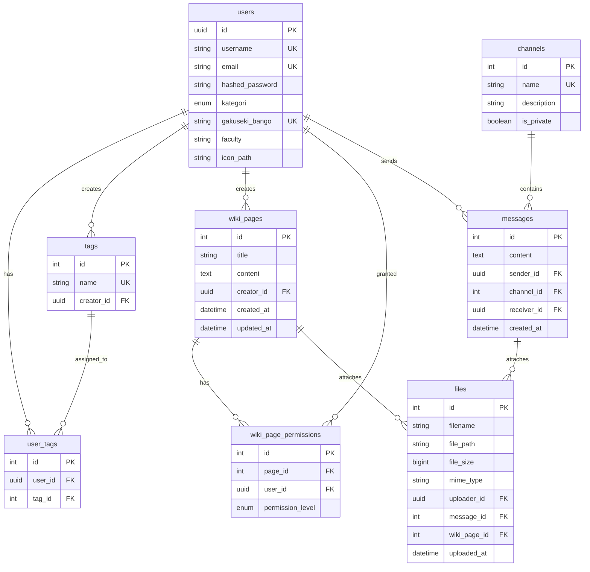

# データベーススキーマ

## 概要

本システムのデータベースはPostgreSQL 14を使用し、SQLAlchemy ORMで管理されています。合計8テーブルで構成され、ユーザー管理、タグ、Wiki、チャンネル、メッセージ、ファイル管理の機能を提供します。

## ER図 (全体)



## テーブル定義

### 1. users テーブル

ユーザー情報を管理するメインテーブル。

| カラム名 | 型 | 制約 | デフォルト値 | 説明 |
|---------|-----|------|------------|------|
| id | UUID | PRIMARY KEY | uuid4() | ユーザーID |
| username | VARCHAR(100) | NOT NULL, UNIQUE | - | ユーザー名 |
| email | VARCHAR(255) | NOT NULL, UNIQUE | - | メールアドレス |
| hashed_password | VARCHAR(255) | NOT NULL | - | bcryptハッシュ化パスワード |
| kategori | ENUM | NOT NULL | - | ユーザーカテゴリー |
| gakuseki_bango | VARCHAR(50) | UNIQUE, NULLABLE | - | 学籍番号（教員/事務は自動生成） |
| faculty | VARCHAR(100) | NULLABLE | - | 学部・所属 |
| icon_path | VARCHAR(255) | NULLABLE | - | アイコン画像パス |

**kategoriaのEnum値**:
- `学生`
- `教授`
- `准教授`
- `講師`
- `事務`

**インデックス**:
```sql
CREATE UNIQUE INDEX idx_users_username ON users(username);
CREATE UNIQUE INDEX idx_users_email ON users(email);
CREATE UNIQUE INDEX idx_users_gakuseki_bango ON users(gakuseki_bango) WHERE gakuseki_bango IS NOT NULL;
```

**v3変更点**:
- `gakuseki_bango`がNULL許容になり、学生以外は自動生成される

**リレーションシップ**:
- `tags`: 作成したタグ一覧 (1:N)
- `user_tags`: ユーザーに割り当てられたタグ (1:N)
- `wiki_pages`: 作成したWikiページ一覧 (1:N)
- `wiki_permissions`: 付与されたWiki権限一覧 (1:N)
- `messages`: 送信したメッセージ一覧 (1:N)

---

### 2. tags テーブル

タグマスターテーブル。ユーザーの属性を管理するタグ情報。

| カラム名 | 型 | 制約 | デフォルト値 | 説明 |
|---------|-----|------|------------|------|
| id | INTEGER | PRIMARY KEY, AUTOINCREMENT | - | タグID |
| name | VARCHAR(100) | NOT NULL, UNIQUE | - | タグ名 |
| creator_id | UUID | NOT NULL, FK → users.id | - | 作成者ID (v3新規) |

**外部キー**:
```sql
FOREIGN KEY (creator_id) REFERENCES users(id) ON DELETE CASCADE
```

**インデックス**:
```sql
CREATE UNIQUE INDEX idx_tags_name ON tags(name);
CREATE INDEX idx_tags_creator_id ON tags(creator_id);
```

**v3変更点**:
- `creator_id`フィールド追加により、タグの作成者を追跡可能に
- タグの割り当て権限が作成者のkategoriaに依存する仕様

**リレーションシップ**:
- `creator`: タグ作成者 (N:1 → users)
- `user_tags`: このタグが割り当てられたユーザー一覧 (1:N)

---

### 3. user_tags テーブル

ユーザーとタグの中間テーブル（多対多関係）。

| カラム名 | 型 | 制約 | デフォルト値 | 説明 |
|---------|-----|------|------------|------|
| id | INTEGER | PRIMARY KEY, AUTOINCREMENT | - | レコードID |
| user_id | UUID | NOT NULL, FK → users.id | - | ユーザーID |
| tag_id | INTEGER | NOT NULL, FK → tags.id | - | タグID |

**外部キー**:
```sql
FOREIGN KEY (user_id) REFERENCES users(id) ON DELETE CASCADE
FOREIGN KEY (tag_id) REFERENCES tags(id) ON DELETE CASCADE
```

**複合ユニーク制約**:
```sql
UNIQUE(user_id, tag_id)
```

**インデックス**:
```sql
CREATE INDEX idx_user_tags_user_id ON user_tags(user_id);
CREATE INDEX idx_user_tags_tag_id ON user_tags(tag_id);
```

**リレーションシップ**:
- `user`: ユーザー (N:1 → users)
- `tag`: タグ (N:1 → tags)

---

### 4. wiki_pages テーブル

Wikiページ情報テーブル。

| カラム名 | 型 | 制約 | デフォルト値 | 説明 |
|---------|-----|------|------------|------|
| id | INTEGER | PRIMARY KEY, AUTOINCREMENT | - | WikiページID |
| title | VARCHAR(255) | NOT NULL | - | ページタイトル |
| content | TEXT | NOT NULL | "" | ページ本文（Markdown） |
| creator_id | UUID | NOT NULL, FK → users.id | - | 作成者ID (v3新規) |
| created_at | TIMESTAMP | NOT NULL | CURRENT_TIMESTAMP | 作成日時 |
| updated_at | TIMESTAMP | NOT NULL | CURRENT_TIMESTAMP | 更新日時 |

**外部キー**:
```sql
FOREIGN KEY (creator_id) REFERENCES users(id) ON DELETE CASCADE
```

**インデックス**:
```sql
CREATE INDEX idx_wiki_pages_creator_id ON wiki_pages(creator_id);
CREATE INDEX idx_wiki_pages_created_at ON wiki_pages(created_at);
```

**v3変更点**:
- `creator_id`フィールド追加
- 権限管理テーブル(`wiki_page_permissions`)との連携

**リレーションシップ**:
- `creator`: ページ作成者 (N:1 → users)
- `permissions`: ページ権限一覧 (1:N → wiki_page_permissions)
- `files`: 添付ファイル一覧 (1:N → files)

---

### 5. wiki_page_permissions テーブル (v3新規)

Wikiページの権限管理テーブル。Google Docs/Notion型の動的権限設定を実現。

| カラム名 | 型 | 制約 | デフォルト値 | 説明 |
|---------|-----|------|------------|------|
| id | INTEGER | PRIMARY KEY, AUTOINCREMENT | - | 権限レコードID |
| page_id | INTEGER | NOT NULL, FK → wiki_pages.id | - | WikiページID |
| user_id | UUID | NOT NULL, FK → users.id | - | ユーザーID |
| permission_level | ENUM | NOT NULL | - | 権限レベル |

**permission_levelのEnum値**:
- `VIEW_ONLY`: 閲覧のみ
- `EDIT`: 閲覧と編集

**外部キー**:
```sql
FOREIGN KEY (page_id) REFERENCES wiki_pages(id) ON DELETE CASCADE
FOREIGN KEY (user_id) REFERENCES users(id) ON DELETE CASCADE
```

**複合ユニーク制約**:
```sql
UNIQUE(page_id, user_id)
```

**インデックス**:
```sql
CREATE INDEX idx_wiki_permissions_page_id ON wiki_page_permissions(page_id);
CREATE INDEX idx_wiki_permissions_user_id ON wiki_page_permissions(user_id);
```

**権限チェックロジック**:
```python
# ページ作成時、作成者に自動的にEDIT権限が付与される
def create_wiki_page(db, title, content, creator_id):
    page = WikiPage(title=title, content=content, creator_id=creator_id)
    db.add(page)
    db.flush()

    # 作成者にEDIT権限を自動付与
    permission = WikiPagePermission(
        page_id=page.id,
        user_id=creator_id,
        permission_level=PermissionLevel.EDIT
    )
    db.add(permission)
    db.commit()
```

**リレーションシップ**:
- `page`: Wikiページ (N:1 → wiki_pages)
- `user`: ユーザー (N:1 → users)

---

### 6. channels テーブル

チャンネル（掲示板）情報テーブル。

| カラム名 | 型 | 制約 | デフォルト値 | 説明 |
|---------|-----|------|------------|------|
| id | INTEGER | PRIMARY KEY, AUTOINCREMENT | - | チャンネルID |
| name | VARCHAR(100) | NOT NULL, UNIQUE | - | チャンネル名 |
| description | VARCHAR(500) | NULLABLE | - | チャンネル説明 |
| is_private | BOOLEAN | NOT NULL | FALSE | プライベートチャンネルフラグ |

**インデックス**:
```sql
CREATE UNIQUE INDEX idx_channels_name ON channels(name);
```

**リレーションシップ**:
- `messages`: チャンネル内のメッセージ一覧 (1:N → messages)

---

### 7. messages テーブル

メッセージ（チャンネル投稿・DM）情報テーブル。

| カラム名 | 型 | 制約 | デフォルト値 | 説明 |
|---------|-----|------|------------|------|
| id | INTEGER | PRIMARY KEY, AUTOINCREMENT | - | メッセージID |
| content | TEXT | NOT NULL | - | メッセージ本文 |
| sender_id | UUID | NOT NULL, FK → users.id | - | 送信者ID |
| channel_id | INTEGER | NULLABLE, FK → channels.id | - | チャンネルID（DMの場合はNULL） |
| receiver_id | UUID | NULLABLE, FK → users.id | - | 受信者ID（チャンネルメッセージの場合はNULL） |
| created_at | TIMESTAMP | NOT NULL | CURRENT_TIMESTAMP | 送信日時 |

**外部キー**:
```sql
FOREIGN KEY (sender_id) REFERENCES users(id) ON DELETE CASCADE
FOREIGN KEY (channel_id) REFERENCES channels(id) ON DELETE CASCADE
FOREIGN KEY (receiver_id) REFERENCES users(id) ON DELETE CASCADE
```

**チェック制約**:
```sql
CHECK (
  (channel_id IS NOT NULL AND receiver_id IS NULL) OR
  (channel_id IS NULL AND receiver_id IS NOT NULL)
)
```
→ チャンネルメッセージとDMのどちらか一方のみ

**インデックス**:
```sql
CREATE INDEX idx_messages_sender_id ON messages(sender_id);
CREATE INDEX idx_messages_channel_id ON messages(channel_id);
CREATE INDEX idx_messages_receiver_id ON messages(receiver_id);
CREATE INDEX idx_messages_created_at ON messages(created_at);
```

**リレーションシップ**:
- `sender`: 送信者 (N:1 → users)
- `channel`: チャンネル (N:1 → channels, NULLABLE)
- `files`: 添付ファイル一覧 (1:N → files)

---

### 8. files テーブル

ファイル情報テーブル（メッセージ・Wiki添付ファイル）。

| カラム名 | 型 | 制約 | デフォルト値 | 説明 |
|---------|-----|------|------------|------|
| id | INTEGER | PRIMARY KEY, AUTOINCREMENT | - | ファイルID |
| filename | VARCHAR(255) | NOT NULL | - | 元のファイル名 |
| file_path | VARCHAR(500) | NOT NULL | - | サーバー上の保存パス |
| file_size | BIGINT | NOT NULL | - | ファイルサイズ（バイト） |
| mime_type | VARCHAR(100) | NULLABLE | - | MIMEタイプ |
| uploader_id | UUID | NOT NULL, FK → users.id | - | アップロード者ID |
| message_id | INTEGER | NULLABLE, FK → messages.id | - | メッセージID（メッセージ添付の場合） |
| wiki_page_id | INTEGER | NULLABLE, FK → wiki_pages.id | - | WikiページID（Wiki添付の場合） |
| uploaded_at | TIMESTAMP | NOT NULL | CURRENT_TIMESTAMP | アップロード日時 |

**外部キー**:
```sql
FOREIGN KEY (uploader_id) REFERENCES users(id) ON DELETE CASCADE
FOREIGN KEY (message_id) REFERENCES messages(id) ON DELETE CASCADE
FOREIGN KEY (wiki_page_id) REFERENCES wiki_pages(id) ON DELETE CASCADE
```

**チェック制約**:
```sql
CHECK (
  (message_id IS NOT NULL AND wiki_page_id IS NULL) OR
  (message_id IS NULL AND wiki_page_id IS NOT NULL)
)
```
→ メッセージ添付かWiki添付のどちらか一方のみ

**インデックス**:
```sql
CREATE INDEX idx_files_uploader_id ON files(uploader_id);
CREATE INDEX idx_files_message_id ON files(message_id);
CREATE INDEX idx_files_wiki_page_id ON files(wiki_page_id);
CREATE INDEX idx_files_uploaded_at ON files(uploaded_at);
```

**リレーションシップ**:
- `message`: 添付先メッセージ (N:1 → messages, NULLABLE)
- `wiki_page`: 添付先Wikiページ (N:1 → wiki_pages, NULLABLE)

---

## Alembicマイグレーション

### マイグレーション履歴

| バージョン | 日付 | 説明 | ファイル |
|-----------|------|------|---------|
| (未実装) | - | 初期マイグレーション | `alembic/versions/001_initial.py` |

### マイグレーションコマンド

```bash
# マイグレーションスクリプト自動生成
alembic revision --autogenerate -m "Initial migration"

# マイグレーション実行
alembic upgrade head

# ロールバック（1つ前）
alembic downgrade -1

# 現在のバージョン確認
alembic current

# マイグレーション履歴
alembic history
```

### Alembic設定 (`alembic/env.py`)

```python
from app.models.base import Base
from app.models.user import User
from app.models.tag import Tag, UserTag
from app.models.wiki import WikiPage, WikiPagePermission
from app.models.channel import Channel
from app.models.message import Message
from app.models.file import File
from app.core.config import settings

target_metadata = Base.metadata

config.set_main_option("sqlalchemy.url", settings.DATABASE_URL)
```

---

## データベース運用

### バックアップ

```bash
# PostgreSQLダンプ
pg_dump -U fastapi_user -d commu_db > backup.sql

# 復元
psql -U fastapi_user -d commu_db < backup.sql
```

### パフォーマンスチューニング

**クエリ分析**:
```sql
EXPLAIN ANALYZE
SELECT * FROM users WHERE username = 'student01';
```

**スロークエリログ有効化** (`postgresql.conf`):
```ini
log_min_duration_statement = 1000  # 1秒以上のクエリをログ出力
```

---

## セキュリティ考慮事項

1. **パスワードハッシュ化**: bcryptを使用（ストレッチング回数: 12）
2. **SQL Injection対策**: SQLAlchemy ORM使用によりパラメータ化クエリ
3. **カスケード削除**: ユーザー削除時に関連データも削除
4. **UNIQUE制約**: 重複登録の防止
