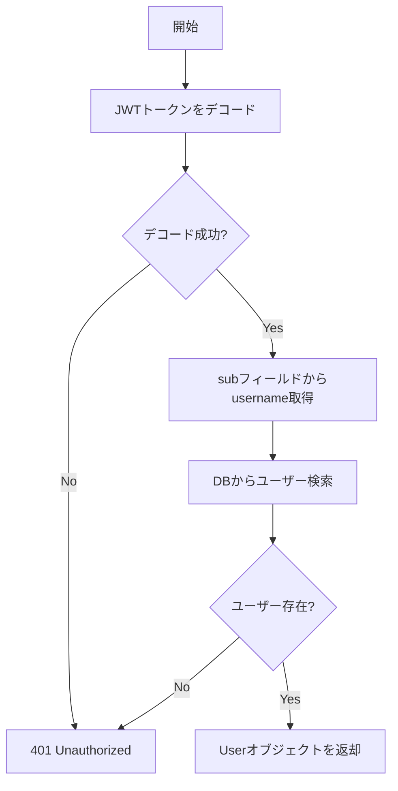
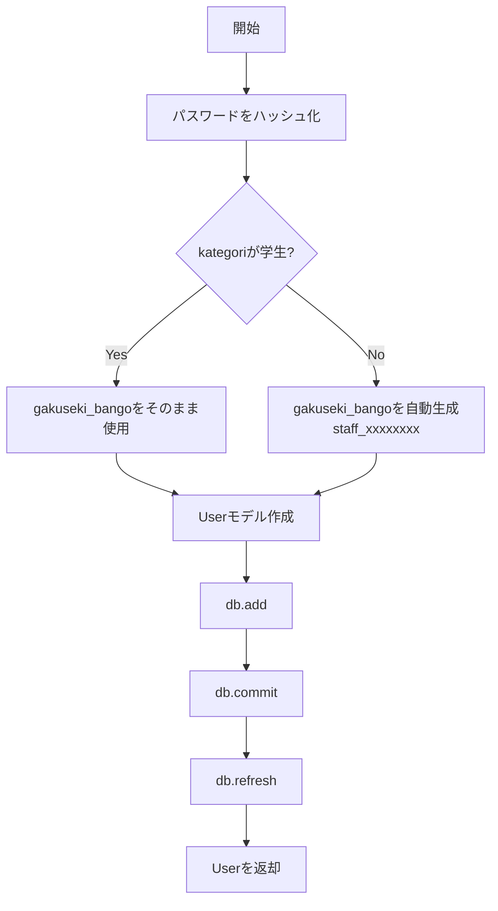

# コア・DB層関数リファレンス

---

## app/core/config.py

環境変数管理とアプリケーション設定。

### Settings クラス

**説明**: pydantic-settingsを使用した設定管理クラス。`.env`ファイルから環境変数を読み込む。

**定義**:
```python
class Settings(BaseSettings):
    DATABASE_URL: str
    SECRET_KEY: str
    ALGORITHM: str = "HS256"
    ACCESS_TOKEN_EXPIRE_MINUTES: int = 60
    POSTGRES_USER: Optional[str] = None
    POSTGRES_PASSWORD: Optional[str] = None
    POSTGRES_DB: Optional[str] = None

    model_config = SettingsConfigDict(
        env_file=".env",
        env_file_encoding="utf-8",
        case_sensitive=True,
        extra="ignore"
    )
```

**フィールド**:

| フィールド | 型 | デフォルト値 | 説明 |
|-----------|-----|------------|------|
| DATABASE_URL | str | - | SQLAlchemy接続URL |
| SECRET_KEY | str | - | JWT署名用秘密鍵 |
| ALGORITHM | str | "HS256" | JWT署名アルゴリズム |
| ACCESS_TOKEN_EXPIRE_MINUTES | int | 60 | トークン有効期限（分） |
| POSTGRES_USER | str \ None | None | PostgreSQLユーザー名 |
| POSTGRES_PASSWORD | str \ None | None | PostgreSQLパスワード |
| POSTGRES_DB | str \ None | None | PostgreSQLデータベース名 |

**使用例**:
```python
from app.core.config import settings

print(settings.DATABASE_URL)
# => "postgresql+psycopg2://user:pass@db:5432/commu_db"

print(settings.ACCESS_TOKEN_EXPIRE_MINUTES)
# => 60
```

**注意事項**:
- `.env`ファイルが存在しない場合、環境変数から読み込む
- `extra="ignore"`により、`.env`に定義されていないフィールドは無視される
- `case_sensitive=True`により、大文字小文字を区別する

---

## app/core/dependencies.py

FastAPI依存性注入コンポーネント。

### oauth2_scheme

**説明**: OAuth2 Bearer トークンスキーム。HTTPヘッダーから`Authorization: Bearer <token>`を抽出する。

**定義**:
```python
oauth2_scheme = OAuth2PasswordBearer(tokenUrl="/auth/token")
```

**引数**:
- `tokenUrl`: トークン取得エンドポイントのURL

**使用例**:
```python
@router.get("/protected")
async def protected_route(token: str = Depends(oauth2_scheme)):
    # token には "Bearer " プレフィックスなしのトークン文字列が入る
    return {"token": token}
```

---

### get_db_session

**説明**: データベースセッションを取得する依存関数（未使用、`get_session`を直接使用）。

**シグネチャ**:
```python
def get_db_session() -> Session:
    return Depends(get_session)
```

---

### get_current_user

**説明**: JWTトークンを検証し、現在のユーザーを取得する依存関数。

**シグネチャ**:
```python
async def get_current_user(
    token: Annotated[str, Depends(oauth2_scheme)],
    db: Session = Depends(get_session)
) -> User
```

**引数**:

| 引数 | 型 | 説明 |
|-----|-----|------|
| token | str | `oauth2_scheme`から抽出されたJWTトークン |
| db | Session | データベースセッション |

**戻り値**:
- `User`: 認証されたユーザーのSQLAlchemyモデル

**例外**:
- `HTTPException(401)`: トークンが無効、または対応するユーザーが存在しない

**処理フロー**:


**実装詳細**:
```python
credentials_exception = HTTPException(
    status_code=status.HTTP_401_UNAUTHORIZED,
    detail="Could not validate credentials",
    headers={"WWW-Authenticate": "Bearer"},
)

try:
    payload = jwt.decode(
        token,
        settings.SECRET_KEY,
        algorithms=[settings.ALGORITHM]
    )
    username: str = payload.get("sub")
    if username is None:
        raise credentials_exception
    token_data = TokenData(username=username)
except JWTError:
    raise credentials_exception

user = get_user_by_username(db, username=token_data.username)
if user is None:
    raise credentials_exception

return user
```

**使用例**:
```python
@router.get("/me")
async def read_users_me(current_user: User = Depends(get_current_user)):
    return {
        "username": current_user.username,
        "email": current_user.email
    }
```

---

## app/db/connect.py

データベース接続管理。

### engine

**説明**: SQLAlchemyエンジン。データベース接続プールを管理する。

**定義**:
```python
engine = create_engine(
    settings.DATABASE_URL,
    echo=False,
    pool_pre_ping=True,
    pool_size=5,
    max_overflow=10
)
```

**パラメータ**:

| パラメータ | 値 | 説明 |
|-----------|-----|------|
| url | settings.DATABASE_URL | DB接続URL |
| echo | False | SQLログ出力（本番環境はFalse） |
| pool_pre_ping | True | 接続前の健全性チェック |
| pool_size | 5 | 常時維持する接続数 |
| max_overflow | 10 | 追加で許可する最大接続数 |

---

### SessionLocal

**説明**: セッションファクトリ。新しいデータベースセッションを生成する。

**定義**:
```python
SessionLocal = sessionmaker(
    autocommit=False,
    autoflush=False,
    bind=engine
)
```

---

### get_session

**説明**: データベースセッションを生成し、リクエスト終了時に自動クローズする依存関数。

**シグネチャ**:
```python
def get_session() -> Generator[Session, None, None]:
    ...
```

**戻り値**:
- `Generator[Session, None, None]`: データベースセッション

**処理フロー**:
```python
db = SessionLocal()
try:
    yield db  # セッションを返却
finally:
    db.close()  # リクエスト終了時にクローズ
```

**使用例**:
```python
@router.get("/items")
async def get_items(db: Session = Depends(get_session)):
    items = db.query(Item).all()
    return items
```

---

## app/db/create.py

CREATE操作（データベース挿入）。

### hash_password

**説明**: パスワードをbcryptでハッシュ化する。

**シグネチャ**:
```python
def hash_password(password: str) -> str
```

**引数**:
- `password` (str): 平文パスワード

**戻り値**:
- `str`: bcryptハッシュ化されたパスワード

**実装**:
```python
pwd_context = CryptContext(schemes=["bcrypt"], deprecated="auto")

def hash_password(password: str) -> str:
    return pwd_context.hash(password)
```

**使用例**:
```python
hashed = hash_password("securepass123")
# => "$2b$12$KIXg3..."
```

---

### create_user

**説明**: 新規ユーザーを作成する。v3ロジックに従い、教員/事務の場合は`gakuseki_bango`を自動生成する。

**シグネチャ**:
```python
def create_user(db: Session, user_data: UserCreate) -> User
```

**引数**:

| 引数 | 型 | 説明 |
|-----|-----|------|
| db | Session | データベースセッション |
| user_data | UserCreate | ユーザー作成用Pydanticスキーマ |

**戻り値**:
- `User`: 作成されたユーザーのSQLAlchemyモデル

**処理フロー**:


**v3ロジック実装**:
```python
# gakuseki_bangoの処理
gakuseki_bango = user_data.gakuseki_bango

if user_data.kategori != UserKategori.STUDENT:
    gakuseki_bango = f"staff_{uuid.uuid4().hex[:8]}"
```

**使用例**:
```python
from app.schemas.user import UserCreate

user_data = UserCreate(
    username="prof_tanaka",
    email="tanaka@example.com",
    password="profpass456",
    kategori=UserKategori.PROFESSOR,
    faculty="情報学部"
)

db_user = create_user(db, user_data)
print(db_user.gakuseki_bango)
# => "staff_a1b2c3d4"
```

**エラーハンドリング**:
- ユーザー名/メールの重複は呼び出し元（`auth.py`）でチェック
- IntegrityErrorはSQLAlchemyが発生させる

---

## app/db/read.py

READ操作（データベース検索）。

### get_user_by_username

**説明**: ユーザー名でユーザーを検索する。

**シグネチャ**:
```python
def get_user_by_username(db: Session, username: str) -> Optional[User]
```

**引数**:

| 引数 | 型 | 説明 |
|-----|-----|------|
| db | Session | データベースセッション |
| username | str | 検索するユーザー名 |

**戻り値**:
- `User | None`: 見つかったユーザー、または`None`

**実装**:
```python
return db.query(User).filter(User.username == username).first()
```

**使用例**:
```python
user = get_user_by_username(db, "student01")
if user:
    print(f"Found: {user.email}")
else:
    print("User not found")
```

---

### get_user_by_id

**説明**: UUIDでユーザーを検索する。

**シグネチャ**:
```python
def get_user_by_id(db: Session, user_id: uuid.UUID) -> Optional[User]
```

**引数**:

| 引数 | 型 | 説明 |
|-----|-----|------|
| db | Session | データベースセッション |
| user_id | uuid.UUID | 検索するユーザーID |

**戻り値**:
- `User | None`: 見つかったユーザー、または`None`

**実装**:
```python
return db.query(User).filter(User.id == user_id).first()
```

**使用例**:
```python
import uuid

user_id = uuid.UUID("3fa85f64-5717-4562-b3fc-2c963f66afa6")
user = get_user_by_id(db, user_id)
```

---

### get_user_by_email

**説明**: メールアドレスでユーザーを検索する。

**シグネチャ**:
```python
def get_user_by_email(db: Session, email: str) -> Optional[User]
```

**引数**:

| 引数 | 型 | 説明 |
|-----|-----|------|
| db | Session | データベースセッション |
| email | str | 検索するメールアドレス |

**戻り値**:
- `User | None`: 見つかったユーザー、または`None`

**実装**:
```python
return db.query(User).filter(User.email == email).first()
```

**使用例**:
```python
user = get_user_by_email(db, "student01@example.com")
```
