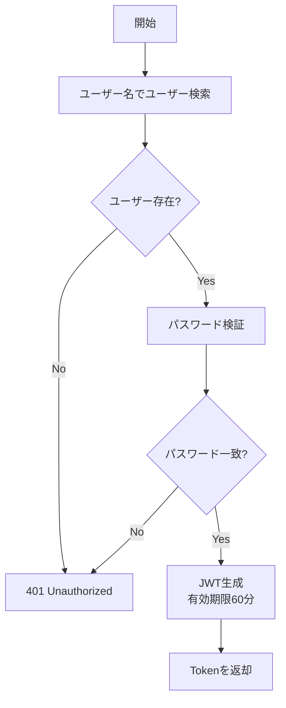
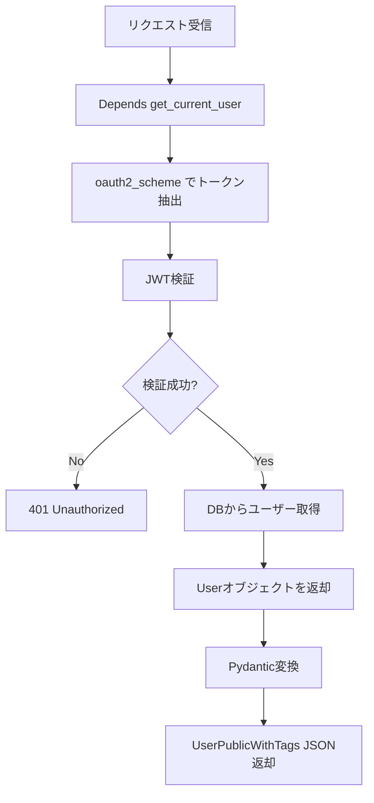

# ルーター層関数リファレンス


---

## app/routers/auth.py

認証APIエンドポイント。

### verify_password

**説明**: 平文パスワードとハッシュ化パスワードを比較する。

**シグネチャ**:
```python
def verify_password(plain_password: str, hashed_password: str) -> bool
```

**引数**:

| 引数 | 型 | 説明 |
|-----|-----|------|
| plain_password | str | 平文パスワード |
| hashed_password | str | bcryptハッシュ化パスワード |

**戻り値**:
- `bool`: パスワードが一致する場合`True`

**実装**:
```python
pwd_context = CryptContext(schemes=["bcrypt"], deprecated="auto")

def verify_password(plain_password: str, hashed_password: str) -> bool:
    return pwd_context.verify(plain_password, hashed_password)
```

---

### create_access_token

**説明**: JWTアクセストークンを生成する。

**シグネチャ**:
```python
def create_access_token(
    data: dict,
    expires_delta: timedelta | None = None
) -> str
```

**引数**:

| 引数 | 型 | 説明 |
|-----|-----|------|
| data | dict | JWTペイロードに含めるデータ（通常は`{"sub": username}`） |
| expires_delta | timedelta \ None | 有効期限（Noneの場合は15分） |

**戻り値**:
- `str`: JWT文字列

**実装**:
```python
to_encode = data.copy()
if expires_delta:
    expire = datetime.utcnow() + expires_delta
else:
    expire = datetime.utcnow() + timedelta(minutes=15)
to_encode.update({"exp": expire})
encoded_jwt = jwt.encode(
    to_encode,
    settings.SECRET_KEY,
    algorithm=settings.ALGORITHM
)
return encoded_jwt
```

**使用例**:
```python
token = create_access_token(
    data={"sub": "student01"},
    expires_delta=timedelta(minutes=60)
)
# => "eyJhbGciOiJIUzI1NiIsInR5cCI6IkpXVCJ9..."
```

---

### signup エンドポイント

**説明**: ユーザー登録エンドポイント。

**シグネチャ**:
```python
@router.post("/signup", response_model=UserPublic, status_code=201)
def signup(
    user_data: UserCreate,
    db: Session = Depends(get_session)
)
```

**パス**: `POST /auth/signup`

**引数**:

| 引数 | 型 | 説明 |
|-----|-----|------|
| user_data | UserCreate | ユーザー登録情報（Pydantic） |
| db | Session | データベースセッション（依存性注入） |

**レスポンス**:
- `UserPublic` (201 Created): 作成されたユーザー情報

**エラー**:
- `400 Bad Request`: ユーザー名またはメールが既に登録済み
- `422 Unprocessable Entity`: バリデーションエラー

**処理フロー**:
1. ユーザー名の重複チェック
2. メールアドレスの重複チェック
3. `create_user`呼び出し（v3ロジックで`gakuseki_bango`自動生成）
4. 作成されたユーザーを返却

**実装詳細**:
```python
# ユーザー名の重複チェック
existing_user = get_user_by_username(db, user_data.username)
if existing_user:
    raise HTTPException(
        status_code=status.HTTP_400_BAD_REQUEST,
        detail="Username already registered"
    )

# メールアドレスの重複チェック
existing_email = get_user_by_email(db, user_data.email)
if existing_email:
    raise HTTPException(
        status_code=status.HTTP_400_BAD_REQUEST,
        detail="Email already registered"
    )

try:
    db_user = create_user(db, user_data)
    return db_user
except IntegrityError as e:
    db.rollback()
    raise HTTPException(
        status_code=status.HTTP_400_BAD_REQUEST,
        detail=f"Database integrity error: {str(e)}"
    )
```

**使用例（curl）**:
```bash
curl -X POST http://localhost:8000/auth/signup \
  -H "Content-Type: application/json" \
  -d '{
    "username": "student01",
    "email": "student01@example.com",
    "password": "securepass123",
    "kategori": "学生",
    "gakuseki_bango": "S12345678",
    "faculty": "情報学部"
  }'
```

---

### login エンドポイント

**説明**: ログインエンドポイント。JWTトークンを発行する。

**シグネチャ**:
```python
@router.post("/token", response_model=Token)
def login(
    form_data: OAuth2PasswordRequestForm = Depends(),
    db: Session = Depends(get_session)
)
```

**パス**: `POST /auth/token`

**引数**:

| 引数 | 型 | 説明 |
|-----|-----|------|
| form_data | OAuth2PasswordRequestForm | ログイン情報（username, password） |
| db | Session | データベースセッション（依存性注入） |

**レスポンス**:
- `Token` (200 OK): `{"access_token": "...", "token_type": "bearer"}`

**エラー**:
- `401 Unauthorized`: ユーザー名またはパスワードが不正

**処理フロー**:


**実装詳細**:
```python
# ユーザー認証
user = get_user_by_username(db, form_data.username)
if not user:
    raise HTTPException(
        status_code=status.HTTP_401_UNAUTHORIZED,
        detail="Incorrect username or password",
        headers={"WWW-Authenticate": "Bearer"},
    )

# パスワード検証
if not verify_password(form_data.password, user.hashed_password):
    raise HTTPException(
        status_code=status.HTTP_401_UNAUTHORIZED,
        detail="Incorrect username or password",
        headers={"WWW-Authenticate": "Bearer"},
    )

# アクセストークン生成
access_token_expires = timedelta(minutes=settings.ACCESS_TOKEN_EXPIRE_MINUTES)
access_token = create_access_token(
    data={"sub": user.username},
    expires_delta=access_token_expires
)

return Token(access_token=access_token, token_type="bearer")
```

**使用例（curl）**:
```bash
curl -X POST http://localhost:8000/auth/token \
  -H "Content-Type: application/x-www-form-urlencoded" \
  -d "username=student01&password=securepass123"
```

**レスポンス例**:
```json
{
  "access_token": "eyJhbGciOiJIUzI1NiIsInR5cCI6IkpXVCJ9.eyJzdWIiOiJzdHVkZW50MDEiLCJleHAiOjE3MzY0MjUyMDB9.signature",
  "token_type": "bearer"
}
```

---

## app/routers/users.py

ユーザーAPIエンドポイント。

### get_current_user_info エンドポイント

**説明**: 現在のユーザー情報とタグ情報を取得する。

**シグネチャ**:
```python
@router.get("/me", response_model=UserPublicWithTags)
async def get_current_user_info(
    current_user: User = Depends(get_current_user)
)
```

**パス**: `GET /users/me`

**引数**:

| 引数 | 型 | 説明 |
|-----|-----|------|
| current_user | User | 認証済みユーザー（依存性注入） |

**レスポンス**:
- `UserPublicWithTags` (200 OK): ユーザー情報（タグ含む）

**エラー**:
- `401 Unauthorized`: トークンが無効

**処理フロー**:


**実装のポイント**:
- `current_user`は既にSQLAlchemyモデル
- `UserPublicWithTags`の`from_attributes=True`により、ORM → Pydantic変換が自動
- タグ情報は`User.tags`リレーションシップで取得済み

**使用例（curl）**:
```bash
export TOKEN="eyJhbGciOiJIUzI1NiIsInR5cCI6IkpXVCJ9..."

curl -X GET http://localhost:8000/users/me \
  -H "Authorization: Bearer $TOKEN"
```

**レスポンス例**:
```json
{
  "id": "3fa85f64-5717-4562-b3fc-2c963f66afa6",
  "username": "student01",
  "email": "student01@example.com",
  "kategori": "学生",
  "gakuseki_bango": "S12345678",
  "faculty": "情報学部",
  "icon_path": null,
  "tags": [
    {
      "id": 1,
      "name": "プログラミング初心者",
      "creator_id": "3fa85f64-5717-4562-b3fc-2c963f66afa6"
    }
  ]
}
```

**依存性注入の流れ**:

```python
# 1. oauth2_scheme がトークン抽出
token = "eyJhbGciOiJIUzI1NiIsInR5cCI6IkpXVCJ9..."

# 2. get_current_user がトークン検証 + ユーザー取得
user = get_current_user(token, db)

# 3. エンドポイントがユーザー返却
return user
```

**エラーハンドリング**:

```python
# トークンなし
# => 401 Unauthorized: Not authenticated

# トークン無効
# => 401 Unauthorized: Could not validate credentials

# ユーザー削除済み
# => 401 Unauthorized: Could not validate credentials
```

---

## 今後の拡張予定

Phase 2以降で実装予定の関数:

### app/routers/users.py

- `update_user`: ユーザー情報更新
- `upload_icon`: アイコン画像アップロード
- `get_user_by_id`: 他ユーザーの公開情報取得
- `search_users`: ユーザー検索

### app/routers/tags.py

- `create_tag`: タグ作成
- `assign_tag`: タグ割り当て
- `unassign_tag`: タグ削除
- `list_tags`: タグ一覧取得

### app/routers/wiki.py

- `create_wiki_page`: Wikiページ作成
- `update_wiki_page`: Wikiページ更新
- `share_wiki_page`: Wiki権限設定
- `unshare_wiki_page`: Wiki権限削除

### app/routers/search.py

- `search_all`: 横断検索（ユーザー、メッセージ、Wiki、ファイル）
