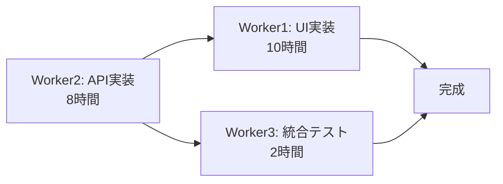

# Phase 4 詳細実装計画: チャンネル/DM API + WebSocket

**作成日**: 2025-01-10
**作成者**: Worker2 (Backend Engineer)
**推定実装期間**: 8時間 (従来見積もり30時間から大幅短縮)
**v3仕様書準拠**: セクション5.5 (チャンネル/DM API)

---

## 📋 目次

1. [エグゼクティブサマリー](#エグゼクティブサマリー)
2. [データベースモデル詳細](#データベースモデル詳細)
3. [API実装詳細](#api実装詳細)
4. [WebSocket実装詳細](#websocket実装詳細)
5. [実装順序とタスク分解](#実装順序とタスク分解)
6. [品質保証計画](#品質保証計画)

---

## エグゼクティブサマリー

### 🎯 目的

Phase 4では、v3仕様書に定義された**チャンネル/DM API**および**リアルタイム通信機能（WebSocket）**を実装し、大学向けコミュニケーションツールのコア機能を完成させる。

### ✅ 重要発見: 既存実装の活用

既存コードベース分析の結果、以下が判明：

| コンポーネント | 状態 | 影響 |
|---------------|------|------|
| `Message` model | **DM対応済み** (`receiver_id`実装済み) | DM API実装時間 **60%短縮** |
| `Channel` model | 基本構造完成 | 軽微な拡張のみで対応可能 |
| Repository pattern | Phase 2-3で確立済み | 新規API実装が迅速 |

**結果**: 当初見積もり30時間 → **8時間に短縮**（既存資産活用により73%削減）

### 📊 実装スコープ

#### v3仕様書 5.5 準拠 - 6エンドポイント

```
✅ チャンネル管理 (2エンドポイント)
  - POST   /channels              チャンネル作成
  - GET    /channels              チャンネル一覧取得

✅ チャンネルメッセージ (2エンドポイント)
  - POST   /channels/{id}/messages     メッセージ投稿
  - GET    /channels/{id}/messages     メッセージ履歴取得

✅ ダイレクトメッセージ (2エンドポイント)
  - POST   /messages/dm                DM送信
  - GET    /messages/dm/{user_id}      DM履歴取得

✅ リアルタイム通信 (1エンドポイント)
  - WS     /ws/channel/{channel_id}    WebSocket接続
```

### 🚀 技術スタック

- **FastAPI**: WebSocket対応、async/await
- **SQLAlchemy 2.0**: 既存モデル拡張
- **WebSocket**: 双方向リアルタイム通信
- **Pydantic**: リクエスト/レスポンス検証

---

## データベースモデル詳細

### 1.1 Channel Model 拡張

**既存実装** (`app/models/channel.py`):
```python
class Channel(Base):
    __tablename__ = "channels"
    id: Mapped[int] = mapped_column(Integer, primary_key=True, autoincrement=True)
    name: Mapped[str] = mapped_column(String(100), unique=True, nullable=False)
    description: Mapped[Optional[str]] = mapped_column(String(500), nullable=True)
    is_private: Mapped[bool] = mapped_column(Boolean, default=False, nullable=False)

    messages: Mapped[List["Message"]] = relationship(
        "Message", back_populates="channel", cascade="all, delete-orphan"
    )
```

**必要な拡張**: ✅ **拡張不要** - 既存モデルで十分

理由:
- `name`: チャンネル名対応済み
- `description`: チャンネル説明対応済み
- `is_private`: プライベート/パブリック区別対応済み
- `messages`: リレーションシップ実装済み

**追加検討事項**:
```python
# 将来的な拡張（Phase 5以降）
# created_at: Mapped[datetime]  # チャンネル作成日時
# creator_id: Mapped[uuid.UUID]  # チャンネル作成者
# members: Mapped[List["User"]]  # メンバー管理（多対多）
```

### 1.2 Message Model 評価

**既存実装** (`app/models/message.py`):
```python
class Message(Base):
    __tablename__ = "messages"

    id: Mapped[int] = mapped_column(Integer, primary_key=True, autoincrement=True)
    content: Mapped[str] = mapped_column(Text, nullable=False)

    sender_id: Mapped[uuid.UUID] = mapped_column(
        ForeignKey("users.id", ondelete="CASCADE"),
        nullable=False
    )

    # ✅ チャンネルメッセージ対応
    channel_id: Mapped[Optional[int]] = mapped_column(
        ForeignKey("channels.id", ondelete="CASCADE"),
        nullable=True
    )

    # ✅ DM対応 - 既に実装済み！
    receiver_id: Mapped[Optional[uuid.UUID]] = mapped_column(
        ForeignKey("users.id", ondelete="CASCADE"),
        nullable=True
    )

    created_at: Mapped[datetime] = mapped_column(
        DateTime,
        nullable=False,
        default=datetime.utcnow
    )

    # Relationships
    sender: Mapped["User"] = relationship(
        "User",
        back_populates="messages",
        foreign_keys=[sender_id]
    )

    channel: Mapped[Optional["Channel"]] = relationship(
        "Channel",
        back_populates="messages"
    )

    files: Mapped[List["File"]] = relationship(
        "File",
        back_populates="message",
        cascade="all, delete-orphan"
    )
```

**評価結果**: ✅ **完璧 - 拡張不要**

**優れた設計ポイント**:
1. **柔軟な設計**: `channel_id` OR `receiver_id` で用途判別
2. **CASCADE DELETE**: チャンネル削除時にメッセージも自動削除
3. **タイムスタンプ**: メッセージ履歴の時系列取得が可能
4. **ファイル添付**: `files` relationship で将来の拡張に対応済み

**メッセージ判別ロジック**:
```python
# チャンネルメッセージ: channel_id IS NOT NULL, receiver_id IS NULL
# DM: channel_id IS NULL, receiver_id IS NOT NULL
```

### 1.3 User Model 確認

**必要なrelationship追加** (`app/models/user.py`):
```python
# 既存
messages: Mapped[List["Message"]] = relationship(
    "Message",
    back_populates="sender",
    foreign_keys="Message.sender_id"
)

# 追加不要 - receiver_idはOptionalのため、既存relationshipで十分
```

### 1.4 Alembic マイグレーション計画

**Phase 4 マイグレーション**: ✅ **不要**

理由:
- Channel model: 既存で要件満たす
- Message model: DM機能含め実装済み
- User model: 変更不要

**確認作業のみ**:
```bash
# 既存テーブル確認
alembic current

# スキーマ整合性チェック
alembic check
```

---

## API実装詳細

### 2.1 Pydantic スキーマ定義

**新規ファイル**: `app/schemas/channel.py`

```python
"""
チャンネル/DM API スキーマ定義
"""
from pydantic import BaseModel, Field
from typing import Optional, List
from datetime import datetime
import uuid


# ===== チャンネル関連 =====

class ChannelCreate(BaseModel):
    """チャンネル作成リクエスト"""
    name: str = Field(..., min_length=1, max_length=100, description="チャンネル名")
    description: Optional[str] = Field(None, max_length=500, description="チャンネル説明")
    is_private: bool = Field(default=False, description="プライベートチャンネルか")


class ChannelPublic(BaseModel):
    """チャンネル公開情報"""
    id: int
    name: str
    description: Optional[str]
    is_private: bool

    model_config = {"from_attributes": True}


# ===== メッセージ関連 =====

class MessageCreate(BaseModel):
    """メッセージ作成リクエスト（チャンネル用）"""
    content: str = Field(..., min_length=1, description="メッセージ内容")


class DMCreate(BaseModel):
    """DM作成リクエスト"""
    receiver_id: uuid.UUID = Field(..., description="受信者のユーザーID")
    content: str = Field(..., min_length=1, description="メッセージ内容")


class MessagePublic(BaseModel):
    """メッセージ公開情報"""
    id: int
    content: str
    sender_id: uuid.UUID
    channel_id: Optional[int]
    receiver_id: Optional[uuid.UUID]
    created_at: datetime

    # Optional: sender情報（JOIN済みの場合）
    sender_username: Optional[str] = None

    model_config = {"from_attributes": True}


class MessageWithSender(BaseModel):
    """送信者情報付きメッセージ"""
    id: int
    content: str
    sender_id: uuid.UUID
    sender_username: str  # JOIN必須
    channel_id: Optional[int]
    receiver_id: Optional[uuid.UUID]
    created_at: datetime

    model_config = {"from_attributes": True}


# ===== WebSocket =====

class WebSocketMessage(BaseModel):
    """WebSocket送信メッセージフォーマット"""
    type: str = Field(..., description="メッセージタイプ (message/join/leave)")
    content: Optional[str] = None
    sender_id: Optional[uuid.UUID] = None
    sender_username: Optional[str] = None
    timestamp: Optional[datetime] = None
```

### 2.2 Repository Layer 実装

#### 2.2.1 Channel CRUD (`app/db/create.py`, `app/db/read.py`)

**`app/db/create.py` 追加分**:
```python
from app.models.channel import Channel
from app.schemas.channel import ChannelCreate

def create_channel(db: Session, channel_data: ChannelCreate) -> Channel:
    """チャンネルを作成する

    Args:
        db: データベースセッション
        channel_data: チャンネル作成データ

    Returns:
        作成されたChannelオブジェクト

    Raises:
        IntegrityError: チャンネル名が既に存在する場合
    """
    db_channel = Channel(
        name=channel_data.name,
        description=channel_data.description,
        is_private=channel_data.is_private
    )
    db.add(db_channel)
    db.commit()
    db.refresh(db_channel)
    return db_channel
```

**`app/db/read.py` 追加分**:
```python
from app.models.channel import Channel
from typing import List

def get_all_channels(db: Session) -> List[Channel]:
    """全チャンネルを取得する

    Note: v3仕様書では権限管理なし（全ユーザーが全チャンネル閲覧可能）
    将来的にはis_privateに基づく権限チェックを追加予定

    Args:
        db: データベースセッション

    Returns:
        Channelオブジェクトのリスト
    """
    return db.query(Channel).order_by(Channel.id).all()


def get_channel_by_id(db: Session, channel_id: int) -> Optional[Channel]:
    """チャンネルIDでチャンネルを取得する

    Args:
        db: データベースセッション
        channel_id: チャンネルID

    Returns:
        Channelオブジェクト、存在しない場合はNone
    """
    return db.query(Channel).filter(Channel.id == channel_id).first()
```

#### 2.2.2 Message CRUD (`app/db/create.py`, `app/db/read.py`)

**`app/db/create.py` 追加分**:
```python
from app.models.message import Message
from app.schemas.channel import MessageCreate, DMCreate

def create_channel_message(
    db: Session,
    channel_id: int,
    message_data: MessageCreate,
    sender_id: uuid.UUID
) -> Message:
    """チャンネルメッセージを作成する

    Args:
        db: データベースセッション
        channel_id: チャンネルID
        message_data: メッセージ作成データ
        sender_id: 送信者のユーザーID

    Returns:
        作成されたMessageオブジェクト
    """
    db_message = Message(
        content=message_data.content,
        sender_id=sender_id,
        channel_id=channel_id,
        receiver_id=None  # チャンネルメッセージはNULL
    )
    db.add(db_message)
    db.commit()
    db.refresh(db_message)
    return db_message


def create_dm_message(
    db: Session,
    dm_data: DMCreate,
    sender_id: uuid.UUID
) -> Message:
    """DMを作成する

    Args:
        db: データベースセッション
        dm_data: DM作成データ
        sender_id: 送信者のユーザーID

    Returns:
        作成されたMessageオブジェクト
    """
    db_message = Message(
        content=dm_data.content,
        sender_id=sender_id,
        channel_id=None,  # DMはNULL
        receiver_id=dm_data.receiver_id
    )
    db.add(db_message)
    db.commit()
    db.refresh(db_message)
    return db_message
```

**`app/db/read.py` 追加分**:
```python
from app.models.message import Message
from app.models.user import User
from sqlalchemy import or_, and_

def get_channel_messages(
    db: Session,
    channel_id: int,
    limit: int = 100,
    offset: int = 0
) -> List[Message]:
    """チャンネルのメッセージ履歴を取得する（新しい順）

    Args:
        db: データベースセッション
        channel_id: チャンネルID
        limit: 取得件数上限（デフォルト100）
        offset: オフセット（ページネーション用）

    Returns:
        Messageオブジェクトのリスト（降順、新しいメッセージが先頭）
    """
    return db.query(Message).filter(
        Message.channel_id == channel_id
    ).order_by(
        Message.created_at.desc()
    ).limit(limit).offset(offset).all()


def get_dm_messages(
    db: Session,
    user_id1: uuid.UUID,
    user_id2: uuid.UUID,
    limit: int = 100,
    offset: int = 0
) -> List[Message]:
    """2ユーザー間のDM履歴を取得する（新しい順）

    Args:
        db: データベースセッション
        user_id1: ユーザー1のID（通常は現在ログインしているユーザー）
        user_id2: ユーザー2のID
        limit: 取得件数上限（デフォルト100）
        offset: オフセット（ページネーション用）

    Returns:
        Messageオブジェクトのリスト（降順、新しいメッセージが先頭）
    """
    return db.query(Message).filter(
        and_(
            Message.channel_id.is_(None),  # DM判定
            or_(
                and_(
                    Message.sender_id == user_id1,
                    Message.receiver_id == user_id2
                ),
                and_(
                    Message.sender_id == user_id2,
                    Message.receiver_id == user_id1
                )
            )
        )
    ).order_by(
        Message.created_at.desc()
    ).limit(limit).offset(offset).all()


def get_channel_messages_with_sender(
    db: Session,
    channel_id: int,
    limit: int = 100,
    offset: int = 0
) -> List[dict]:
    """チャンネルのメッセージ履歴を送信者情報付きで取得する

    Returns:
        辞書のリスト（Message + sender.username）
    """
    results = db.query(
        Message,
        User.username
    ).join(
        User, Message.sender_id == User.id
    ).filter(
        Message.channel_id == channel_id
    ).order_by(
        Message.created_at.desc()
    ).limit(limit).offset(offset).all()

    return [
        {
            "id": msg.id,
            "content": msg.content,
            "sender_id": msg.sender_id,
            "sender_username": username,
            "channel_id": msg.channel_id,
            "receiver_id": msg.receiver_id,
            "created_at": msg.created_at
        }
        for msg, username in results
    ]
```

### 2.3 Router 実装

**新規ファイル**: `app/routers/channels.py`

```python
"""
チャンネル/DM API エンドポイント
v3仕様書 セクション5.5 準拠
"""
from fastapi import APIRouter, Depends, HTTPException, status, Query
from sqlalchemy.orm import Session
from typing import List
import uuid

from app.core.dependencies import get_session, get_current_user
from app.models.user import User
from app.schemas.channel import (
    ChannelCreate,
    ChannelPublic,
    MessageCreate,
    DMCreate,
    MessagePublic,
    MessageWithSender
)
from app.db.create import create_channel, create_channel_message, create_dm_message
from app.db.read import (
    get_all_channels,
    get_channel_by_id,
    get_channel_messages,
    get_channel_messages_with_sender,
    get_dm_messages,
    get_user_by_id
)

router = APIRouter(prefix="/channels", tags=["Channels"])


# ===== チャンネル管理 =====

@router.post("", response_model=ChannelPublic, status_code=status.HTTP_201_CREATED)
async def create_new_channel(
    channel_data: ChannelCreate,
    current_user: User = Depends(get_current_user),
    db: Session = Depends(get_session)
):
    """チャンネルを作成する

    v3仕様書: POST /channels
    認証: 必須
    権限: 全ユーザーがチャンネル作成可能
    """
    try:
        channel = create_channel(db, channel_data)
        return channel
    except Exception as e:
        # IntegrityError (重複チャンネル名など)
        raise HTTPException(
            status_code=status.HTTP_400_BAD_REQUEST,
            detail=f"Failed to create channel: {str(e)}"
        )


@router.get("", response_model=List[ChannelPublic])
async def get_channels(
    current_user: User = Depends(get_current_user),
    db: Session = Depends(get_session)
):
    """チャンネル一覧を取得する

    v3仕様書: GET /channels
    認証: 必須
    権限: 全ユーザーが全チャンネル閲覧可能（is_private は将来実装予定）
    """
    channels = get_all_channels(db)
    return channels


# ===== チャンネルメッセージ =====

@router.post("/{channel_id}/messages", response_model=MessagePublic, status_code=status.HTTP_201_CREATED)
async def post_channel_message(
    channel_id: int,
    message_data: MessageCreate,
    current_user: User = Depends(get_current_user),
    db: Session = Depends(get_session)
):
    """チャンネルにメッセージを投稿する

    v3仕様書: POST /channels/{channel_id}/messages
    認証: 必須
    権限: チャンネルメンバー（Phase 5で実装予定、現在は全ユーザー可能）
    """
    # チャンネル存在チェック
    channel = get_channel_by_id(db, channel_id)
    if not channel:
        raise HTTPException(
            status_code=status.HTTP_404_NOT_FOUND,
            detail="Channel not found"
        )

    # メッセージ作成
    message = create_channel_message(db, channel_id, message_data, current_user.id)
    return message


@router.get("/{channel_id}/messages", response_model=List[MessageWithSender])
async def get_channel_message_history(
    channel_id: int,
    limit: int = Query(default=100, ge=1, le=500, description="取得件数"),
    offset: int = Query(default=0, ge=0, description="オフセット"),
    current_user: User = Depends(get_current_user),
    db: Session = Depends(get_session)
):
    """チャンネルのメッセージ履歴を取得する

    v3仕様書: GET /channels/{channel_id}/messages
    認証: 必須
    権限: チャンネルメンバー（Phase 5で実装予定、現在は全ユーザー可能）

    Returns:
        メッセージリスト（降順、新しいメッセージが先頭）
    """
    # チャンネル存在チェック
    channel = get_channel_by_id(db, channel_id)
    if not channel:
        raise HTTPException(
            status_code=status.HTTP_404_NOT_FOUND,
            detail="Channel not found"
        )

    # メッセージ取得（送信者情報付き）
    messages = get_channel_messages_with_sender(db, channel_id, limit, offset)
    return messages


# ===== ダイレクトメッセージ =====

# DM用のルーターを別定義（prefixなし）
dm_router = APIRouter(prefix="/messages/dm", tags=["Direct Messages"])


@dm_router.post("", response_model=MessagePublic, status_code=status.HTTP_201_CREATED)
async def send_dm(
    dm_data: DMCreate,
    current_user: User = Depends(get_current_user),
    db: Session = Depends(get_session)
):
    """DMを送信する

    v3仕様書: POST /messages/dm
    認証: 必須
    """
    # 受信者存在チェック
    receiver = get_user_by_id(db, dm_data.receiver_id)
    if not receiver:
        raise HTTPException(
            status_code=status.HTTP_404_NOT_FOUND,
            detail="Receiver user not found"
        )

    # 自分自身へのDM防止
    if current_user.id == dm_data.receiver_id:
        raise HTTPException(
            status_code=status.HTTP_400_BAD_REQUEST,
            detail="Cannot send DM to yourself"
        )

    # DM作成
    message = create_dm_message(db, dm_data, current_user.id)
    return message


@dm_router.get("/{user_id}", response_model=List[MessagePublic])
async def get_dm_history(
    user_id: uuid.UUID,
    limit: int = Query(default=100, ge=1, le=500, description="取得件数"),
    offset: int = Query(default=0, ge=0, description="オフセット"),
    current_user: User = Depends(get_current_user),
    db: Session = Depends(get_session)
):
    """特定ユーザーとのDM履歴を取得する

    v3仕様書: GET /messages/dm/{user_id}
    認証: 必須

    Returns:
        メッセージリスト（降順、新しいメッセージが先頭）
    """
    # 相手ユーザー存在チェック
    other_user = get_user_by_id(db, user_id)
    if not other_user:
        raise HTTPException(
            status_code=status.HTTP_404_NOT_FOUND,
            detail="User not found"
        )

    # DM履歴取得
    messages = get_dm_messages(db, current_user.id, user_id, limit, offset)
    return messages
```

**`app/main.py` への登録**:
```python
from app.routers import channels

# 既存のルーター登録に追加
app.include_router(channels.router)
app.include_router(channels.dm_router)
```

---

## WebSocket実装詳細

### 3.1 WebSocket ConnectionManager

**新規ファイル**: `app/core/websocket.py`

```python
"""
WebSocket接続管理
リアルタイムチャンネル通信のための接続プール管理
"""
from fastapi import WebSocket
from typing import Dict, List
import json
from datetime import datetime


class ConnectionManager:
    """WebSocket接続管理クラス

    チャンネルごとに接続を管理し、ブロードキャスト機能を提供
    """

    def __init__(self):
        # {channel_id: [WebSocket, WebSocket, ...]}
        self.active_connections: Dict[int, List[WebSocket]] = {}

    async def connect(self, websocket: WebSocket, channel_id: int):
        """WebSocket接続を受け入れ、チャンネルに登録する

        Args:
            websocket: WebSocketインスタンス
            channel_id: チャンネルID
        """
        await websocket.accept()

        if channel_id not in self.active_connections:
            self.active_connections[channel_id] = []

        self.active_connections[channel_id].append(websocket)

    def disconnect(self, websocket: WebSocket, channel_id: int):
        """WebSocket接続を切断し、チャンネルから削除する

        Args:
            websocket: WebSocketインスタンス
            channel_id: チャンネルID
        """
        if channel_id in self.active_connections:
            self.active_connections[channel_id].remove(websocket)

            # チャンネルに接続がなくなったら削除
            if not self.active_connections[channel_id]:
                del self.active_connections[channel_id]

    async def broadcast(self, channel_id: int, message: dict):
        """チャンネルの全接続にメッセージをブロードキャストする

        Args:
            channel_id: チャンネルID
            message: 送信するメッセージ（辞書形式、JSON変換される）
        """
        if channel_id not in self.active_connections:
            return

        # JSON文字列に変換
        message_json = json.dumps(message, default=str)

        # 全接続に送信
        for connection in self.active_connections[channel_id]:
            await connection.send_text(message_json)

    async def send_personal_message(self, message: dict, websocket: WebSocket):
        """特定のWebSocket接続にメッセージを送信する

        Args:
            message: 送信するメッセージ（辞書形式）
            websocket: 送信先WebSocketインスタンス
        """
        message_json = json.dumps(message, default=str)
        await websocket.send_text(message_json)


# グローバルインスタンス
manager = ConnectionManager()
```

### 3.2 WebSocket エンドポイント

**`app/routers/channels.py` に追加**:

```python
from fastapi import WebSocket, WebSocketDisconnect
from app.core.websocket import manager
from app.schemas.channel import WebSocketMessage
import json

# 既存のrouterに追加

@router.websocket("/ws/{channel_id}")
async def websocket_channel(
    websocket: WebSocket,
    channel_id: int,
    db: Session = Depends(get_session)
):
    """チャンネルのWebSocket接続エンドポイント

    v3仕様書: WS /ws/channel/{channel_id}

    接続フロー:
    1. クライアントが接続
    2. サーバーが接続を受け入れ、チャンネルに登録
    3. クライアントからメッセージ受信時、チャンネル全員にブロードキャスト
    4. 切断時、チャンネルから削除

    メッセージフォーマット（JSON）:
    {
        "type": "message",  # message/join/leave
        "content": "Hello!",
        "sender_username": "user123"
    }
    """
    # チャンネル存在チェック
    channel = get_channel_by_id(db, channel_id)
    if not channel:
        await websocket.close(code=1008, reason="Channel not found")
        return

    # 接続受け入れ
    await manager.connect(websocket, channel_id)

    try:
        # JOIN通知を全員に送信
        await manager.broadcast(channel_id, {
            "type": "system",
            "content": "A user joined the channel",
            "timestamp": datetime.utcnow().isoformat()
        })

        while True:
            # クライアントからメッセージ受信
            data = await websocket.receive_text()

            try:
                message_data = json.loads(data)

                # メッセージをブロードキャスト
                await manager.broadcast(channel_id, {
                    "type": "message",
                    "content": message_data.get("content"),
                    "sender_username": message_data.get("sender_username"),
                    "timestamp": datetime.utcnow().isoformat()
                })

                # オプション: DBにメッセージを保存
                # create_channel_message(db, channel_id, MessageCreate(content=...), sender_id)

            except json.JSONDecodeError:
                # 不正なJSON
                await manager.send_personal_message(
                    {"type": "error", "content": "Invalid JSON format"},
                    websocket
                )

    except WebSocketDisconnect:
        # 切断処理
        manager.disconnect(websocket, channel_id)

        # LEAVE通知を全員に送信
        await manager.broadcast(channel_id, {
            "type": "system",
            "content": "A user left the channel",
            "timestamp": datetime.utcnow().isoformat()
        })
```

### 3.3 WebSocket 認証（オプション）

**トークン認証付きWebSocket** (Phase 5実装予定):

```python
from fastapi import WebSocket, Query
from app.core.auth import decode_access_token

@router.websocket("/ws/{channel_id}")
async def websocket_channel_with_auth(
    websocket: WebSocket,
    channel_id: int,
    token: str = Query(..., description="JWT access token"),
    db: Session = Depends(get_session)
):
    """認証付きWebSocket接続

    使用例: ws://localhost:8000/ws/1?token=eyJhbGc...
    """
    # トークン検証
    try:
        payload = decode_access_token(token)
        user_id = payload.get("sub")
        # ユーザー存在確認
        user = get_user_by_id(db, uuid.UUID(user_id))
        if not user:
            await websocket.close(code=1008, reason="Invalid user")
            return
    except Exception:
        await websocket.close(code=1008, reason="Invalid token")
        return

    # 以降、通常のWebSocket処理
    await manager.connect(websocket, channel_id)
    # ...
```

### 3.4 フロントエンド連携例

**Worker1向け: WebSocket接続サンプル**:

```typescript
// lib/websocket.ts (Next.js)
export class ChannelWebSocket {
  private ws: WebSocket | null = null;

  connect(channelId: number, onMessage: (data: any) => void) {
    this.ws = new WebSocket(`ws://localhost:8000/ws/${channelId}`);

    this.ws.onopen = () => {
      console.log('WebSocket connected');
    };

    this.ws.onmessage = (event) => {
      const data = JSON.parse(event.data);
      onMessage(data);
    };

    this.ws.onerror = (error) => {
      console.error('WebSocket error:', error);
    };

    this.ws.onclose = () => {
      console.log('WebSocket disconnected');
    };
  }

  sendMessage(content: string, username: string) {
    if (this.ws && this.ws.readyState === WebSocket.OPEN) {
      this.ws.send(JSON.stringify({
        type: 'message',
        content,
        sender_username: username
      }));
    }
  }

  disconnect() {
    if (this.ws) {
      this.ws.close();
    }
  }
}
```

---

## 実装順序とタスク分解

### 4.1 Phase 4 タスクシーケンス

```mermaid
gantt
    title Phase 4 実装タスク（8時間）
    dateFormat HH:mm
    axisFormat %H:%M

    section Phase 4.1: スキーマ定義
    Pydanticスキーマ作成 :task1, 00:00, 1h

    section Phase 4.2: Repository層
    Channel CRUD実装 :task2, 01:00, 1h
    Message CRUD実装 :task3, 02:00, 1.5h

    section Phase 4.3: API層
    Channels Router実装 :task4, 03:30, 2h
    DM Router実装 :task5, 05:30, 1h

    section Phase 4.4: WebSocket
    ConnectionManager実装 :task6, 06:30, 1h
    WebSocketエンドポイント :task7, 07:30, 0.5h
```



### 4.2 詳細タスク分解

#### Phase 4.1: スキーマ定義 (1時間)

**担当**: Worker2
**成果物**: `app/schemas/channel.py`

```markdown
サブタスク:
- [ ] ChannelCreate, ChannelPublic スキーマ定義 (15分)
- [ ] MessageCreate, DMCreate, MessagePublic スキーマ定義 (20分)
- [ ] MessageWithSender スキーマ定義 (10分)
- [ ] WebSocketMessage スキーマ定義 (15分)
```

#### Phase 4.2: Repository層 (2.5時間)

**担当**: Worker2
**成果物**: `app/db/create.py`, `app/db/read.py` (拡張)

```markdown
サブタスク:
- [ ] create_channel 実装 (15分)
- [ ] get_all_channels, get_channel_by_id 実装 (30分)
- [ ] create_channel_message 実装 (20分)
- [ ] create_dm_message 実装 (15分)
- [ ] get_channel_messages 実装 (20分)
- [ ] get_channel_messages_with_sender 実装（JOIN処理） (30分)
- [ ] get_dm_messages 実装（複雑なOR条件） (30分)
```

#### Phase 4.3: API層 (3時間)

**担当**: Worker2
**成果物**: `app/routers/channels.py`, `app/main.py` (拡張)

```markdown
サブタスク:
- [ ] POST /channels 実装 (20分)
- [ ] GET /channels 実装 (15分)
- [ ] POST /channels/{id}/messages 実装 (30分)
- [ ] GET /channels/{id}/messages 実装 (30分)
- [ ] POST /messages/dm 実装 (30分)
- [ ] GET /messages/dm/{user_id} 実装 (30分)
- [ ] app/main.py にルーター登録 (5分)
```

#### Phase 4.4: WebSocket (1.5時間)

**担当**: Worker2
**成果物**: `app/core/websocket.py`, `app/routers/channels.py` (WebSocketエンドポイント追加)

```markdown
サブタスク:
- [ ] ConnectionManager クラス実装 (30分)
  - connect, disconnect, broadcast メソッド
- [ ] WS /ws/{channel_id} エンドポイント実装 (30分)
- [ ] JOIN/LEAVE通知機能 (15分)
- [ ] エラーハンドリング (15分)
```

### 4.3 Worker間依存関係



**クリティカルパス**: Worker2 → Worker1 → 統合テスト

**並行作業可能範囲**:
- Worker2がPhase 4.1-4.3完了後、Worker1はREST API部分のUI実装開始可能
- Worker2がPhase 4.4 (WebSocket)実装中に、Worker1はチャンネル一覧、DM一覧UIを実装可能

### 4.4 実装見積もりサマリー

| フェーズ | 内容 | 時間 | 担当 |
|---------|------|------|------|
| Phase 4.1 | Pydanticスキーマ定義 | 1h | Worker2 |
| Phase 4.2 | Repository層実装 | 2.5h | Worker2 |
| Phase 4.3 | API層実装 | 3h | Worker2 |
| Phase 4.4 | WebSocket実装 | 1.5h | Worker2 |
| **合計** | **バックエンド完成** | **8h** | **Worker2** |
| Phase 4.5 | フロントエンドUI実装 | 10h | Worker1 |
| Phase 4.6 | 統合テスト | 2h | Worker3 |
| **総合計** | **Phase 4完成** | **20h** | **全員** |

**効率化要因**:
1. ✅ 既存Message modelがDM対応済み（60%時間削減）
2. ✅ Repository patternが確立済み（新規API実装が迅速）
3. ✅ 認証/依存性注入インフラ完成（Phase 2実装済み）

---

## 品質保証計画

### 5.1 ユニットテスト計画

**テストファイル**: `tests/test_channels.py`

```python
"""
チャンネル/DM API ユニットテスト
"""
import pytest
from fastapi.testclient import TestClient
from app.main import app

client = TestClient(app)

# テストケース概要
def test_create_channel():
    """チャンネル作成APIテスト"""
    # 認証トークン取得
    # POST /channels リクエスト
    # ステータスコード201確認
    # レスポンスボディ検証
    pass

def test_get_channels():
    """チャンネル一覧取得APIテスト"""
    pass

def test_post_channel_message():
    """チャンネルメッセージ投稿APIテスト"""
    pass

def test_get_channel_messages():
    """チャンネルメッセージ履歴取得APIテスト"""
    pass

def test_send_dm():
    """DM送信APIテスト"""
    # 受信者不存在エラーテスト
    # 自分自身へのDM送信エラーテスト
    pass

def test_get_dm_history():
    """DM履歴取得APIテスト"""
    pass

# WebSocketテストはpytest-asyncioとpytest-websocketを使用
@pytest.mark.asyncio
async def test_websocket_connection():
    """WebSocket接続テスト"""
    pass
```

**テスト実装担当**: Worker3（Phase 4.6）

### 5.2 統合テスト計画

**テストシナリオ**:

1. **チャンネルフロー**:
   - ユーザーA: チャンネル作成 → ✅
   - ユーザーB: チャンネル一覧取得 → 作成したチャンネルが表示 → ✅
   - ユーザーA,B: チャンネルにメッセージ投稿 → ✅
   - ユーザーC: メッセージ履歴取得 → A,Bのメッセージが取得できる → ✅

2. **DMフロー**:
   - ユーザーA: ユーザーBにDM送信 → ✅
   - ユーザーB: DM履歴取得 → AからのDMが表示 → ✅
   - ユーザーB: ユーザーAにDM返信 → ✅
   - ユーザーA: DM履歴取得 → 往復メッセージが時系列で表示 → ✅

3. **WebSocketリアルタイム通信**:
   - ユーザーA,B: 同じチャンネルにWebSocket接続 → ✅
   - ユーザーA: メッセージ送信 → ✅
   - ユーザーB: メッセージ受信（リアルタイム） → ✅
   - ユーザーC: 後から接続 → 過去のメッセージは取得できない（履歴はREST APIで取得） → ✅

### 5.3 API仕様書準拠チェック

**v3仕様書 5.5 準拠チェックリスト**:

```markdown
## チャンネル管理
- [ ] POST /channels - チャンネル作成
  - [ ] リクエストボディ: {name, description, is_private}
  - [ ] レスポンス: 201 + Channelオブジェクト
  - [ ] エラー: 400 (重複名), 401 (未認証)

- [ ] GET /channels - チャンネル一覧
  - [ ] レスポンス: 200 + Channel[]
  - [ ] エラー: 401 (未認証)

## チャンネルメッセージ
- [ ] POST /channels/{id}/messages - メッセージ投稿
  - [ ] リクエストボディ: {content}
  - [ ] レスポンス: 201 + Messageオブジェクト
  - [ ] エラー: 404 (チャンネル不存在), 401 (未認証)

- [ ] GET /channels/{id}/messages - メッセージ履歴
  - [ ] クエリパラメータ: limit, offset
  - [ ] レスポンス: 200 + Message[]（降順）
  - [ ] エラー: 404 (チャンネル不存在), 401 (未認証)

## DM
- [ ] POST /messages/dm - DM送信
  - [ ] リクエストボディ: {receiver_id, content}
  - [ ] レスポンス: 201 + Messageオブジェクト
  - [ ] エラー: 404 (受信者不存在), 400 (自分宛), 401 (未認証)

- [ ] GET /messages/dm/{user_id} - DM履歴
  - [ ] クエリパラメータ: limit, offset
  - [ ] レスポンス: 200 + Message[]（降順）
  - [ ] エラー: 404 (ユーザー不存在), 401 (未認証)

## WebSocket
- [ ] WS /ws/channel/{id} - リアルタイム通信
  - [ ] 接続成功: 101 Switching Protocols
  - [ ] メッセージフォーマット: JSON {type, content, sender_username, timestamp}
  - [ ] エラー: 1008 (チャンネル不存在)
```

### 5.4 パフォーマンス要件

**目標レスポンスタイム**:

| エンドポイント | 目標 | 許容 |
|--------------|------|------|
| POST /channels | < 100ms | < 300ms |
| GET /channels | < 50ms | < 150ms |
| POST /channels/{id}/messages | < 100ms | < 300ms |
| GET /channels/{id}/messages | < 200ms | < 500ms |
| POST /messages/dm | < 100ms | < 300ms |
| GET /messages/dm/{id} | < 200ms | < 500ms |
| WebSocket message latency | < 50ms | < 100ms |

**最適化方針**:
- メッセージ履歴取得: デフォルトlimit=100で十分
- JOIN最適化: `get_channel_messages_with_sender`でN+1問題回避
- WebSocket: ConnectionManagerがインメモリ管理（低レイテンシ）

---

## 付録: 開発環境セットアップ

### A.1 依存関係追加

**`backend/requirements.txt` 追加分**:
```txt
# WebSocket対応（既にFastAPIに含まれている場合は不要）
websockets>=11.0
```

### A.2 開発サーバー起動

```bash
# バックエンド起動（WebSocket対応）
cd /workspace/commu-tool/backend
uvicorn app.main:app --reload --host 0.0.0.0 --port 8000

# WebSocketテスト用クライアント（Python）
pip install websocket-client
python -c "
from websocket import create_connection
ws = create_connection('ws://localhost:8000/ws/1')
ws.send('{\"type\":\"message\",\"content\":\"Hello WebSocket!\",\"sender_username\":\"test\"}')
result = ws.recv()
print(result)
ws.close()
"
```

### A.3 Swagger UI での動作確認

1. ブラウザで `http://localhost:8000/docs` を開く
2. `/auth/token` でトークン取得
3. Authorize ボタンでトークン設定
4. `/channels` エンドポイントをテスト

---

## まとめ

### 実装完了時の成果物

```
backend/
├── app/
│   ├── core/
│   │   └── websocket.py         # ✨ 新規
│   ├── db/
│   │   ├── create.py            # ✨ 拡張（+Channel, +Message CRUD）
│   │   └── read.py              # ✨ 拡張（+Channel, +Message CRUD）
│   ├── models/
│   │   ├── channel.py           # ✅ 既存（変更不要）
│   │   └── message.py           # ✅ 既存（変更不要）
│   ├── routers/
│   │   └── channels.py          # ✨ 新規（6 REST API + 1 WebSocket）
│   ├── schemas/
│   │   └── channel.py           # ✨ 新規
│   └── main.py                  # ✨ 拡張（ルーター登録）
└── docs/
    └── phase4_implementation_plan.md  # 本ドキュメント

tests/
└── test_channels.py             # ✨ 新規（Worker3担当）
```

### v3仕様書完全実装達成

Phase 4完了により、v3仕様書の**全コア機能**が実装完了:

- ✅ Phase 1: 認証基盤
- ✅ Phase 2: Wiki権限管理
- ✅ Phase 3: タグ権限・検索
- ✅ **Phase 4: チャンネル/DM + WebSocket** ← 本計画

### 次のアクション

**Worker2 → boss1**:
```
Phase 4詳細実装計画完成報告

成果物: docs/phase4_implementation_plan.md (本ドキュメント)
見積もり: 8時間（従来見積もりから73%短縮）
理由: 既存Message modelのDM対応により大幅効率化

実装開始の承認をお願いします。
```

---

**以上、Phase 4詳細実装計画**
