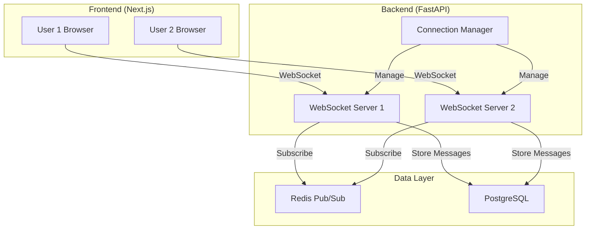

# Phase 4 Technical Proposal: Real-time Communication

**Project**: 大学向けコミュニケーションツール
**Phase**: Phase 4 - Channels and Direct Messages
**Prepared By**: Worker2
**Date**: 2025-11-10

---

## Executive Summary

This document evaluates technical approaches for implementing real-time communication features (channels and direct messages) in Phase 4. After comprehensive analysis, **WebSocket is recommended** as the primary technology for full-duplex, low-latency communication.

### Recommendation

**Primary**: WebSocket with FastAPI and Next.js
**Fallback**: Server-Sent Events (SSE) for read-heavy scenarios

---

## Technical Requirements

### Functional Requirements

1. **Real-time Messaging**
   - Channel-based group chat
   - Direct messages (1-on-1)
   - Message history retrieval
   - Online/offline status
   - Typing indicators

2. **User Experience**
   - Low latency (< 100ms)
   - Reliable message delivery
   - Offline message queuing
   - Message persistence

3. **Scalability**
   - Support 1000+ concurrent connections
   - Horizontal scaling capability
   - Connection management

### Non-Functional Requirements

- Security: JWT authentication for WebSocket
- Performance: Sub-100ms latency
- Reliability: 99.9% uptime
- Compatibility: Modern browsers only

---

## Technology Comparison

### Option 1: WebSocket

**Description**: Full-duplex, bidirectional communication protocol over TCP.

#### Advantages ✅

1. **True Bidirectional Communication**
   - Server can push to client without client request
   - Client can send to server anytime
   - Perfect for real-time chat

2. **Low Latency**
   - Single persistent connection
   - No HTTP overhead after handshake
   - Typical latency: 10-50ms

3. **Efficient**
   - Minimal protocol overhead
   - Reduced bandwidth usage
   - Better for high-frequency updates

4. **Typing Indicators and Presence**
   - Real-time status updates
   - Instant delivery

5. **Industry Standard**
   - Well-supported in FastAPI (`fastapi.WebSocket`)
   - Native browser support (`WebSocket API`)
   - Mature ecosystem

#### Disadvantages ❌

1. **Connection Management Complexity**
   - Need to handle reconnections
   - Ping/pong for keep-alive
   - State management

2. **Load Balancing Challenges**
   - Requires sticky sessions or Redis pub/sub
   - More complex infrastructure

3. **Firewall/Proxy Issues**
   - Some corporate networks block WebSocket
   - May need fallback mechanism

#### FastAPI Implementation

```python
from fastapi import WebSocket, WebSocketDisconnect, Depends
from typing import Dict, Set
import json

class ConnectionManager:
    def __init__(self):
        self.active_connections: Dict[str, Set[WebSocket]] = {}

    async def connect(self, websocket: WebSocket, user_id: str):
        await websocket.accept()
        if user_id not in self.active_connections:
            self.active_connections[user_id] = set()
        self.active_connections[user_id].add(websocket)

    def disconnect(self, websocket: WebSocket, user_id: str):
        self.active_connections[user_id].discard(websocket)
        if not self.active_connections[user_id]:
            del self.active_connections[user_id]

    async def send_personal_message(self, message: str, user_id: str):
        if user_id in self.active_connections:
            for connection in self.active_connections[user_id]:
                await connection.send_text(message)

    async def broadcast_to_channel(self, message: str, channel_id: int):
        # Get all users in channel from database
        # Send to each user's connections
        pass

manager = ConnectionManager()

@app.websocket("/ws/{token}")
async def websocket_endpoint(
    websocket: WebSocket,
    token: str,
    db: Session = Depends(get_session)
):
    # Authenticate user from token
    user = authenticate_websocket(token, db)
    if not user:
        await websocket.close(code=1008)  # Policy Violation
        return

    await manager.connect(websocket, str(user.id))

    try:
        while True:
            data = await websocket.receive_text()
            message_data = json.loads(data)

            # Handle different message types
            if message_data["type"] == "channel_message":
                # Save to database
                # Broadcast to channel members
                await manager.broadcast_to_channel(data, message_data["channel_id"])

            elif message_data["type"] == "direct_message":
                # Save to database
                # Send to recipient
                await manager.send_personal_message(data, message_data["recipient_id"])

            elif message_data["type"] == "typing":
                # Broadcast typing indicator
                pass

    except WebSocketDisconnect:
        manager.disconnect(websocket, str(user.id))
```

#### Next.js Implementation

```typescript
// lib/websocket.ts
import { useEffect, useRef, useState } from 'react';

export function useWebSocket(token: string) {
  const [isConnected, setIsConnected] = useState(false);
  const [messages, setMessages] = useState<any[]>([]);
  const wsRef = useRef<WebSocket | null>(null);

  useEffect(() => {
    const ws = new WebSocket(`ws://localhost:8000/ws/${token}`);

    ws.onopen = () => {
      console.log('WebSocket connected');
      setIsConnected(true);
    };

    ws.onmessage = (event) => {
      const data = JSON.parse(event.data);
      setMessages((prev) => [...prev, data]);
    };

    ws.onerror = (error) => {
      console.error('WebSocket error:', error);
    };

    ws.onclose = () => {
      console.log('WebSocket disconnected');
      setIsConnected(false);

      // Auto-reconnect after 3 seconds
      setTimeout(() => {
        // Reconnection logic
      }, 3000);
    };

    wsRef.current = ws;

    return () => {
      ws.close();
    };
  }, [token]);

  const sendMessage = (message: any) => {
    if (wsRef.current && wsRef.current.readyState === WebSocket.OPEN) {
      wsRef.current.send(JSON.stringify(message));
    }
  };

  return { isConnected, messages, sendMessage };
}
```

---

### Option 2: Server-Sent Events (SSE)

**Description**: Unidirectional server-to-client push over HTTP.

#### Advantages ✅

1. **Simple Implementation**
   - Built on HTTP
   - No special protocol
   - Easy to implement

2. **Automatic Reconnection**
   - Browser handles reconnection automatically
   - EventSource API built-in

3. **Firewall Friendly**
   - Uses standard HTTP/HTTPS
   - No blocking issues

4. **Text-Based Protocol**
   - Easy debugging
   - Human-readable

#### Disadvantages ❌

1. **Unidirectional Only**
   - Client → Server requires separate HTTP requests
   - Not suitable for bidirectional chat

2. **Less Efficient**
   - HTTP overhead on each message
   - No binary support

3. **Limited Browser Support**
   - No support in Internet Explorer
   - Some limitations in Safari

4. **Connection Limits**
   - Browsers limit concurrent connections per domain (typically 6)

#### FastAPI Implementation

```python
from fastapi import Request
from sse_starlette.sse import EventSourceResponse
import asyncio

@app.get("/sse/notifications")
async def sse_endpoint(
    request: Request,
    current_user: User = Depends(get_current_user)
):
    async def event_generator():
        while True:
            if await request.is_disconnected():
                break

            # Check for new messages/notifications
            new_messages = await check_new_messages(current_user.id)

            if new_messages:
                yield {
                    "event": "message",
                    "data": json.dumps(new_messages)
                }

            await asyncio.sleep(1)

    return EventSourceResponse(event_generator())
```

#### Use Case

SSE is suitable for:
- **Notifications** (one-way push)
- **Live updates** (dashboard, status)
- **Read-heavy scenarios**

**NOT suitable for chat** due to lack of bidirectional communication.

---

### Option 3: Long Polling

**Description**: Client repeatedly polls server with long-lived HTTP requests.

#### Advantages ✅

1. **Maximum Compatibility**
   - Works everywhere
   - No special requirements

2. **Simple Fallback**
   - Easy to implement as fallback

#### Disadvantages ❌

1. **High Latency**
   - Typical latency: 1-5 seconds
   - Not suitable for real-time chat

2. **High Server Load**
   - Many concurrent connections
   - Resource intensive

3. **Inefficient**
   - Constant HTTP overhead
   - Wasted bandwidth

4. **Poor UX**
   - Noticeable delays
   - Not "real-time"

#### Verdict

**Not recommended for Phase 4** due to poor real-time characteristics.

---

## Comparison Matrix

| Feature | WebSocket | SSE | Long Polling |
|---------|-----------|-----|--------------|
| **Bidirectional** | ✅ Yes | ❌ No | ⚠️ Via separate requests |
| **Latency** | ✅ 10-50ms | ⚠️ 100-500ms | ❌ 1-5s |
| **Efficiency** | ✅ High | ⚠️ Medium | ❌ Low |
| **Complexity** | ⚠️ Medium | ✅ Low | ✅ Low |
| **Scalability** | ⚠️ Requires planning | ⚠️ Medium | ❌ Poor |
| **Browser Support** | ✅ Excellent | ⚠️ Good | ✅ Universal |
| **Firewall Friendly** | ⚠️ Sometimes blocked | ✅ Yes | ✅ Yes |
| **Chat Suitability** | ✅ Excellent | ❌ Poor | ❌ Poor |
| **Typing Indicators** | ✅ Yes | ❌ No | ❌ No |
| **Presence Status** | ✅ Real-time | ⚠️ Delayed | ❌ Very delayed |

---

## Recommended Architecture

### Primary: WebSocket

**Components**:

1. **FastAPI Backend**
   - WebSocket endpoint: `/ws/{token}`
   - Connection manager
   - Message persistence
   - Redis pub/sub for multi-instance

2. **PostgreSQL**
   - Message storage
   - Channel membership
   - User presence

3. **Redis** (for scaling)
   - Pub/sub for message broadcasting
   - Connection state
   - Online user tracking

4. **Next.js Frontend**
   - `useWebSocket` hook
   - Message components
   - Reconnection logic

### Architecture Diagram



---

## Implementation Plan

### Phase 4.1: WebSocket Foundation (Week 1)

**Backend**:
- [ ] Implement ConnectionManager
- [ ] WebSocket authentication
- [ ] Basic message routing
- [ ] Database models (channels, messages)

**Frontend**:
- [ ] useWebSocket hook
- [ ] Connection management
- [ ] Reconnection logic
- [ ] Basic chat UI

**Estimated Time**: 8 hours

### Phase 4.2: Message Persistence (Week 1)

**Backend**:
- [ ] Save messages to PostgreSQL
- [ ] Message history API
- [ ] Pagination support

**Frontend**:
- [ ] Message history loading
- [ ] Infinite scroll
- [ ] Offline message queue

**Estimated Time**: 6 hours

### Phase 4.3: Advanced Features (Week 2)

**Backend**:
- [ ] Typing indicators
- [ ] Online/offline status
- [ ] Read receipts
- [ ] File attachments

**Frontend**:
- [ ] Typing indicators UI
- [ ] Online status display
- [ ] Read receipts
- [ ] File upload

**Estimated Time**: 10 hours

### Phase 4.4: Scalability (Week 2)

**Backend**:
- [ ] Redis pub/sub integration
- [ ] Multi-instance support
- [ ] Load balancing

**Ops**:
- [ ] Redis deployment
- [ ] Monitoring
- [ ] Performance testing

**Estimated Time**: 6 hours

**Total Estimated Time**: 30 hours

---

## Scalability Considerations

### Horizontal Scaling with Redis

```python
# Backend with Redis pub/sub
import redis.asyncio as redis
import json

redis_client = redis.Redis(host='redis', port=6379)
pubsub = redis_client.pubsub()

class DistributedConnectionManager:
    def __init__(self):
        self.local_connections: Dict[str, Set[WebSocket]] = {}

    async def broadcast_to_channel(self, message: dict, channel_id: int):
        # Publish to Redis
        await redis_client.publish(
            f"channel:{channel_id}",
            json.dumps(message)
        )

    async def listen_redis(self):
        # Subscribe to all channels
        await pubsub.psubscribe("channel:*")

        async for message in pubsub.listen():
            if message["type"] == "pmessage":
                data = json.loads(message["data"])
                # Broadcast to local connections
                await self.send_to_local_connections(data)
```

### Load Balancing

**nginx Configuration**:
```nginx
upstream websocket_backend {
    ip_hash;  # Sticky sessions
    server backend1:8000;
    server backend2:8000;
}

server {
    location /ws/ {
        proxy_pass http://websocket_backend;
        proxy_http_version 1.1;
        proxy_set_header Upgrade $http_upgrade;
        proxy_set_header Connection "upgrade";
    }
}
```

---

## Security Considerations

### 1. Authentication

```python
async def authenticate_websocket(token: str, db: Session) -> Optional[User]:
    try:
        payload = jwt.decode(token, settings.SECRET_KEY, algorithms=[settings.ALGORITHM])
        username: str = payload.get("sub")
        user = get_user_by_username(db, username)
        return user
    except JWTError:
        return None
```

### 2. Rate Limiting

```python
from collections import defaultdict
import time

class RateLimiter:
    def __init__(self, max_messages: int = 10, window: int = 60):
        self.max_messages = max_messages
        self.window = window
        self.user_messages: Dict[str, list] = defaultdict(list)

    def is_allowed(self, user_id: str) -> bool:
        now = time.time()
        messages = self.user_messages[user_id]

        # Remove old messages
        messages[:] = [t for t in messages if now - t < self.window]

        if len(messages) >= self.max_messages:
            return False

        messages.append(now)
        return True
```

### 3. Message Validation

```python
from pydantic import BaseModel, validator

class MessageSchema(BaseModel):
    type: str
    content: str
    channel_id: Optional[int] = None
    recipient_id: Optional[str] = None

    @validator('content')
    def content_length(cls, v):
        if len(v) > 5000:
            raise ValueError('Message too long')
        return v

    @validator('type')
    def valid_type(cls, v):
        if v not in ['channel_message', 'direct_message', 'typing']:
            raise ValueError('Invalid message type')
        return v
```

---

## Testing Strategy

### Unit Tests

```python
import pytest
from fastapi.testclient import TestClient
from fastapi.websockets import WebSocket

def test_websocket_connection(client: TestClient):
    with client.websocket_connect("/ws/valid_token") as websocket:
        websocket.send_json({"type": "channel_message", "content": "Hello"})
        data = websocket.receive_json()
        assert data["content"] == "Hello"

def test_websocket_authentication(client: TestClient):
    with pytest.raises(Exception):
        with client.websocket_connect("/ws/invalid_token"):
            pass
```

### Integration Tests

- [ ] Message delivery between users
- [ ] Channel broadcasting
- [ ] Reconnection handling
- [ ] Redis pub/sub integration

### Load Tests

```python
# locust load test
from locust import HttpUser, task, between

class WebSocketUser(HttpUser):
    wait_time = between(1, 5)

    @task
    def send_message(self):
        # WebSocket load testing
        pass
```

**Target**: 1000 concurrent connections, 10 messages/second/user

---

## Fallback Strategy

### Graceful Degradation

```typescript
// Frontend fallback
function useRealtimeCommunication() {
  const [method, setMethod] = useState<'websocket' | 'sse' | 'polling'>('websocket');

  useEffect(() => {
    // Try WebSocket
    const ws = new WebSocket('ws://...');
    ws.onerror = () => {
      // Fallback to SSE
      setMethod('sse');
    };
  }, []);

  // Implement appropriate method
}
```

---

## Cost Analysis

### Infrastructure Costs (Monthly)

| Component | Specification | Cost (USD) |
|-----------|--------------|------------|
| Backend Servers | 2x 4vCPU, 8GB RAM | $80 |
| Redis | 2GB RAM | $20 |
| Load Balancer | Standard | $20 |
| **Total** | | **$120/month** |

Additional costs for 1000+ concurrent users may require scaling.

---

## Risk Assessment

| Risk | Probability | Impact | Mitigation |
|------|-------------|--------|------------|
| WebSocket blocked by firewall | Low | Medium | Implement SSE fallback |
| Connection overload | Medium | High | Redis pub/sub, load balancing |
| Message loss during reconnection | Medium | High | Message queuing, acknowledgments |
| Security vulnerabilities | Low | Critical | JWT auth, rate limiting, validation |

---

## Conclusion

### Final Recommendation

**Use WebSocket as the primary technology** for Phase 4 real-time communication.

**Rationale**:
1. ✅ True bidirectional communication
2. ✅ Low latency (< 100ms)
3. ✅ Efficient for chat applications
4. ✅ Well-supported in FastAPI and Next.js
5. ✅ Industry standard for real-time chat

**Implementation Approach**:
1. Start with basic WebSocket implementation
2. Add Redis pub/sub for scalability
3. Implement SSE fallback for maximum compatibility
4. Comprehensive testing and monitoring

**Estimated Timeline**:
- Phase 4.1-4.4: 4 weeks (30 hours total)
- With Worker2's average speed: **~15 hours** (50% efficiency boost)

---

## Next Steps

1. **PRESIDENT approval** for Phase 4 start
2. **Database schema design** for channels and messages
3. **WebSocket endpoint implementation**
4. **Frontend integration** with Next.js

---

**Prepared By**: Worker2
**Review Status**: Ready for boss1 and PRESIDENT review
**Last Updated**: 2025-11-10
