# システムアーキテクチャ

---

## システム全体構成

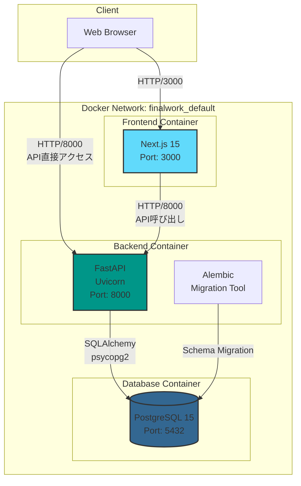

### レイヤー構成

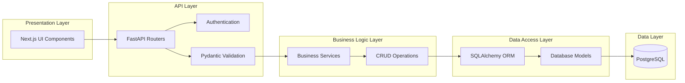

---

## コンテナ構成

### 1. Frontend Container (`finalwork-frontend-1`)

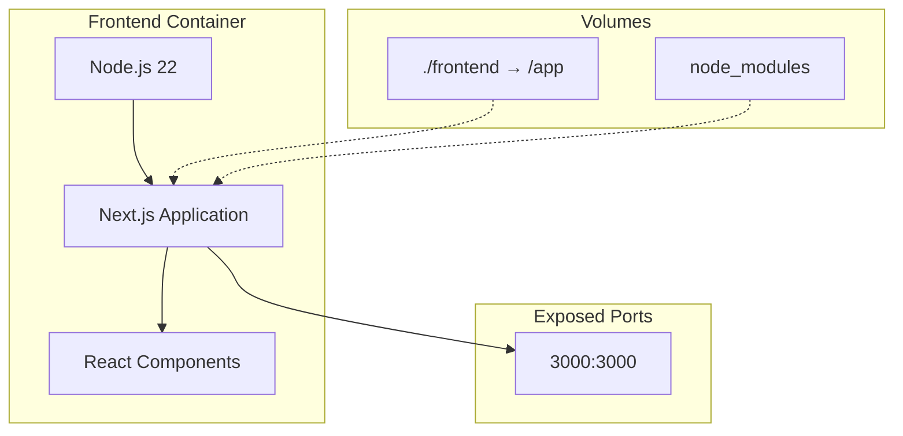

**仕様**
- **Base Image**: `node:22-alpine`
- **Working Directory**: `/app`
- **Port**: `3000`
- **Volume**: `./frontend:/app`, `node_modules`
- **Hot Reload**: 有効
- **Startup Command**: `npm run dev`

### 2. Backend Container (`finalwork-backend-1`)

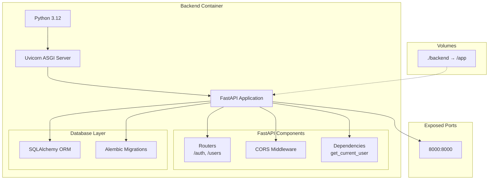

**仕様**
- **Base Image**: `python:3.12-slim`
- **Package Manager**: `uv`
- **Working Directory**: `/app`
- **Port**: `8000`
- **Volume**: `./backend:/app`
- **Hot Reload**: 有効（Uvicorn `--reload`）
- **Startup Command**: `uvicorn main:app --host 0.0.0.0 --port 8000 --reload`

### 3. Database Container (`finalwork-db-1`)

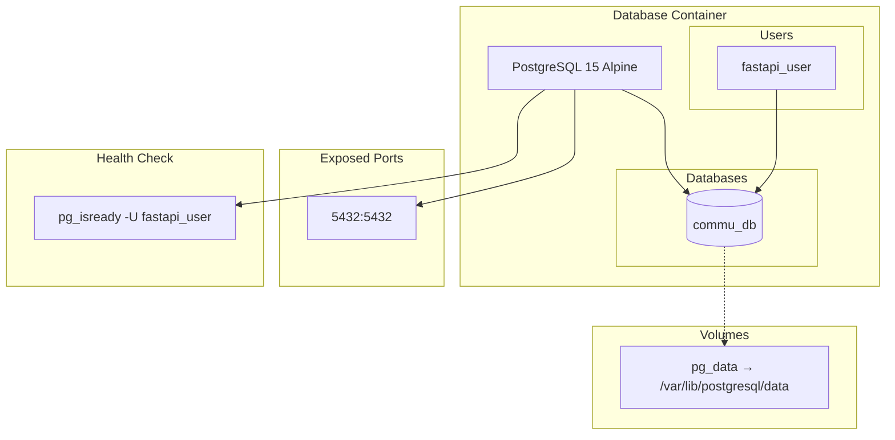

**仕様**
- **Base Image**: `postgres:15-alpine`
- **Port**: `5432`
- **Volume**: `pg_data:/var/lib/postgresql/data`
- **Database**: `commu_db`
- **User**: `fastapi_user`
- **Password**: `fastapi_password`（開発環境）
- **Health Check**: `pg_isready -U fastapi_user`

---

## ネットワーク構成

### Docker Network

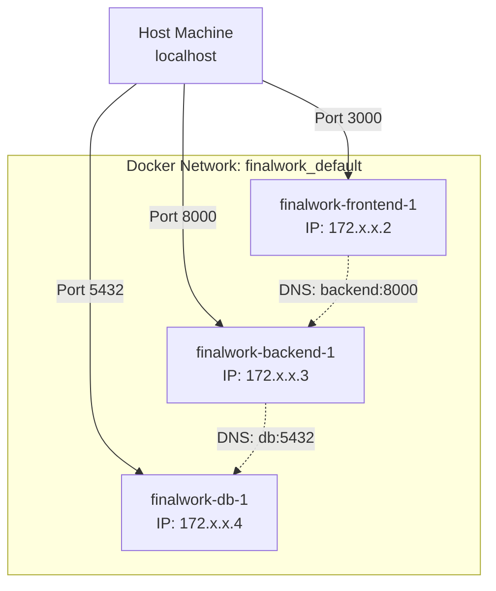

### ポート番号一覧

| サービス | ホストポート | コンテナポート | プロトコル | 用途 |
|---------|------------|--------------|----------|------|
| Frontend | 3000 | 3000 | HTTP | Next.js開発サーバー |
| Backend | 8000 | 8000 | HTTP | FastAPI/Uvicorn |
| Database | 5432 | 5432 | PostgreSQL | PostgreSQLサーバー |

### 内部通信

**Frontend → Backend**
```
URL: http://backend:8000
DNS Resolution: Docker内部DNS
Protocol: HTTP
```

**Backend → Database**
```
URL: postgresql://fastapi_user:fastapi_password@db:5432/commu_db
DNS Resolution: Docker内部DNS
Protocol: PostgreSQL Wire Protocol
```

---

## データベーススキーマ

### ER図（全体）

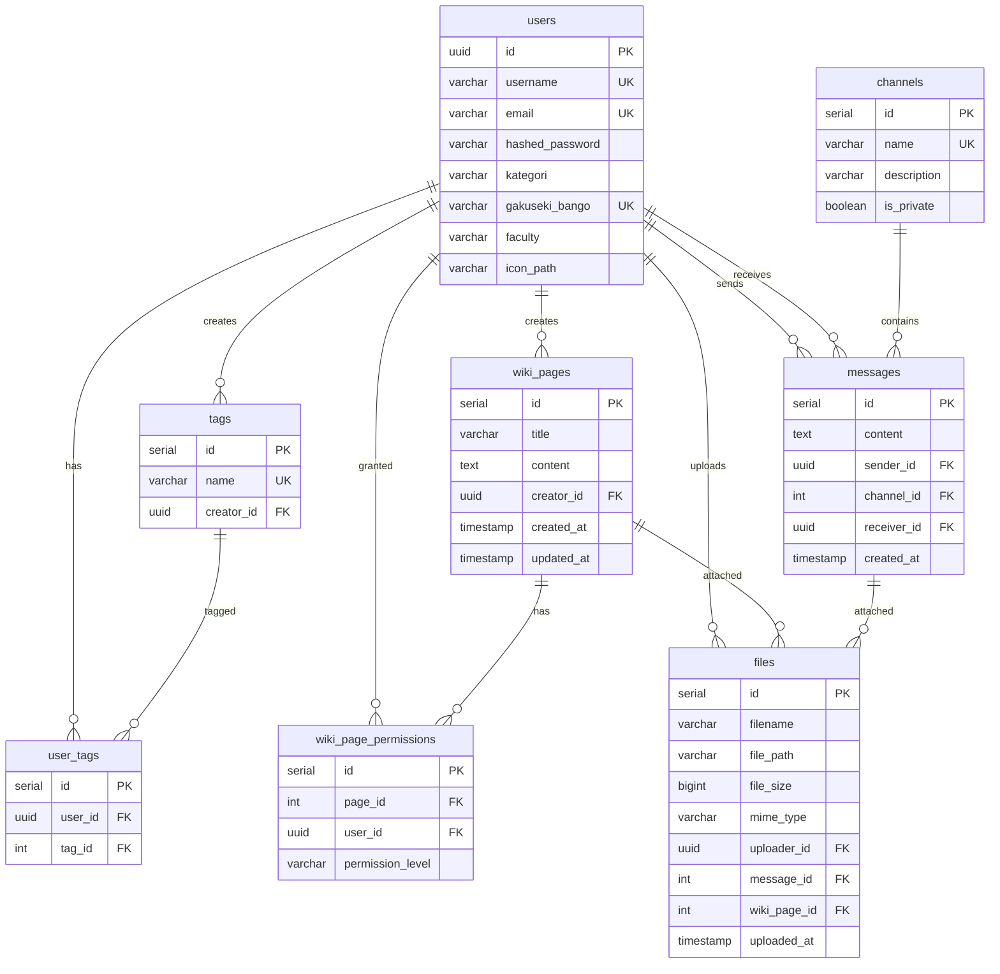

### テーブル詳細

#### 1. users テーブル
```sql
CREATE TABLE users (
    id UUID PRIMARY KEY,
    username VARCHAR(100) UNIQUE NOT NULL,
    email VARCHAR(255) UNIQUE NOT NULL,
    hashed_password VARCHAR(255) NOT NULL,
    kategori VARCHAR(19) NOT NULL,  -- '学生', '教授', '准教授', '講師', '事務'
    gakuseki_bango VARCHAR(50) UNIQUE,
    faculty VARCHAR(100),
    icon_path VARCHAR(255)
);
```

#### 2. tags テーブル
```sql
CREATE TABLE tags (
    id SERIAL PRIMARY KEY,
    name VARCHAR(100) UNIQUE NOT NULL,
    creator_id UUID NOT NULL REFERENCES users(id) ON DELETE CASCADE
);
```

#### 3. wiki_pages テーブル
```sql
CREATE TABLE wiki_pages (
    id SERIAL PRIMARY KEY,
    title VARCHAR(255) NOT NULL,
    content TEXT NOT NULL,
    creator_id UUID NOT NULL REFERENCES users(id) ON DELETE CASCADE,
    created_at TIMESTAMP NOT NULL,
    updated_at TIMESTAMP NOT NULL
);
```

---

## 技術スタック

### Frontend

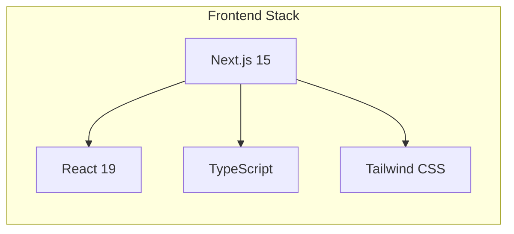

| 技術 | バージョン | 用途 |
|-----|----------|------|
| Next.js | 15.x | Reactフレームワーク |
| React | 19.x | UIライブラリ |
| TypeScript | 5.x | 型安全な開発 |
| Tailwind CSS | 3.x | CSSフレームワーク |

### Backend

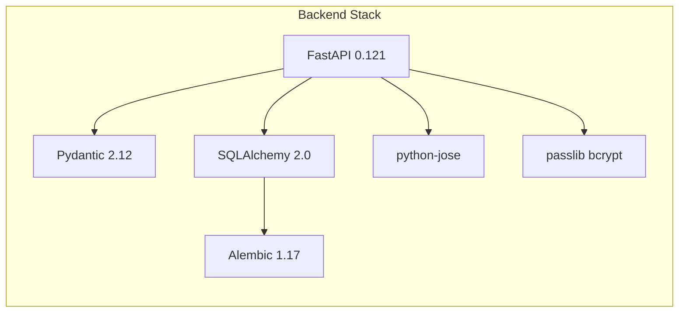

| 技術 | バージョン | 用途 |
|-----|----------|------|
| FastAPI | 0.121.x | Webフレームワーク |
| Uvicorn | 0.38.x | ASGIサーバー |
| Pydantic | 2.12.x | データバリデーション |
| SQLAlchemy | 2.0.x | ORM |
| Alembic | 1.17.x | データベースマイグレーション |
| python-jose | 3.5.x | JWT処理 |
| passlib | 1.7.x | パスワードハッシュ化 |
| psycopg2-binary | 2.9.x | PostgreSQLドライバ |

### Database

| 技術 | バージョン | 用途 |
|-----|----------|------|
| PostgreSQL | 15 Alpine | リレーショナルデータベース |

### Development Tools

| 技術 | バージョン | 用途 |
|-----|----------|------|
| Docker | 20.10+ | コンテナ化 |
| Docker Compose | 2.0+ | マルチコンテナ管理 |
| uv | latest | Python パッケージマネージャー |
| pytest | 9.0.x | テストフレームワーク |
| httpx | 0.28.x | HTTPクライアント（テスト用） |

---

## 環境変数

### Backend環境変数 (`backend/.env`)

| 変数名 | 説明 | デフォルト値 | 必須 |
|-------|-----|------------|-----|
| `DATABASE_URL` | PostgreSQL接続URL | `postgresql://...` | ✅ |
| `SECRET_KEY` | JWT署名鍵 | - | ✅ |
| `ALGORITHM` | JWT署名アルゴリズム | `HS256` | ✅ |
| `ACCESS_TOKEN_EXPIRE_MINUTES` | トークン有効期限（分） | `30` | ✅ |
| `ALLOWED_ORIGINS` | CORS許可オリジン | `http://localhost:3000` | ✅ |
| `ENVIRONMENT` | 実行環境 | `development` | ❌ |

### Frontend環境変数 (`frontend/.env.local`)

| 変数名 | 説明 | デフォルト値 | 必須 |
|-------|-----|------------|-----|
| `NEXT_PUBLIC_API_URL` | バックエンドAPI URL | `http://localhost:8000` | ✅ |

### Docker Compose環境変数

| 変数名 | 説明 | デフォルト値 |
|-------|-----|------------|
| `POSTGRES_USER` | PostgreSQLユーザー名 | `fastapi_user` |
| `POSTGRES_PASSWORD` | PostgreSQLパスワード | `fastapi_password` |
| `POSTGRES_DB` | データベース名 | `commu_db` |

---

## セキュリティ考慮事項

### 1. 認証・認可

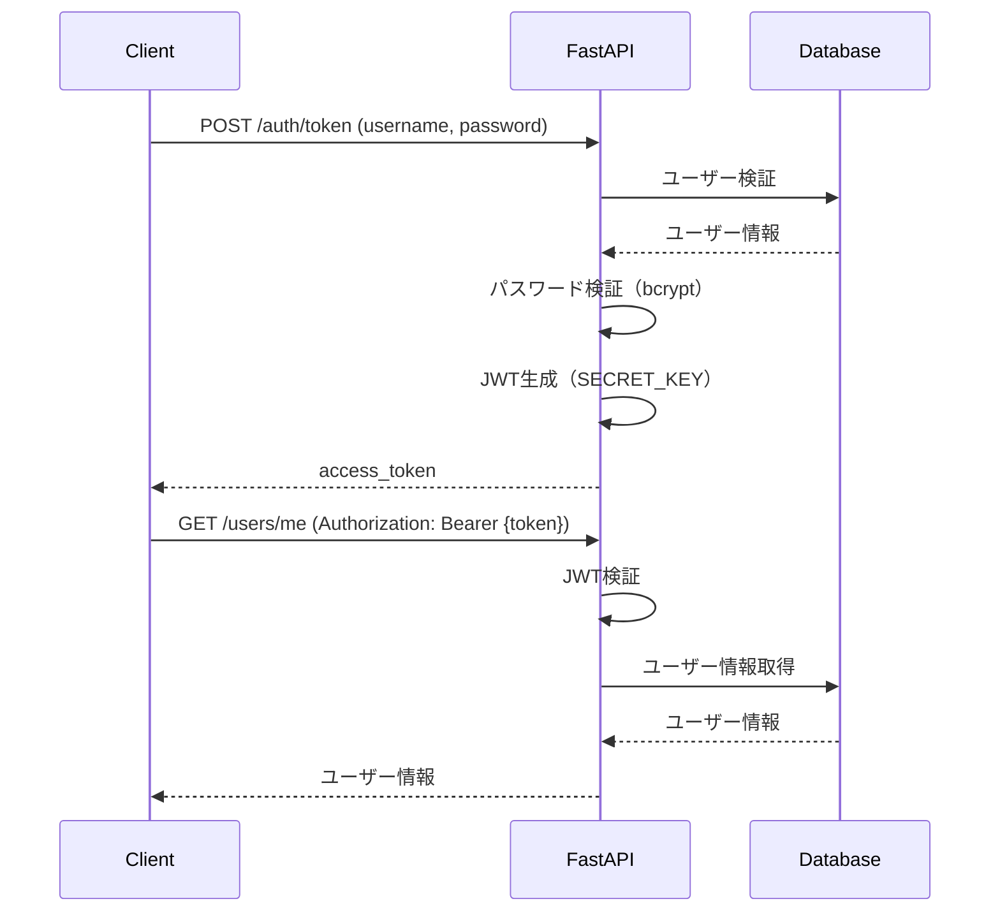

### 2. パスワードハッシュ化

- **アルゴリズム**: bcrypt
- **ライブラリ**: passlib
- **ソルト**: 自動生成

### 3. CORS設定

```python
# 開発環境
ALLOWED_ORIGINS = ["http://localhost:3000"]

# 本番環境（例）
ALLOWED_ORIGINS = ["https://your-domain.com"]
```

---

## スケーラビリティ

### 水平スケーリング

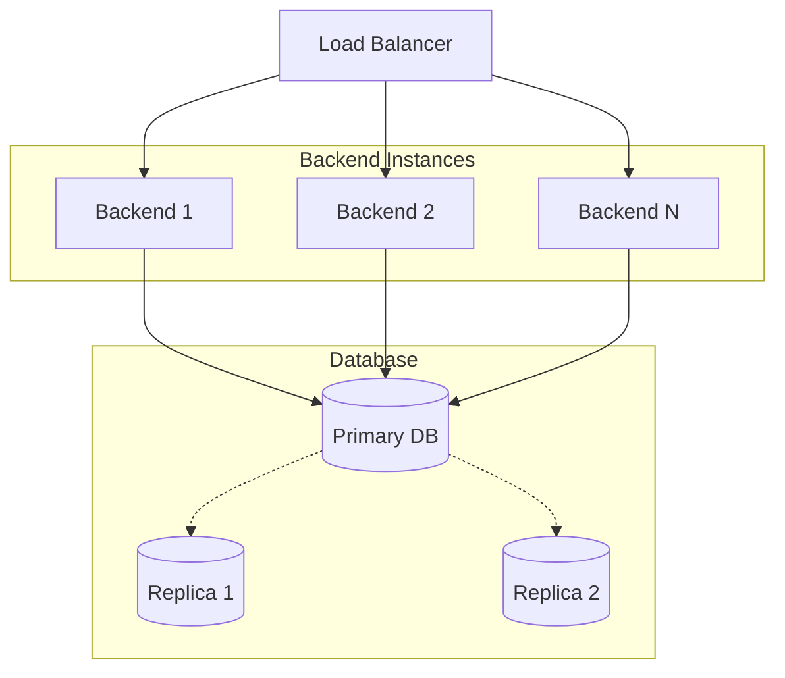

### 推奨構成（本番環境）

1. **アプリケーション層**
   - Backend: 複数インスタンス（最低2台）
   - Frontend: CDN配信（Vercel, Cloudflare等）

2. **データベース層**
   - マネージドサービス（AWS RDS, Google Cloud SQL等）
   - レプリケーション有効化
   - 自動バックアップ

3. **キャッシュ層**
   - Redis（セッション管理、キャッシュ）

---

**作成日**: 2025-11-09
**作成者**: worker3
**バージョン**: 1.0.0
