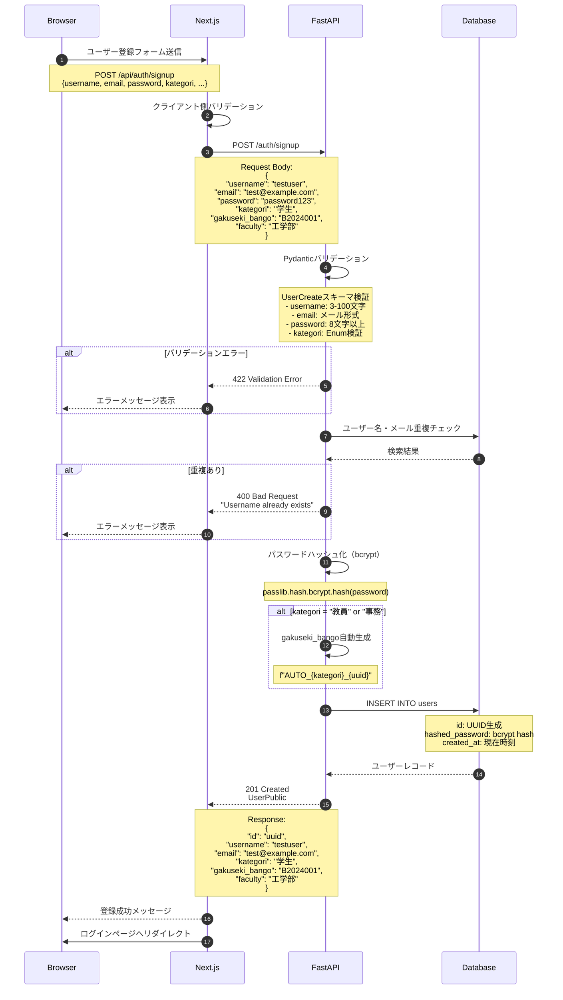
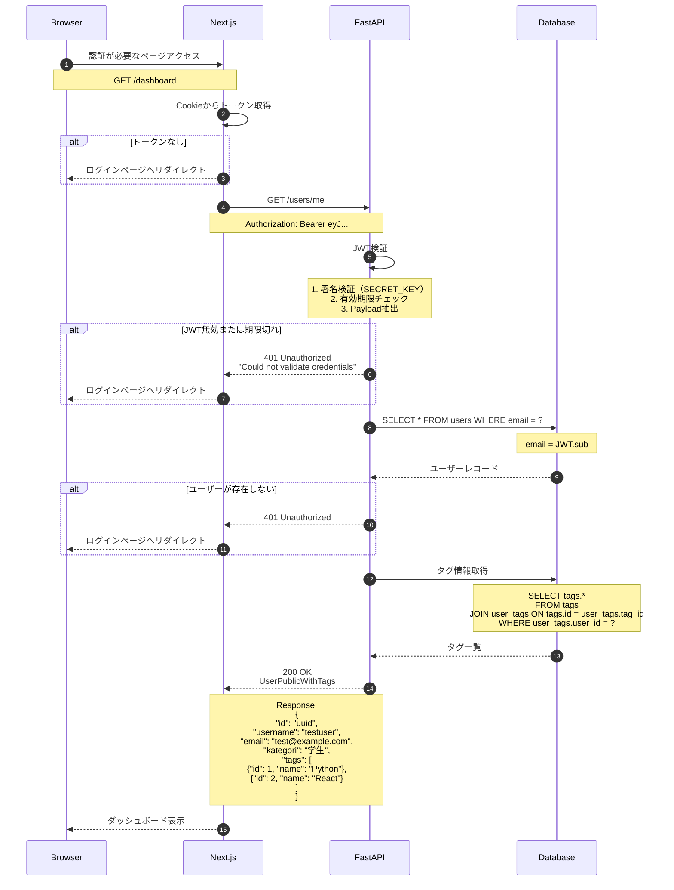
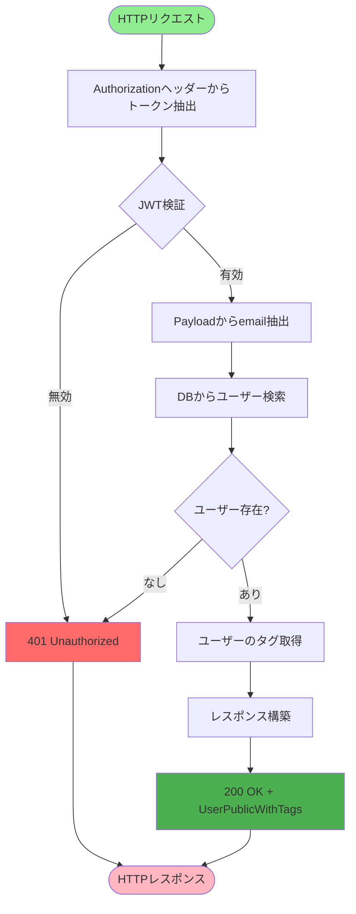
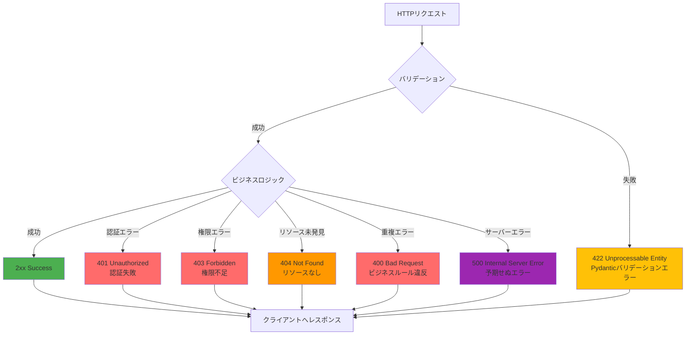
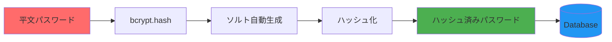

# データフロー図

---

## 認証フロー

### 1. ユーザー登録フロー



### 2. ログインフロー（JWT発行）

```mermaid
sequenceDiagram
    autonumber
    participant Browser
    participant Next.js
    participant FastAPI
    participant Database

    Browser->>Next.js: ログインフォーム送信
    Note over Browser,Next.js: POST /api/auth/login<br/>{username, password}

    Next.js->>FastAPI: POST /auth/token
    Note over Next.js,FastAPI: Content-Type: application/x-www-form-urlencoded<br/>username=testuser&password=password123

    FastAPI->>Database: SELECT * FROM users WHERE username = ?
    Database-->>FastAPI: ユーザーレコード

    alt ユーザーが存在しない
        FastAPI-->>Next.js: 401 Unauthorized<br/>"Incorrect username or password"
        Next.js-->>Browser: エラーメッセージ表示
    end

    FastAPI->>FastAPI: パスワード検証
    Note over FastAPI: passlib.verify(<br/>  plain_password,<br/>  hashed_password<br/>)

    alt パスワード不一致
        FastAPI-->>Next.js: 401 Unauthorized<br/>"Incorrect username or password"
        Next.js-->>Browser: エラーメッセージ表示
    end

    FastAPI->>FastAPI: JWT生成
    Note over FastAPI: Payload:<br/>{<br/>  "sub": user.email,<br/>  "exp": now + 30 minutes<br/>}<br/><br/>Algorithm: HS256<br/>Secret: SECRET_KEY

    FastAPI-->>Next.js: 200 OK
    Note over Next.js,FastAPI: Response:<br/>{<br/>  "access_token": "eyJ...",<br/>  "token_type": "bearer"<br/>}

    Next.js->>Next.js: HttpOnly Cookieに保存
    Note over Next.js: Set-Cookie:<br/>access_token=eyJ...;<br/>HttpOnly; Secure; SameSite=Strict

    Next.js-->>Browser: ログイン成功
    Next.js->>Browser: ダッシュボードへリダイレクト
```

### 3. 認証チェックフロー



---

## ユーザー情報取得フロー

### 現在のユーザー情報取得（/users/me）



### データ取得クエリ

**ユーザー情報取得**
```sql
SELECT
    id, username, email, kategori,
    gakuseki_bango, faculty, icon_path
FROM users
WHERE email = :email;
```

**タグ情報取得**
```sql
SELECT
    t.id, t.name, t.creator_id
FROM tags t
INNER JOIN user_tags ut ON t.id = ut.tag_id
WHERE ut.user_id = :user_id;
```

---

## エラーハンドリングフロー

### HTTPステータスコードマッピング



### エラーレスポンス形式

#### 422 Validation Error（Pydantic）

```json
{
  "detail": [
    {
      "type": "string_too_short",
      "loc": ["body", "username"],
      "msg": "String should have at least 3 characters",
      "input": "ab",
      "ctx": {
        "min_length": 3
      }
    }
  ]
}
```

#### 401 Unauthorized（認証エラー）

```json
{
  "detail": "Could not validate credentials"
}
```

#### 400 Bad Request（重複エラー）

```json
{
  "detail": "Username already exists"
}
```

---

## データ形式

### リクエストスキーマ

#### UserCreate（ユーザー登録）

```json
{
  "username": "testuser",
  "email": "test@example.com",
  "password": "password123",
  "kategori": "学生",
  "gakuseki_bango": "B2024001",
  "faculty": "工学部"
}
```

**バリデーションルール**
- `username`: 3-100文字、必須
- `email`: メール形式、必須
- `password`: 8文字以上、必須
- `kategori`: Enum値（学生, 教授, 准教授, 講師, 事務）、必須
- `gakuseki_bango`: 最大50文字、教員/事務の場合はオプション
- `faculty`: 最大100文字、オプション

#### OAuth2 Login Form

```
Content-Type: application/x-www-form-urlencoded

username=testuser&password=password123
```

### レスポンススキーマ

#### UserPublic（ユーザー情報）

```json
{
  "id": "550e8400-e29b-41d4-a716-446655440000",
  "username": "testuser",
  "email": "test@example.com",
  "kategori": "学生",
  "gakuseki_bango": "B2024001",
  "faculty": "工学部",
  "icon_path": null
}
```

#### UserPublicWithTags（タグ付きユーザー情報）

```json
{
  "id": "550e8400-e29b-41d4-a716-446655440000",
  "username": "testuser",
  "email": "test@example.com",
  "kategori": "学生",
  "gakuseki_bango": "B2024001",
  "faculty": "工学部",
  "icon_path": null,
  "tags": [
    {
      "id": 1,
      "name": "Python",
      "creator_id": "550e8400-e29b-41d4-a716-446655440000"
    },
    {
      "id": 2,
      "name": "React",
      "creator_id": "550e8400-e29b-41d4-a716-446655440000"
    }
  ]
}
```

#### Token（JWT）

```json
{
  "access_token": "eyJhbGciOiJIUzI1NiIsInR5cCI6IkpXVCJ9.eyJzdWIiOiJ0ZXN0QGV4YW1wbGUuY29tIiwiZXhwIjoxNzMxMTQwNDAwfQ.signature",
  "token_type": "bearer"
}
```

### JWTペイロード構造

```json
{
  "sub": "test@example.com",
  "exp": 1731140400
}
```

**フィールド説明**
- `sub`: Subject（ユーザーのemail）
- `exp`: Expiration Time（有効期限、UNIX timestamp）

---

## セキュリティフロー

### パスワードハッシュ化フロー



**bcrypt特性**
- ソルトは自動生成
- ラウンド数: デフォルト（12）
- 同じパスワードでも毎回異なるハッシュ値

**例**
```python
# 入力
password = "password123"

# 出力（bcrypt hash）
hashed = "$2b$12$abc123...xyz789"
```

### JWT署名フロー

```mermaid
graph TB
    Header[Header<br/>{alg: HS256, typ: JWT}] --> Base64H[Base64URLエンコード]
    Payload[Payload<br/>{sub: email, exp: timestamp}] --> Base64P[Base64URLエンコード]

    Base64H --> Concat[ヘッダー.ペイロード]
    Base64P --> Concat

    Concat --> HMAC[HMAC-SHA256]
    SecretKey[SECRET_KEY] --> HMAC

    HMAC --> Signature[署名]
    Concat --> Final[JWT = ヘッダー.ペイロード.署名]
    Signature --> Final

    style SecretKey fill:#FF6B6B
    style Final fill:#4CAF50
```

**JWT検証プロセス**
1. JWTを `.` で分割（ヘッダー、ペイロード、署名）
2. ヘッダーとペイロードを再度HMAC-SHA256で署名
3. 計算した署名と受信した署名を比較
4. 一致すれば改ざんなし
5. 有効期限（exp）をチェック

---

**作成日**: 2025-11-09
**作成者**: worker3
**バージョン**: 1.0.0
