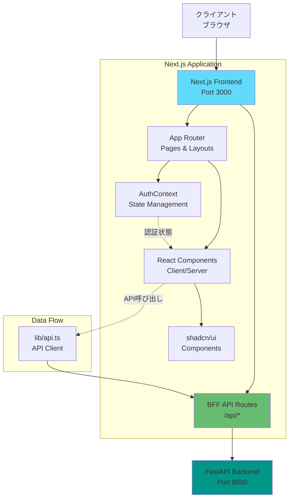
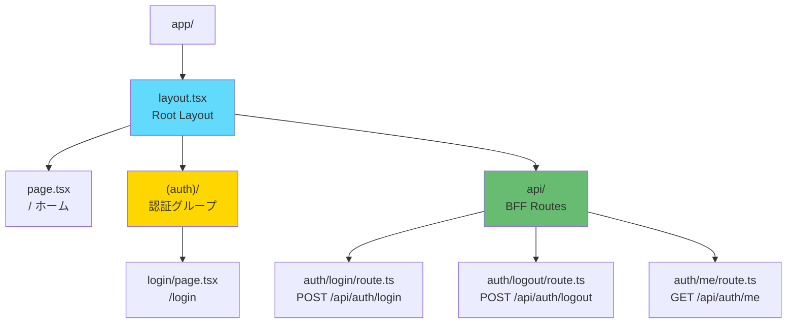
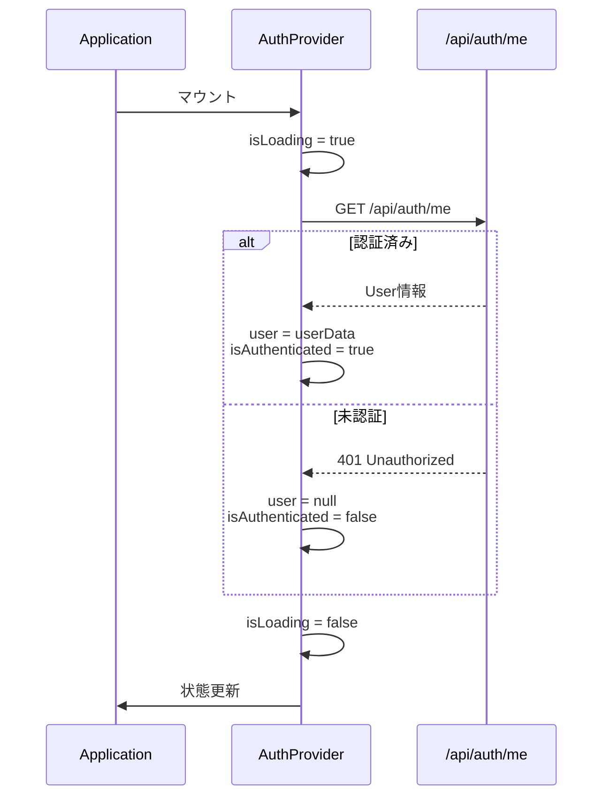
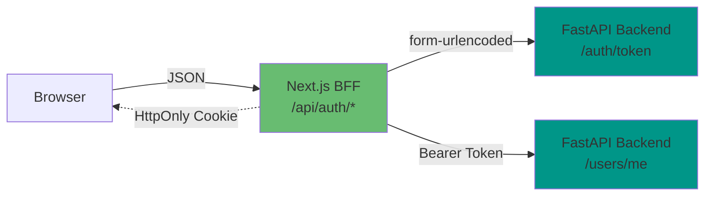

# フロントエンドアーキテクチャ

## 概要

本ドキュメントでは、Miscatフロントエンドアプリケーションのアーキテクチャについて説明します。Next.js 16 (App Router)、shadcn/ui、TypeScriptを使用した現代的なフロントエンドアーキテクチャです。

---

## 技術スタック

### コアテクノロジー

| 技術 | バージョン | 用途 |
|-----|----------|------|
| Next.js | 16.0.1 | Reactフレームワーク、SSR、ルーティング |
| React | 19.2.0 | UIライブラリ |
| TypeScript | ^5 | 型安全性 |
| Tailwind CSS | ^4 | スタイリング |
| axios | ^1.7.9 | HTTP通信 |

### UIライブラリ

| ライブラリ | 用途 |
|----------|------|
| shadcn/ui | UIコンポーネント集 |
| Radix UI | アクセシブルなプリミティブ |
| Lucide React | アイコン |

### アーキテクチャパターン



---

## ディレクトリ構造

### 完全なディレクトリツリー

```
frontend/miscat/
├── app/                          # Next.js App Router
│   ├── (auth)/                   # 認証グループ（ヘッダーなし）
│   │   └── login/
│   │       └── page.tsx          # ログインページ
│   ├── api/                      # BFF API Routes
│   │   └── auth/
│   │       ├── login/
│   │       │   └── route.ts      # POST /api/auth/login
│   │       ├── logout/
│   │       │   └── route.ts      # POST /api/auth/logout
│   │       └── me/
│   │           └── route.ts      # GET /api/auth/me
│   ├── layout.tsx                # ルートレイアウト
│   ├── page.tsx                  # ホームページ
│   └── globals.css               # グローバルスタイル
├── components/                   # Reactコンポーネント
│   └── ui/                       # shadcn/ui コンポーネント
│       ├── button.tsx
│       ├── card.tsx
│       ├── input.tsx
│       ├── select.tsx
│       └── dialog.tsx
├── context/                      # React Context
│   └── AuthContext.tsx           # 認証コンテキスト
├── lib/                          # ユーティリティ
│   ├── api.ts                    # APIクライアント
│   └── utils.ts                  # ヘルパー関数
├── public/                       # 静的ファイル
├── .env.local                    # 環境変数
├── next.config.ts                # Next.js設定
├── tailwind.config.ts            # Tailwind CSS設定
├── tsconfig.json                 # TypeScript設定
└── package.json                  # 依存関係
```

### ディレクトリの役割

#### `app/`
Next.js 16のApp Routerを使用。ファイルシステムベースのルーティング。

**主要な規約:**
- `page.tsx` - ルートのページコンポーネント
- `layout.tsx` - レイアウトコンポーネント（共通UI）
- `route.ts` - API Route Handler
- `(folder)` - ルートグループ（URLに影響しない）

#### `components/`
再利用可能なReactコンポーネント。shadcn/uiコンポーネントは`ui/`配下に配置。

#### `context/`
React Contextによるグローバル状態管理。

#### `lib/`
ユーティリティ関数やヘルパー。APIクライアントなど。

---

## App Routerの構成

### ルーティングアーキテクチャ



### ルートグループ: `(auth)`

**目的:** 認証関連ページをグループ化（URLに影響なし）

```
app/
├── (auth)/           ← URLには含まれない
│   └── login/
│       └── page.tsx  → /login
```

**特徴:**
- 共通のレイアウトを適用可能
- ヘッダー・フッターを非表示にできる
- URLに `(auth)` は含まれない

**レイアウト設定例:**
```typescript
// app/(auth)/layout.tsx（必要に応じて作成）
export default function AuthLayout({ children }: { children: React.ReactNode }) {
  return (
    <div className="min-h-screen bg-gray-50">
      {/* ヘッダーなし */}
      {children}
      {/* フッターなし */}
    </div>
  );
}
```

### BFF API Routes

**アーキテクチャ:**
```
Client → Next.js BFF (/api/*) → FastAPI Backend
```

**利点:**
1. **セキュリティ:** HttpOnly Cookieでトークン管理
2. **柔軟性:** クライアント向けにAPIをカスタマイズ
3. **エラーハンドリング:** 統一されたエラーレスポンス
4. **型安全性:** TypeScriptで型定義

**API Route Handler の例:**
```typescript
// app/api/auth/login/route.ts
import { NextRequest, NextResponse } from 'next/server';

export async function POST(request: NextRequest) {
  const body = await request.json();

  // バックエンドへのプロキシ処理
  const response = await fetch(`${process.env.BACKEND_URL}/auth/token`, {
    method: 'POST',
    // ...
  });

  // HttpOnly Cookie設定
  const res = NextResponse.json(data);
  res.cookies.set('access_token', token, { httpOnly: true });

  return res;
}
```

---

## 状態管理

### React Context による認証管理

```mermaid
graph TD
    A[AuthProvider<br/>context/AuthContext.tsx] --> B[State]
    A --> C[Actions]

    B --> D[user: User | null]
    B --> E[isAuthenticated: boolean]
    B --> F[isLoading: boolean]

    C --> G[login]
    C --> H[logout]
    C --> I[refreshUser]

    J[useAuth hook] --> A

    K[Components] --> J

    style A fill:#61dafb
    style B fill:#4caf50
    style C fill:#ff9800
```

### AuthContext 構造

**状態:**
```typescript
interface AuthContextType {
  user: User | null;              // 現在のユーザー情報
  isAuthenticated: boolean;       // 認証済みフラグ
  isLoading: boolean;             // ローディング状態
  login: (username: string, password: string) => Promise<void>;
  logout: () => Promise<void>;
  refreshUser: () => Promise<void>;
}
```

**初期化フロー:**


### 使用例

**1. アプリケーションラップ:**
```typescript
// app/layout.tsx
import { AuthProvider } from '@/context/AuthContext';

export default function RootLayout({ children }) {
  return (
    <html lang="ja">
      <body>
        <AuthProvider>
          {children}
        </AuthProvider>
      </body>
    </html>
  );
}
```

**2. コンポーネントで使用:**
```typescript
import { useAuth } from '@/context/AuthContext';

export default function UserProfile() {
  const { user, isAuthenticated, isLoading, logout } = useAuth();

  if (isLoading) {
    return <div>Loading...</div>;
  }

  if (!isAuthenticated) {
    return <div>Please login</div>;
  }

  return (
    <div>
      <h1>Welcome, {user?.display_name}!</h1>
      <p>@{user?.username}</p>
      <button onClick={logout}>Logout</button>
    </div>
  );
}
```

**3. 保護されたページ:**
```typescript
'use client';

import { useEffect } from 'react';
import { useRouter } from 'next/navigation';
import { useAuth } from '@/context/AuthContext';

export default function ProtectedPage() {
  const router = useRouter();
  const { isAuthenticated, isLoading } = useAuth();

  useEffect(() => {
    if (!isLoading && !isAuthenticated) {
      router.push('/login');
    }
  }, [isAuthenticated, isLoading, router]);

  if (isLoading) {
    return <div>Loading...</div>;
  }

  return <div>Protected Content</div>;
}
```

---

## APIアーキテクチャ

### BFF (Backend for Frontend) パターン



### データフロー

**1. ログインフロー:**
```
1. Client → POST /api/auth/login (JSON)
2. BFF → POST /auth/token (form-urlencoded)
3. Backend → BFF (access_token)
4. BFF → Client (Set-Cookie + JSON)
```

**2. 認証確認フロー:**
```
1. Client → GET /api/auth/me (Cookie)
2. BFF → GET /users/me (Bearer Token)
3. Backend → BFF (User Info)
4. BFF → Client (User Info)
```

### APIクライアント (lib/api.ts)

**設定:**
```typescript
export const apiClient = axios.create({
  baseURL: '/api',
  headers: {
    'Content-Type': 'application/json',
  },
  withCredentials: true,  // Cookieを自動送信
});
```

**関数:**
- `login(username, password)` - ログイン
- `logout()` - ログアウト
- `getMe()` - ユーザー情報取得

---

## 環境変数

### `.env.local`

```bash
# Backend API URL (FastAPI)
BACKEND_URL=http://backend:8000
```

### 環境変数の使用方法

**Server Componentで使用:**
```typescript
// app/api/auth/login/route.ts
const BACKEND_URL = process.env.BACKEND_URL || 'http://backend:8000';

export async function POST(request: NextRequest) {
  const response = await fetch(`${BACKEND_URL}/auth/token`, {
    // ...
  });
}
```

**注意事項:**
- `NEXT_PUBLIC_` プレフィックスなしの環境変数はサーバーサイドのみで利用可能
- クライアントサイドで使用する場合は `NEXT_PUBLIC_BACKEND_URL` のように命名

### 環境別設定

| ファイル | 環境 | 優先度 |
|---------|------|--------|
| `.env.local` | 開発・本番共通 | 最高 |
| `.env.production` | 本番環境 | 高 |
| `.env.development` | 開発環境 | 高 |
| `.env` | デフォルト | 低 |

**Docker Compose での設定:**
```yaml
# docker-compose.yml
services:
  frontend:
    environment:
      - BACKEND_URL=http://backend:8000
```

---

## shadcn/ui コンポーネントの統合

### インストール済みコンポーネント

```typescript
// components/ui/
├── button.tsx      // ボタン
├── card.tsx        // カード
├── input.tsx       // 入力フィールド
├── select.tsx      // セレクトボックス
└── dialog.tsx      // モーダル
```

### 使用例

**Button:**
```typescript
import { Button } from '@/components/ui/button';

<Button variant="default" size="lg">
  Click me
</Button>
```

**Card:**
```typescript
import { Card, CardHeader, CardTitle, CardContent } from '@/components/ui/card';

<Card>
  <CardHeader>
    <CardTitle>Title</CardTitle>
  </CardHeader>
  <CardContent>
    Content here
  </CardContent>
</Card>
```

**Input:**
```typescript
import { Input } from '@/components/ui/input';

<Input
  type="text"
  placeholder="Enter text"
  value={value}
  onChange={(e) => setValue(e.target.value)}
/>
```

### カスタマイズ

shadcn/uiコンポーネントはプロジェクト内にコピーされるため、自由にカスタマイズ可能。

```typescript
// components/ui/button.tsx
export interface ButtonProps extends React.ButtonHTMLAttributes<HTMLButtonElement> {
  variant?: 'default' | 'destructive' | 'outline' | 'secondary' | 'ghost' | 'link';
  size?: 'default' | 'sm' | 'lg' | 'icon';
}
```

---

## ビルド＆デプロイ

### ビルドコマンド

```bash
# 開発サーバー起動
npm run dev

# 本番ビルド
npm run build

# 本番サーバー起動
npm start

# リント
npm run lint
```

### Docker での実行

```dockerfile
# Dockerfile
FROM node:20-alpine

WORKDIR /app

COPY package*.json ./
RUN npm install

COPY . .

CMD ["npm", "run", "dev"]
```

```yaml
# docker-compose.yml
services:
  frontend:
    build: ./frontend/miscat
    ports:
      - "3000:3000"
    environment:
      - BACKEND_URL=http://backend:8000
    volumes:
      - ./frontend/miscat:/app
      - /app/node_modules
```

---

## まとめ

Miscatフロントエンドは、Next.js 16のApp Router、React Context、BFFパターンを組み合わせた現代的なアーキテクチャです。

**主要な特徴:**
- App Routerによるファイルベースルーティング
- BFFパターンによるセキュアなAPI通信
- React Contextによるシンプルな状態管理
- shadcn/uiによる高品質なUI
- TypeScriptによる型安全性

**次のドキュメント:**
- [UI/UXデザインガイド](./ui-design.md)
- [関数リファレンス](./functions/frontend.md)
