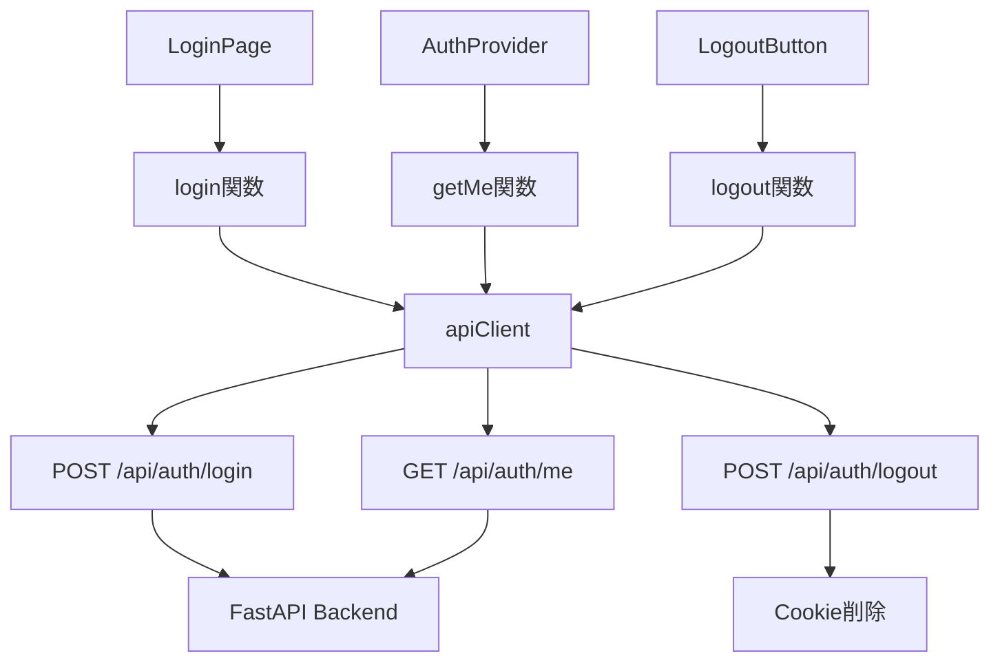

# フロントエンド関数リファレンス

## 概要

本ドキュメントでは、Miscatフロントエンドアプリケーションの主要なファイル、コンポーネント、関数について詳細に説明します。


---

## ファイル構成

```
frontend/miscat/
├── lib/
│   └── api.ts                        # APIクライアント
├── app/
│   ├── api/
│   │   └── auth/
│   │       ├── login/route.ts        # ログインBFF
│   │       ├── logout/route.ts       # ログアウトBFF
│   │       └── me/route.ts           # ユーザー情報取得BFF
│   ├── (auth)/
│   │   └── login/
│   │       └── page.tsx              # ログインページ
│   └── layout.tsx                    # ルートレイアウト
└── context/
    └── AuthContext.tsx               # 認証コンテキスト
```

---

## APIクライアント (lib/api.ts)

### 概要

axiosを使用したAPIクライアント。BFF（Backend for Frontend）との通信を担当します。

### axiosインスタンス: `apiClient`

**説明:** BFF API用に設定されたaxiosインスタンス

**設定:**
```typescript
export const apiClient = axios.create({
  baseURL: '/api',
  headers: {
    'Content-Type': 'application/json',
  },
  withCredentials: true, // HttpOnly Cookieを使用
});
```

**特徴:**
- baseURL: `/api` - Next.js BFFへのリクエスト
- withCredentials: `true` - Cookieの送受信を有効化
- 自動でJSONをパース

---

### 型定義

#### `LoginResponse`

```typescript
export interface LoginResponse {
  access_token: string;
  token_type: string;
}
```

| フィールド | 型 | 説明 |
|-----------|-----|------|
| `access_token` | string | JWT認証トークン |
| `token_type` | string | トークンタイプ（通常 "bearer"） |

#### `User`

```typescript
export interface User {
  user_id: number;
  username: string;
  display_name: string;
  bio?: string;
  created_at: string;
}
```

| フィールド | 型 | 説明 |
|-----------|-----|------|
| `user_id` | number | ユーザーID |
| `username` | string | ユーザー名（一意） |
| `display_name` | string | 表示名 |
| `bio` | string? | 自己紹介（オプショナル） |
| `created_at` | string | アカウント作成日時（ISO 8601形式） |

---

### 関数: `login`

**説明:** ユーザーログイン処理

**シグネチャ:**
```typescript
async function login(
  username: string,
  password: string
): Promise<LoginResponse>
```

**引数:**
| 引数 | 型 | 説明 |
|------|-----|------|
| `username` | string | ユーザー名 |
| `password` | string | パスワード |

**戻り値:**
- `Promise<LoginResponse>` - アクセストークンとトークンタイプ

**例外:**
- `AxiosError` - 認証失敗、ネットワークエラー等

**使用例:**
```typescript
import { login } from '@/lib/api';

try {
  const response = await login('testuser', 'password123');
  console.log('Token:', response.access_token);
} catch (error) {
  if (axios.isAxiosError(error)) {
    console.error('Login failed:', error.response?.data);
  }
}
```

**実装:**
```typescript
export async function login(username: string, password: string): Promise<LoginResponse> {
  const response = await apiClient.post<LoginResponse>('/auth/login', {
    username,
    password,
  });
  return response.data;
}
```

---

### 関数: `logout`

**説明:** ユーザーログアウト処理（Cookieをクリア）

**シグネチャ:**
```typescript
async function logout(): Promise<void>
```

**引数:** なし

**戻り値:** `Promise<void>`

**例外:**
- `AxiosError` - サーバーエラー

**使用例:**
```typescript
import { logout } from '@/lib/api';

try {
  await logout();
  console.log('Logged out successfully');
} catch (error) {
  console.error('Logout failed:', error);
}
```

**実装:**
```typescript
export async function logout(): Promise<void> {
  await apiClient.post('/auth/logout');
}
```

---

### 関数: `getMe`

**説明:** 現在のユーザー情報を取得

**シグネチャ:**
```typescript
async function getMe(): Promise<User>
```

**引数:** なし

**戻り値:**
- `Promise<User>` - 現在のユーザー情報

**例外:**
- `AxiosError` - 未認証（401）、サーバーエラー

**使用例:**
```typescript
import { getMe } from '@/lib/api';

try {
  const user = await getMe();
  console.log('Current user:', user.username);
} catch (error) {
  if (axios.isAxiosError(error) && error.response?.status === 401) {
    console.log('Not authenticated');
  }
}
```

**実装:**
```typescript
export async function getMe(): Promise<User> {
  const response = await apiClient.get<User>('/auth/me');
  return response.data;
}
```

---

## BFF認証API

### POST /api/auth/login (app/api/auth/login/route.ts)

**概要:** ログイン処理を行うBFF API。FastAPIバックエンドへのプロキシとHttpOnly Cookie設定を担当。

**リクエスト:**
```typescript
// Method: POST
// Content-Type: application/json
{
  "username": "testuser",
  "password": "password123"
}
```

**レスポンス (成功):**
```typescript
// Status: 200 OK
// Set-Cookie: access_token=xxx; HttpOnly; Secure; SameSite=Lax
{
  "access_token": "eyJhbGciOiJIUzI1NiIs...",
  "token_type": "bearer"
}
```

**レスポンス (失敗):**
```typescript
// Status: 400 Bad Request
{
  "error": "Username and password are required"
}

// Status: 401 Unauthorized
{
  "error": "Authentication failed"
}

// Status: 500 Internal Server Error
{
  "error": "Internal server error"
}
```

**実装詳細:**

```typescript
export async function POST(request: NextRequest) {
  try {
    const { username, password } = await request.json();

    // バリデーション
    if (!username || !password) {
      return NextResponse.json(
        { error: 'Username and password are required' },
        { status: 400 }
      );
    }

    // FastAPIへform-urlencodedでリクエスト
    const formData = new URLSearchParams();
    formData.append('username', username);
    formData.append('password', password);

    const response = await fetch(`${BACKEND_URL}/auth/token`, {
      method: 'POST',
      headers: {
        'Content-Type': 'application/x-www-form-urlencoded',
      },
      body: formData.toString(),
    });

    if (!response.ok) {
      const error = await response.json();
      return NextResponse.json(
        { error: error.detail || 'Authentication failed' },
        { status: response.status }
      );
    }

    const data = await response.json();
    const { access_token, token_type } = data;

    // HttpOnly Cookie設定
    const res = NextResponse.json({ access_token, token_type });
    res.cookies.set('access_token', access_token, {
      httpOnly: true,
      secure: process.env.NODE_ENV === 'production',
      sameSite: 'lax',
      maxAge: 60 * 60 * 24 * 7, // 7日間
      path: '/',
    });

    return res;
  } catch (error) {
    console.error('Login error:', error);
    return NextResponse.json(
      { error: 'Internal server error' },
      { status: 500 }
    );
  }
}
```

**セキュリティ設定:**
- `httpOnly: true` - JavaScriptからのアクセスを防止
- `secure: true` (production) - HTTPS接続時のみ送信
- `sameSite: 'lax'` - CSRF攻撃を防止
- `maxAge: 7日間` - 自動ログアウト

---

### POST /api/auth/logout (app/api/auth/logout/route.ts)

**概要:** ログアウト処理（Cookieの削除）

**リクエスト:**
```typescript
// Method: POST
// No body required
```

**レスポンス:**
```typescript
// Status: 200 OK
{
  "message": "Logged out successfully"
}
```

**実装:**
```typescript
export async function POST(request: NextRequest) {
  try {
    const res = NextResponse.json({ message: 'Logged out successfully' });
    res.cookies.delete('access_token');
    return res;
  } catch (error) {
    console.error('Logout error:', error);
    return NextResponse.json(
      { error: 'Internal server error' },
      { status: 500 }
    );
  }
}
```

---

### GET /api/auth/me (app/api/auth/me/route.ts)

**概要:** 現在のユーザー情報を取得

**リクエスト:**
```typescript
// Method: GET
// Cookie: access_token=xxx
```

**レスポンス (成功):**
```typescript
// Status: 200 OK
{
  "user_id": 1,
  "username": "testuser",
  "display_name": "Test User",
  "bio": "Hello, World!",
  "created_at": "2025-01-01T00:00:00Z"
}
```

**レスポンス (失敗):**
```typescript
// Status: 401 Unauthorized
{
  "error": "Not authenticated"
}
// または
{
  "error": "Invalid or expired token"
}
```

**実装:**
```typescript
export async function GET(request: NextRequest) {
  try {
    const accessToken = request.cookies.get('access_token')?.value;

    if (!accessToken) {
      return NextResponse.json(
        { error: 'Not authenticated' },
        { status: 401 }
      );
    }

    const response = await fetch(`${BACKEND_URL}/users/me`, {
      method: 'GET',
      headers: {
        Authorization: `Bearer ${accessToken}`,
      },
    });

    if (!response.ok) {
      if (response.status === 401) {
        return NextResponse.json(
          { error: 'Invalid or expired token' },
          { status: 401 }
        );
      }
      const error = await response.json();
      return NextResponse.json(
        { error: error.detail || 'Failed to fetch user information' },
        { status: response.status }
      );
    }

    const userData = await response.json();
    return NextResponse.json(userData);
  } catch (error) {
    console.error('Get user error:', error);
    return NextResponse.json(
      { error: 'Internal server error' },
      { status: 500 }
    );
  }
}
```

---

## ログインページ

### コンポーネント: LoginPage (app/(auth)/login/page.tsx)

**概要:** ユーザーログインUIを提供するページコンポーネント

**使用コンポーネント:**
- `Button` - shadcn/ui
- `Input` - shadcn/ui
- `Card`, `CardContent`, `CardHeader`, `CardTitle`, `CardDescription` - shadcn/ui

**状態管理:**
```typescript
const [username, setUsername] = useState('');
const [password, setPassword] = useState('');
const [error, setError] = useState('');
const [isLoading, setIsLoading] = useState(false);
```

**主要機能:**
1. フォームバリデーション
2. ログイン処理
3. エラー表示
4. ローディング状態管理
5. ログイン成功後のリダイレクト

**使用例（実装）:**
```typescript
'use client';

import { useState } from 'react';
import { useRouter } from 'next/navigation';
import { Button } from '@/components/ui/button';
import { Input } from '@/components/ui/input';
import { Card, CardContent, CardDescription, CardHeader, CardTitle } from '@/components/ui/card';
import { login } from '@/lib/api';

export default function LoginPage() {
  const router = useRouter();
  const [username, setUsername] = useState('');
  const [password, setPassword] = useState('');
  const [error, setError] = useState('');
  const [isLoading, setIsLoading] = useState(false);

  const handleSubmit = async (e: React.FormEvent) => {
    e.preventDefault();
    setError('');
    setIsLoading(true);

    try {
      if (!username || !password) {
        setError('ユーザー名とパスワードを入力してください');
        setIsLoading(false);
        return;
      }

      await login(username, password);
      router.push('/');
    } catch (err: unknown) {
      if (err instanceof Error) {
        setError(err.message || 'ログインに失敗しました');
      } else {
        setError('ログインに失敗しました');
      }
    } finally {
      setIsLoading(false);
    }
  };

  return (
    <div className="min-h-screen flex items-center justify-center bg-gray-50 px-4">
      <Card className="w-full max-w-md">
        <CardHeader className="space-y-1">
          <CardTitle className="text-2xl font-bold text-center">
            ログイン
          </CardTitle>
          <CardDescription className="text-center">
            アカウント情報を入力してください
          </CardDescription>
        </CardHeader>
        <CardContent>
          <form onSubmit={handleSubmit} className="space-y-4">
            {/* Form fields... */}
          </form>
        </CardContent>
      </Card>
    </div>
  );
}
```

---

## 認証コンテキスト

### コンポーネント: AuthProvider (context/AuthContext.tsx)

**概要:** アプリケーション全体で認証状態を管理するReact Context

**提供される値:**
```typescript
interface AuthContextType {
  user: User | null;
  isAuthenticated: boolean;
  isLoading: boolean;
  login: (username: string, password: string) => Promise<void>;
  logout: () => Promise<void>;
  refreshUser: () => Promise<void>;
}
```

**使用方法:**

1. **アプリケーションをラップ:**
```typescript
// app/layout.tsx
import { AuthProvider } from '@/context/AuthContext';

export default function RootLayout({ children }) {
  return (
    <html>
      <body>
        <AuthProvider>
          {children}
        </AuthProvider>
      </body>
    </html>
  );
}
```

2. **コンポーネントで使用:**
```typescript
import { useAuth } from '@/context/AuthContext';

export default function SomeComponent() {
  const { user, isAuthenticated, isLoading, logout } = useAuth();

  if (isLoading) {
    return <div>Loading...</div>;
  }

  if (!isAuthenticated) {
    return <div>Please login</div>;
  }

  return (
    <div>
      <p>Welcome, {user?.username}!</p>
      <button onClick={logout}>Logout</button>
    </div>
  );
}
```

---

## 依存関係図



---

## まとめ

本ドキュメントでは、Miscatフロントエンドの主要な関数とコンポーネントについて詳しく説明しました。

**次のドキュメント:**
- [フロントエンドアーキテクチャ](../frontend-architecture.md)
- [UI/UXデザインガイド](../ui-design.md)
