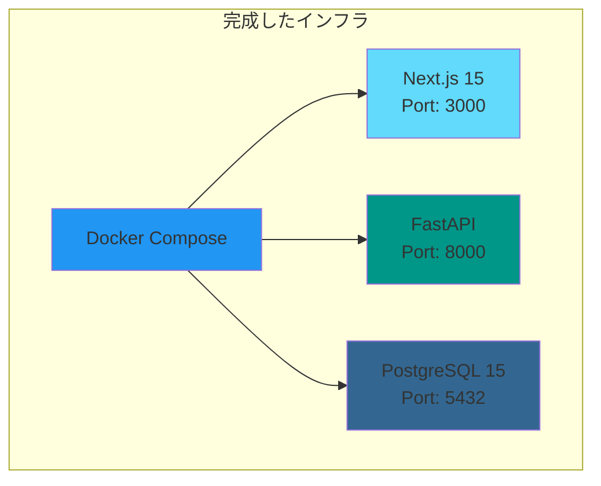

# 次回イテレーション作業指示書

**作成日**: 2025-11-09
**対象読者**: 次回の開発者
**現在のバージョン**: Phase 1 完了

---

## 今回実装した機能

### ✅ インフラストラクチャ



**詳細**:
- Docker Compose による3コンテナ構成
- ホットリロード有効化（開発効率向上）
- ボリューム永続化（データベース）
- ヘルスチェック機能

**ファイル**:
- `docker-compose.yml`
- `backend/Dockerfile`
- `frontend/Dockerfile`
- `Makefile`

---

### ✅ データベーススキーマ（Alembic）

**実装済みテーブル**: 8テーブル

| # | テーブル名 | 説明 | レコード数 |
|---|----------|-----|-----------|
| 1 | users | ユーザー情報 | 0 |
| 2 | tags | タグ情報 | 0 |
| 3 | user_tags | ユーザー-タグ関連 | 0 |
| 4 | wiki_pages | Wikiページ | 0 |
| 5 | wiki_page_permissions | Wiki権限管理 | 0 |
| 6 | channels | チャンネル情報 | 0 |
| 7 | messages | メッセージ | 0 |
| 8 | files | ファイル情報 | 0 |

**マイグレーション**:
- リビジョンID: `34b3d39281f3`
- ファイル: `backend/alembic/versions/34b3d39281f3_create_all_tables.py`

**実行方法**:
```bash
make migrate-be
```

---

### ✅ 認証・認可API（バックエンド）

**実装済みエンドポイント**:

| メソッド | パス | 説明 | 認証 |
|---------|-----|------|-----|
| POST | /auth/signup | ユーザー登録 | ❌ |
| POST | /auth/token | ログイン（JWT発行） | ❌ |
| GET | /users/me | 現在のユーザー情報取得 | ✅ |
| GET | /health | ヘルスチェック | ❌ |

**主要機能**:
- パスワードハッシュ化（bcrypt）
- JWT生成・検証（python-jose）
- Pydanticバリデーション
- CORS設定

**ファイル**:
- `backend/main.py`
- `backend/app/routers/auth.py`
- `backend/app/routers/users.py`
- `backend/app/schemas/user.py`
- `backend/app/models/user.py`
- `backend/app/db/create.py`
- `backend/app/db/auth.py`

---

### ✅ テスト環境（pytest）

**実装済みテスト**: 4件

```bash
test/test_api.py::test_root_endpoint PASSED              [ 25%]
test/test_api.py::test_health_check_endpoint PASSED      [ 50%]
test/test_api.py::test_openapi_spec PASSED               [ 75%]
test/test_api.py::test_docs_available PASSED             [100%]
```

**ファイル**:
- `backend/test/conftest.py` - pytest設定・フィクスチャ
- `backend/test/test_api.py` - APIテスト
- `backend/pytest.ini` - pytest設定

**実行方法**:
```bash
docker exec finalwork-backend-1 python -m pytest test/ -v
```

---

### ✅ ドキュメント

作成済みドキュメント:
1. `docs/setup.md` - セットアップガイド
2. `docs/architecture.md` - システムアーキテクチャ
3. `docs/data-flow.md` - データフロー図
4. `docs/operations.md` - 運用ガイド
5. `docs/testing.md` - テストガイド
6. `docs/next-iteration/README.md` - 次回作業用指示書（本ファイル）

---

## 未実装機能

### 🔴 優先度: 高

#### 1. Wiki機能

**概要**: Wikiページの作成・編集・閲覧機能

**必要なエンドポイント**:
```
POST   /wiki/pages           - Wikiページ作成
GET    /wiki/pages           - Wikiページ一覧取得
GET    /wiki/pages/{id}      - Wikiページ詳細取得
PUT    /wiki/pages/{id}      - Wikiページ更新
DELETE /wiki/pages/{id}      - Wikiページ削除
```

**参考実装**:
```python
# backend/app/routers/wiki.py
from fastapi import APIRouter, Depends
from app.schemas.wiki import WikiPageCreate, WikiPageUpdate, WikiPagePublic

router = APIRouter(prefix="/wiki", tags=["Wiki"])

@router.post("/pages", response_model=WikiPagePublic, status_code=201)
async def create_wiki_page(
    page: WikiPageCreate,
    current_user = Depends(get_current_user)
):
    # 実装が必要
    pass
```

**テーブル**: `wiki_pages`（既に存在）

---

#### 2. Wiki権限機能

**概要**: Wikiページへのアクセス権限管理

**必要なエンドポイント**:
```
POST   /wiki/pages/{id}/permissions      - 権限追加
GET    /wiki/pages/{id}/permissions      - 権限一覧取得
DELETE /wiki/pages/{id}/permissions/{uid} - 権限削除
```

**権限レベル**:
- `read` - 閲覧のみ
- `write` - 編集可能
- `admin` - 削除・権限管理可能

**テーブル**: `wiki_page_permissions`（既に存在）

---

#### 3. タグ機能

**概要**: ユーザーへのタグ付け機能

**必要なエンドポイント**:
```
POST   /tags              - タグ作成
GET    /tags              - タグ一覧取得
POST   /users/me/tags     - 自分にタグ追加
DELETE /users/me/tags/{id} - 自分からタグ削除
GET    /tags/{id}/users   - タグを持つユーザー検索
```

**テーブル**: `tags`, `user_tags`（既に存在）

---

### 🟡 優先度: 中

#### 4. チャンネル・DM機能

**概要**: チャンネルチャットとダイレクトメッセージ

**必要なエンドポイント**:
```
# チャンネル
POST   /channels              - チャンネル作成
GET    /channels              - チャンネル一覧取得
POST   /channels/{id}/messages - メッセージ送信

# DM
POST   /messages              - DM送信
GET    /messages              - DM一覧取得
```

**テーブル**: `channels`, `messages`（既に存在）

**注意事項**:
- リアルタイム性が必要な場合、WebSocketの検討が必要
- 既存のREST APIでは定期的なポーリングが必要

**WebSocket実装例**:
```python
# backend/app/routers/websocket.py
from fastapi import WebSocket, WebSocketDisconnect

@router.websocket("/ws/channels/{channel_id}")
async def websocket_channel(websocket: WebSocket, channel_id: int):
    await websocket.accept()
    try:
        while True:
            data = await websocket.receive_text()
            # メッセージブロードキャスト
            await websocket.send_text(f"Message: {data}")
    except WebSocketDisconnect:
        pass
```

---

#### 5. ファイル管理機能

**概要**: ファイルアップロード・ダウンロード

**必要なエンドポイント**:
```
POST   /files              - ファイルアップロード
GET    /files/{id}         - ファイルダウンロード
DELETE /files/{id}         - ファイル削除
GET    /wiki/pages/{id}/files - Wikiページのファイル一覧
GET    /messages/{id}/files   - メッセージのファイル一覧
```

**テーブル**: `files`（既に存在）

**実装例**:
```python
from fastapi import File, UploadFile
import shutil

@router.post("/files", status_code=201)
async def upload_file(file: UploadFile = File(...)):
    file_path = f"uploads/{file.filename}"
    with open(file_path, "wb") as buffer:
        shutil.copyfileobj(file.file, buffer)
    return {"filename": file.filename, "path": file_path}
```

**注意事項**:
- ファイル保存先を検討（ローカル or S3等）
- ファイルサイズ制限の設定
- MIMEタイプの検証

---

### 🟢 優先度: 低

#### 6. 検索機能

**概要**: ユーザー、Wiki、メッセージの全文検索

**必要なエンドポイント**:
```
GET /search?q={query}&type={users|wiki|messages}
```

**実装方法の選択肢**:
1. PostgreSQL Full-Text Search
2. Elasticsearch（外部サービス）
3. 簡易的なLIKE検索

**PostgreSQL Full-Text Search例**:
```sql
SELECT * FROM wiki_pages
WHERE to_tsvector('english', title || ' ' || content)
      @@ to_tsquery('english', 'search_term');
```

---

#### 7. 通知機能

**概要**: メンション、DM、Wiki更新の通知

**必要なエンドポイント**:
```
GET    /notifications           - 通知一覧取得
PUT    /notifications/{id}/read - 既読にする
DELETE /notifications/{id}      - 通知削除
```

**新規テーブル**:
```sql
CREATE TABLE notifications (
    id SERIAL PRIMARY KEY,
    user_id UUID NOT NULL REFERENCES users(id),
    type VARCHAR(50) NOT NULL,  -- 'mention', 'dm', 'wiki_update'
    content TEXT NOT NULL,
    is_read BOOLEAN DEFAULT FALSE,
    created_at TIMESTAMP NOT NULL
);
```

---

## 技術的負債

### 🔧 要対処

#### 1. テストカバレッジ不足

**現状**: 基本的なエンドポイントテストのみ（4件）

**必要な改善**:
- 認証フローのテスト（signup, login, JWT検証）
- データベーステスト（CRUD操作）
- バリデーションエラーテスト
- 統合テスト

**推奨カバレッジ**: 80%以上

**実装例**:
```bash
# カバレッジ測定
docker exec finalwork-backend-1 python -m pytest test/ --cov=app --cov-report=html

# HTMLレポート確認
open backend/htmlcov/index.html
```

---

#### 2. エラーハンドリングの統一

**現状**: エラーレスポンスの形式が統一されていない

**推奨**: カスタム例外ハンドラーの実装

```python
# backend/app/exceptions.py
from fastapi import HTTPException

class UserAlreadyExistsException(HTTPException):
    def __init__(self, username: str):
        super().__init__(
            status_code=400,
            detail=f"Username '{username}' already exists"
        )

# backend/main.py
from fastapi.responses import JSONResponse

@app.exception_handler(UserAlreadyExistsException)
async def user_already_exists_handler(request, exc):
    return JSONResponse(
        status_code=exc.status_code,
        content={"error": "USER_ALREADY_EXISTS", "detail": exc.detail}
    )
```

---

#### 3. ログ設定の改善

**現状**: デフォルトのUvicornログのみ

**推奨**: 構造化ログの導入

```python
# backend/app/logging_config.py
import logging
import json

class JSONFormatter(logging.Formatter):
    def format(self, record):
        log_data = {
            "timestamp": self.formatTime(record),
            "level": record.levelname,
            "message": record.getMessage(),
            "module": record.module
        }
        return json.dumps(log_data)

# 設定
logging.basicConfig(level=logging.INFO)
handler = logging.StreamHandler()
handler.setFormatter(JSONFormatter())
logger = logging.getLogger("app")
logger.addHandler(handler)
```

---

#### 4. 環境変数管理の改善

**現状**: `.env` ファイルに直接記述

**推奨**: Pydantic Settingsの活用

```python
# backend/app/config.py
from pydantic_settings import BaseSettings

class Settings(BaseSettings):
    database_url: str
    secret_key: str
    algorithm: str = "HS256"
    access_token_expire_minutes: int = 30

    class Config:
        env_file = ".env"

settings = Settings()
```

---

## 改善提案

### 💡 パフォーマンス

#### 1. データベースインデックス

**現状**: 主キー以外にインデックスなし

**推奨**:
```sql
-- ユーザー検索の高速化
CREATE INDEX idx_users_username ON users(username);
CREATE INDEX idx_users_email ON users(email);

-- Wiki検索の高速化
CREATE INDEX idx_wiki_pages_creator_id ON wiki_pages(creator_id);
CREATE INDEX idx_wiki_pages_created_at ON wiki_pages(created_at DESC);

-- メッセージ検索の高速化
CREATE INDEX idx_messages_channel_id ON messages(channel_id);
CREATE INDEX idx_messages_sender_id ON messages(sender_id);
```

---

#### 2. レスポンスキャッシュ

**推奨**: Redisを使ったキャッシュ

```python
# docker-compose.yml に追加
services:
  redis:
    image: redis:7-alpine
    ports:
      - "6379:6379"

# backend/app/cache.py
import redis
import json

redis_client = redis.Redis(host='redis', port=6379, decode_responses=True)

def cache_response(key: str, data: dict, expire: int = 300):
    """レスポンスをキャッシュ"""
    redis_client.setex(key, expire, json.dumps(data))

def get_cached_response(key: str):
    """キャッシュからレスポンス取得"""
    data = redis_client.get(key)
    return json.loads(data) if data else None
```

---

### 🔒 セキュリティ

#### 1. レート制限

**推奨**: slowapi の導入

```python
# backend/app/rate_limit.py
from slowapi import Limiter, _rate_limit_exceeded_handler
from slowapi.util import get_remote_address

limiter = Limiter(key_func=get_remote_address)

# backend/main.py
app.state.limiter = limiter
app.add_exception_handler(RateLimitExceeded, _rate_limit_exceeded_handler)

@app.post("/auth/signup")
@limiter.limit("5/minute")  # 1分間に5回まで
async def signup(request: Request, user: UserCreate):
    pass
```

---

#### 2. HTTPS強制（本番環境）

```python
# backend/main.py
from fastapi.middleware.httpsredirect import HTTPSRedirectMiddleware

if settings.environment == "production":
    app.add_middleware(HTTPSRedirectMiddleware)
```

---

### 🎨 フロントエンド

#### 1. UIコンポーネントライブラリの導入

**推奨**: shadcn/ui または MUI

```bash
# shadcn/ui のインストール
npx shadcn-ui@latest init
npx shadcn-ui@latest add button
npx shadcn-ui@latest add input
npx shadcn-ui@latest add card
```

---

#### 2. 状態管理の導入

**推奨**: Zustand または Jotai

```bash
npm install zustand
```

```typescript
// frontend/src/store/authStore.ts
import { create } from 'zustand'

interface AuthState {
  user: User | null
  setUser: (user: User) => void
  logout: () => void
}

export const useAuthStore = create<AuthState>((set) => ({
  user: null,
  setUser: (user) => set({ user }),
  logout: () => set({ user: null })
}))
```

---

## 次回開発者へのヒント

### 📝 作業開始前のチェックリスト

```markdown
- [ ] リポジトリをクローン
- [ ] 環境変数ファイル作成（backend/.env, frontend/.env.local）
- [ ] Docker Compose起動（make up）
- [ ] マイグレーション実行（make migrate-be）
- [ ] Swagger UI確認（http://localhost:8000/docs）
- [ ] テスト実行（pytest）
- [ ] ドキュメント全て読了
```

---

### 🛠️ 推奨開発フロー


1. **要件確認**: 未実装機能リストから選択
2. **スキーマ設計**: 必要に応じてテーブル追加・変更
3. **マイグレーション作成**: Alembic revision
4. **モデル実装**: SQLAlchemy models
5. **スキーマ実装**: Pydantic schemas
6. **CRUD実装**: データベース操作関数
7. **ルーター実装**: FastAPI routers
8. **テスト作成**: pytest
9. **動作確認**: Swagger UI
10. **ドキュメント更新**: 実装内容を記録

---

### 🔍 デバッグTips

#### Swagger UIが便利
```
http://localhost:8000/docs
```
- 全エンドポイントをGUIでテスト可能
- リクエスト・レスポンスの確認が容易
- 認証トークンの設定も簡単

#### ログはリアルタイムで確認
```bash
# 全サービス
docker-compose logs -f

# バックエンドのみ
make logs-be
```

#### データベースを直接確認
```bash
make sh-db
psql -U fastapi_user -d commu_db
\dt           # テーブル一覧
\d users      # usersテーブル詳細
SELECT * FROM users;
```

---

### 📚 参考リソース

**FastAPI公式**:
- https://fastapi.tiangolo.com/

**SQLAlchemy公式**:
- https://docs.sqlalchemy.org/

**Alembic公式**:
- https://alembic.sqlalchemy.org/

**Pydantic公式**:
- https://docs.pydantic.dev/

**pytest公式**:
- https://docs.pytest.org/

---

### 💬 困ったときは

1. **Swagger UIで確認**: http://localhost:8000/docs
2. **ログを確認**: `make logs-be`
3. **データベースを確認**: `make sh-db`
4. **ドキュメントを参照**: `docs/`
5. **テストを実行**: `pytest test/ -v`

---

## まとめ

Phase 1では基礎的なインフラとユーザー認証機能を実装しました。
次回は **Wiki機能** または **タグ機能** から着手することを推奨します。

**頑張ってください！**

---

**作成日**: 2025-11-09
**作成者**: worker3
**バージョン**: 1.0.0
