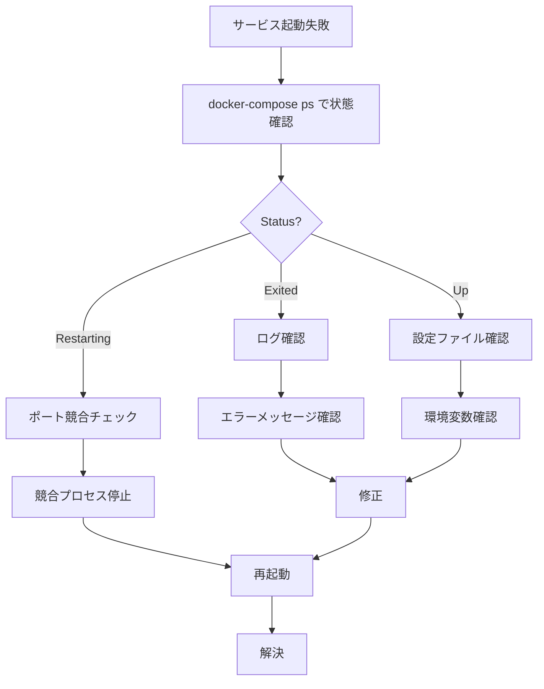

# 運用ガイド
---

## Makefileコマンド

プロジェクトルートの `Makefile` には、頻繁に使用するコマンドがまとめられています。

### サービス管理

#### make up
全サービスを起動します（デタッチモード）。

```bash
make up
```

**内部コマンド**: `docker-compose up -d`

**実行内容**:
- フロントエンド、バックエンド、データベースの3コンテナを起動
- 初回実行時はイメージをビルド
- バックグラウンドで実行

**確認**:
```bash
docker-compose ps
```

---

#### make down
全サービスを停止し、コンテナを削除します。

```bash
make down
```

**内部コマンド**: `docker-compose down`

**実行内容**:
- 全コンテナを停止
- コンテナを削除
- ネットワークを削除
- ボリュームは保持（データは削除されない）

**ボリュームも削除する場合**:
```bash
docker-compose down -v
```

---

#### make restart
全サービスを再起動します。

```bash
make restart
```

**内部コマンド**: `docker-compose restart`

**使用例**:
- 環境変数を変更した後
- 設定ファイルを変更した後

---

### ログ表示

#### make logs
全サービスのログを表示します。

```bash
make logs
```

**内部コマンド**: `docker-compose logs`

**オプション**:
```bash
# リアルタイムでログを表示（tail -f 相当）
docker-compose logs -f

# 最新100行のみ表示
docker-compose logs --tail=100
```

---

#### make logs-be
バックエンドのログのみ表示します。

```bash
make logs-be
```

**内部コマンド**: `docker-compose logs backend`

**出力例**:
```
INFO:     Uvicorn running on http://0.0.0.0:8000 (Press CTRL+C to quit)
INFO:     Started reloader process [1] using StatReload
INFO:     Started server process [7]
INFO:     Waiting for application startup.
INFO:     Application startup complete.
```

---

#### make logs-fe
フロントエンドのログのみ表示します。

```bash
make logs-fe
```

**内部コマンド**: `docker-compose logs frontend`

**出力例**:
```
> frontend@0.1.0 dev
> next dev

   ▲ Next.js 15.0.0
   - Local:        http://localhost:3000

 ✓ Ready in 842ms
```

---

#### make logs-db
データベースのログのみ表示します。

```bash
make logs-db
```

**内部コマンド**: `docker-compose logs db`

**出力例**:
```
PostgreSQL Database directory appears to contain a database; Skipping initialization

2025-11-09 06:00:00.000 UTC [1] LOG:  starting PostgreSQL 15.3
2025-11-09 06:00:00.100 UTC [1] LOG:  listening on IPv4 address "0.0.0.0", port 5432
2025-11-09 06:00:00.200 UTC [1] LOG:  database system is ready to accept connections
```

---

### シェルアクセス

#### make sh-be
バックエンドコンテナのシェルに入ります。

```bash
make sh-be
```

**内部コマンド**: `docker exec -it finalwork-backend-1 /bin/bash`

**使用例**:
```bash
# シェルに入る
make sh-be

# Pythonインタープリタを起動
root@container:/app# python

# 依存関係を確認
root@container:/app# uv pip list

# 手動でマイグレーション実行
root@container:/app# python -m alembic upgrade head

# 終了
root@container:/app# exit
```

---

#### make sh-fe
フロントエンドコンテナのシェルに入ります。

```bash
make sh-fe
```

**内部コマンド**: `docker exec -it finalwork-frontend-1 /bin/sh`

**使用例**:
```bash
# シェルに入る
make sh-fe

# 依存関係を確認
/app # npm list

# パッケージを追加
/app # npm install axios

# 終了
/app # exit
```

---

#### make sh-db
データベースコンテナのシェルに入ります。

```bash
make sh-db
```

**内部コマンド**: `docker exec -it finalwork-db-1 /bin/bash`

**使用例**:
```bash
# シェルに入る
make sh-db

# PostgreSQLクライアントで接続
bash-5.1# psql -U fastapi_user -d commu_db

# テーブル一覧表示
commu_db=# \dt

# SQLクエリ実行
commu_db=# SELECT * FROM users;

# 終了
commu_db=# \q
bash-5.1# exit
```

---

### マイグレーション

#### make migrate-be
Alembicマイグレーションを実行します。

```bash
make migrate-be
```

**内部コマンド**: `docker exec finalwork-backend-1 python -m alembic upgrade head`

**実行内容**:
- `alembic/versions/` 内の未適用マイグレーションを全て実行
- データベーススキーマを最新状態に更新

**マイグレーション状態確認**:
```bash
docker exec finalwork-backend-1 python -m alembic current
```

---

## Docker Composeコマンド

Makefileを使わない場合の直接コマンド。

### 基本操作

```bash
# サービス起動
docker-compose up -d

# サービス停止
docker-compose down

# サービス再起動
docker-compose restart

# サービス状態確認
docker-compose ps

# イメージビルド
docker-compose build

# キャッシュなしでビルド
docker-compose build --no-cache

# 特定サービスのみビルド
docker-compose build backend
```

### コンテナ操作

```bash
# コンテナ一覧
docker-compose ps

# 実行中のプロセス確認
docker-compose top

# コンテナの詳細情報
docker-compose inspect backend

# コンテナ内でコマンド実行
docker-compose exec backend python --version

# 特定サービスのみ起動
docker-compose up -d backend db
```

### ログとモニタリング

```bash
# 全ログ表示
docker-compose logs

# 特定サービスのログ
docker-compose logs backend

# リアルタイムログ（tail -f相当）
docker-compose logs -f

# 最新N行のみ表示
docker-compose logs --tail=50

# タイムスタンプ付きログ
docker-compose logs -t
```

---

## ログ確認

### ログレベルの理解

#### バックエンドログレベル（Uvicorn）

| レベル | 説明 | 例 |
|-------|-----|---|
| INFO | 通常動作の情報 | `Application startup complete` |
| WARNING | 警告（動作は継続） | `StatReload detected changes` |
| ERROR | エラー発生 | `Error loading ASGI app` |

#### ログフォーマット

```
INFO:     [uvicorn.server] Uvicorn running on http://0.0.0.0:8000 (Press CTRL+C to quit)
|         |                |
レベル    モジュール名       メッセージ
```

### よく見るログパターン

#### 正常起動

**バックエンド**:
```
INFO:     Will watch for changes in these directories: ['/app']
INFO:     Uvicorn running on http://0.0.0.0:8000 (Press CTRL+C to quit)
INFO:     Started reloader process [1] using StatReload
INFO:     Started server process [7]
INFO:     Waiting for application startup.
INFO:     Application startup complete.
```

**フロントエンド**:
```
   ▲ Next.js 15.0.0
   - Local:        http://localhost:3000

 ✓ Ready in 842ms
```

**データベース**:
```
LOG:  database system is ready to accept connections
```

#### エラーパターン

**ポート競合**:
```
Error: Bind for 0.0.0.0:8000 failed: port is already allocated
```

**データベース接続エラー**:
```
sqlalchemy.exc.OperationalError: could not connect to server
```

**マイグレーションエラー**:
```
ERROR: Target database is not up to date
```

---

## デバッグ方法

### 1. サービスが起動しない場合



**手順**:

```bash
# 1. サービス状態確認
docker-compose ps

# 2. ログ確認
docker-compose logs backend

# 3. ポート使用確認（macOS/Linux）
lsof -i :8000

# 4. コンテナ再作成
docker-compose down
docker-compose up -d --build
```

### 2. データベース接続エラー

```bash
# データベースコンテナが起動しているか確認
docker-compose ps db

# データベースログ確認
docker-compose logs db

# データベースに直接接続して確認
docker exec -it finalwork-db-1 psql -U fastapi_user -d commu_db

# 接続URL確認（バックエンドコンテナ内で）
docker exec -it finalwork-backend-1 env | grep DATABASE_URL
```

### 3. APIエンドポイントが動かない

```bash
# 1. バックエンドが起動しているか確認
curl http://localhost:8000/health

# 2. Swagger UIで確認
open http://localhost:8000/docs

# 3. バックエンドログでエラー確認
docker-compose logs -f backend

# 4. ルーティング確認
docker exec -it finalwork-backend-1 python << EOF
from main import app
print(app.routes)
EOF
```

### 4. ホットリロードが効かない

**バックエンド**:
```bash
# Uvicornが--reloadオプション付きで起動しているか確認
docker-compose logs backend | grep reload

# 期待される出力:
# Started reloader process [1] using StatReload
```

**フロントエンド**:
```bash
# Next.jsが開発モードで起動しているか確認
docker-compose logs frontend | grep dev

# 期待される出力:
# > next dev
```

### 5. パフォーマンス問題

```bash
# コンテナのリソース使用状況
docker stats

# 出力例:
# CONTAINER           CPU %     MEM USAGE / LIMIT     MEM %
# finalwork-backend   0.50%     150MiB / 2GiB        7.32%
# finalwork-db        0.30%     50MiB / 2GiB         2.44%
# finalwork-frontend  0.20%     100MiB / 2GiB        4.88%

# スロークエリ確認（PostgreSQL）
docker exec -it finalwork-db-1 psql -U fastapi_user -d commu_db -c "
SELECT query, calls, total_time, mean_time
FROM pg_stat_statements
ORDER BY total_time DESC
LIMIT 10;
"
```

---

## メンテナンス作業

### データベースバックアップ

```bash
# バックアップ作成
docker exec finalwork-db-1 pg_dump -U fastapi_user commu_db > backup_$(date +%Y%m%d_%H%M%S).sql

# バックアップからリストア
cat backup_20251109_120000.sql | docker exec -i finalwork-db-1 psql -U fastapi_user -d commu_db
```

### ボリューム管理

```bash
# ボリューム一覧
docker volume ls | grep finalwork

# ボリュームの詳細情報
docker volume inspect finalwork_pg_data

# 使用されていないボリューム削除
docker volume prune

# 特定ボリューム削除（データが削除されるので注意！）
docker volume rm finalwork_pg_data
```

### イメージ管理

```bash
# イメージ一覧
docker images | grep finalwork

# 未使用イメージ削除
docker image prune

# 特定イメージ削除
docker rmi finalwork-backend
```

### クリーンアップ

```bash
# 停止中のコンテナ、未使用ネットワーク、未使用イメージを全て削除
docker system prune

# ボリュームも含めて全て削除（データも削除されるので注意！）
docker system prune -a --volumes

# ディスク使用量確認
docker system df
```

---

## モニタリング

### ヘルスチェック

```bash
# バックエンドヘルスチェック
curl http://localhost:8000/health

# 期待されるレスポンス:
# {"status":"healthy"}

# データベースヘルスチェック
docker exec finalwork-db-1 pg_isready -U fastapi_user

# 期待される出力:
# /var/run/postgresql:5432 - accepting connections
```

### リソース監視

```bash
# リアルタイムリソース監視
docker stats

# 一回だけ出力
docker stats --no-stream

# 特定コンテナのみ
docker stats finalwork-backend-1
```

---

## トラブルシューティングチートシート

| 問題 | コマンド | 期待される結果 |
|-----|---------|-------------|
| コンテナ起動しない | `docker-compose ps` | STATUS = Up |
| ポート競合 | `lsof -i :8000` | 空の出力 |
| DB接続エラー | `docker-compose logs db` | "ready to accept connections" |
| API応答なし | `curl localhost:8000/health` | `{"status":"healthy"}` |
| マイグレーション失敗 | `docker exec ... alembic current` | リビジョンID表示 |
| ディスク不足 | `docker system df` | 空き容量確認 |

---

**作成日**: 2025-11-09
**作成者**: worker3
**バージョン**: 1.0.0
