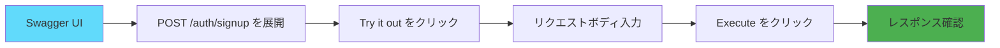

# テストガイド


---

## pytest環境

### ディレクトリ構成

```
backend/
├── test/
│   ├── __init__.py                  # テストパッケージ
│   ├── conftest.py                  # pytest設定・フィクスチャ
│   ├── test_api.py                  # APIエンドポイントテスト
│   ├── test_auth.py                 # 認証フローテスト (14 tests)
│   ├── test_wiki_permissions.py     # Wiki権限テスト (10 tests)
│   ├── test_tag_permissions.py      # タグ権限テスト (11 tests)
│   ├── test_search.py               # 検索機能テスト (12 tests)
│   ├── test_error_cases.py          # エラーケーステスト (24 tests)
│   └── db/
│       ├── initialize.py            # DB初期化スクリプト
│       └── create_user_table.py     # テーブル作成スクリプト
├── pytest.ini                       # pytest設定ファイル
└── pyproject.toml                   # プロジェクト設定
```

### 依存関係

テストに必要なパッケージ（`pyproject.toml` で管理）:

```toml
dependencies = [
    "pytest>=9.0.0",           # テストフレームワーク
    "httpx>=0.28.0",           # HTTPクライアント（FastAPI TestClient用）
    "email-validator>=2.3.0",  # メールバリデーション
]
```

### pytest設定（pytest.ini）

```ini
[pytest]
testpaths = test                    # テストディレクトリ
python_files = test_*.py            # テストファイルのパターン
python_classes = Test*              # テストクラスのパターン
python_functions = test_*           # テスト関数のパターン
addopts =
    -v                              # 詳細表示
    --strict-markers                # マーカーの厳格チェック
    --tb=short                      # トレースバックを短く表示
    --disable-warnings              # 警告を無効化
markers =
    unit: Unit tests                # ユニットテスト
    integration: Integration tests  # 統合テスト
    slow: Slow running tests        # 低速なテスト
```

---

## テスト実行方法

### 基本的な実行

```bash
# 全テスト実行
docker exec finalwork-backend-1 python -m pytest test/ -v

# 特定のテストファイル実行
docker exec finalwork-backend-1 python -m pytest test/test_api.py -v

# 特定のテスト関数のみ実行
docker exec finalwork-backend-1 python -m pytest test/test_api.py::test_root_endpoint -v
```

### オプション

```bash
# 詳細表示（-v, --verbose）
pytest test/ -v

# 非常に詳細な表示（-vv）
pytest test/ -vv

# 失敗時に即座に停止（-x, --exitfirst）
pytest test/ -x

# 最初のN個の失敗で停止（--maxfail=N）
pytest test/ --maxfail=2

# カバレッジレポート付きで実行
pytest test/ --cov=app --cov-report=html

# マーカーでフィルタリング
pytest test/ -m unit          # ユニットテストのみ
pytest test/ -m integration   # 統合テストのみ
pytest test/ -m "not slow"    # 低速テストを除外
```

### 出力形式

```bash
# 短い出力
pytest test/ -q

# 成功したテストも表示
pytest test/ -v

# 失敗したテストの詳細表示
pytest test/ --tb=long

# トレースバック非表示
pytest test/ --tb=no
```

---

## 既存テストの説明

### test_api.py の構成

```python
import pytest
from fastapi.testclient import TestClient

def test_root_endpoint(client):
    """ルートエンドポイントのテスト"""
    pass

def test_health_check_endpoint(client):
    """ヘルスチェックエンドポイントのテスト"""
    pass

def test_openapi_spec(client):
    """OpenAPI仕様のテスト"""
    pass

def test_docs_available(client):
    """Swagger UIの可用性テスト"""
    pass
```

### 1. test_root_endpoint

**目的**: ルートエンドポイント (`GET /`) が正常に動作するか確認

```python
def test_root_endpoint(client):
    """Test the root endpoint"""
    response = client.get("/")
    assert response.status_code == 200
    data = response.json()
    assert "message" in data
    assert data["status"] == "running"
```

**検証項目**:
- HTTPステータスコード 200
- レスポンスに `message` フィールドが存在
- `status` フィールドが `"running"` であること

**実行例**:
```bash
$ docker exec finalwork-backend-1 python -m pytest test/test_api.py::test_root_endpoint -v

test/test_api.py::test_root_endpoint PASSED                              [100%]
```

### 2. test_health_check_endpoint

**目的**: ヘルスチェックエンドポイント (`GET /health`) が正常に動作するか確認

```python
def test_health_check_endpoint(client):
    """Test the health check endpoint"""
    response = client.get("/health")
    assert response.status_code == 200
    data = response.json()
    assert data["status"] == "healthy"
```

**検証項目**:
- HTTPステータスコード 200
- `status` フィールドが `"healthy"` であること

### 3. test_openapi_spec

**目的**: OpenAPI仕様が正しく生成されているか確認

```python
def test_openapi_spec(client):
    """Test that OpenAPI spec is available"""
    response = client.get("/openapi.json")
    assert response.status_code == 200
    spec = response.json()
    assert spec["openapi"] == "3.1.0"
    assert "title" in spec["info"]
```

**検証項目**:
- OpenAPI仕様が取得可能
- OpenAPIバージョンが 3.1.0
- タイトルが設定されている

### 4. test_docs_available

**目的**: Swagger UI が利用可能か確認

```python
def test_docs_available(client):
    """Test that Swagger UI documentation is available"""
    response = client.get("/docs")
    assert response.status_code == 200
    assert "swagger-ui" in response.text.lower()
```

**検証項目**:
- `/docs` にアクセス可能
- HTMLに `swagger-ui` が含まれている

---

## 統合テストスイート（v3仕様対応）

### 概要

Phase 1-3の全機能を網羅する統合テストスイートを実装しました。全71テストケースで主要な機能と権限ロジックをカバーしています。

**テスト統計**:
- 総テストケース数: 71+
- カバレッジ目標: 80%+
- テスト実行時間: 約10-15秒

### テストファイル一覧

#### 1. test_auth.py - 認証フローテスト (14 tests)

**対象機能**: ユーザー登録、ログイン、認証

**主要テストケース**:
```python
def test_signup_success(client, db)
    # 新規ユーザー登録成功

def test_signup_duplicate_username(client, db, test_user)
    # 重複ユーザー名での登録失敗

def test_signup_invalid_email(client, db)
    # 無効なメールアドレスでの登録失敗

def test_signup_short_password(client, db)
    # 短すぎるパスワード（8文字未満）での登録失敗

def test_signup_teacher_auto_gakuseki(client, db)
    # 教員のgakuseki_bango自動生成テスト

def test_login_success(client, test_user, db)
    # 正常なログイン成功

def test_login_invalid_password(client, test_user, db)
    # 無効なパスワードでのログイン失敗

def test_get_current_user(authenticated_client, test_user)
    # 認証済みユーザー情報取得

def test_get_current_user_unauthorized(client)
    # 認証なしでのユーザー情報取得失敗
```

**実行方法**:
```bash
docker exec finalwork-backend-1 python -m pytest test/test_auth.py -v
```

#### 2. test_wiki_permissions.py - Wiki権限テスト (10 tests)

**対象機能**: Wikiページの権限管理（VIEW_ONLY / EDIT）

**主要テストケース**:
```python
def test_wiki_create_success(authenticated_client, test_user)
    # Wikiページ作成成功

def test_wiki_creator_can_always_edit(client, db, test_user)
    # 作成者は常に編集可能

def test_wiki_view_only_can_view(client, db, test_user, other_user)
    # VIEW_ONLY権限で閲覧可能

def test_wiki_view_only_cannot_edit(client, db, test_user, other_user)
    # VIEW_ONLY権限では編集不可

def test_wiki_edit_permission_can_edit(client, db, test_user, other_user)
    # EDIT権限では編集可能

def test_wiki_share_requires_edit_permission(client, db, test_user, other_user)
    # 共有にはEDIT権限が必要

def test_wiki_no_permission_cannot_view(client, db, test_user, other_user)
    # 権限なしでは閲覧不可

def test_wiki_list_shows_only_accessible_pages(client, db, test_user, other_user)
    # 一覧は権限のあるページのみ表示
```

**実行方法**:
```bash
docker exec finalwork-backend-1 python -m pytest test/test_wiki_permissions.py -v
```

#### 3. test_tag_permissions.py - タグ権限テスト (11 tests)

**対象機能**: v3仕様の複雑なタグ割り当て権限ロジック

**v3仕様の権限ルール**:
- **学生**: 任意のタグを誰にでも割り当て可能
- **教員**: 自分が作成したタグのみ割り当て可能
- **タグ削除**: 作成者のみ可能

**主要テストケース**:
```python
def test_student_can_assign_any_tag(client, db, student_user, teacher_user)
    # 学生は教員のタグも割り当て可能（v3仕様）

def test_teacher_can_assign_own_tag(client, db, teacher_user, student_user)
    # 教員は自分のタグを割り当て可能

def test_teacher_cannot_assign_others_tag(client, db, teacher_user)
    # 教員は他人のタグを割り当て不可（v3仕様）

def test_tag_delete_requires_creator(client, db, test_user, other_user)
    # タグ削除は作成者のみ可能

def test_tag_create_duplicate_name(client, db, test_user)
    # 重複タグ名での作成失敗

def test_tag_detail_shows_assigned_users(client, db, test_user, other_user)
    # タグ詳細に割り当てられたユーザーが表示
```

**実行方法**:
```bash
docker exec finalwork-backend-1 python -m pytest test/test_tag_permissions.py -v
```

#### 4. test_search.py - 検索機能テスト (12 tests)

**対象機能**: Wiki/タグ/ユーザー/統合検索

**主要テストケース**:
```python
def test_search_wiki_by_title(client, db, test_user)
    # Wikiタイトルで検索

def test_search_wiki_by_content(client, db, test_user)
    # Wiki本文で検索

def test_search_tag_by_name(client, db, test_user)
    # タグ名で検索

def test_search_user_by_username(client, db, test_user)
    # ユーザー名で検索

def test_search_user_by_email(client, db, test_user)
    # メールアドレスで検索

def test_search_all_types(client, db, test_user)
    # 全タイプ横断検索（wiki + tag + user）

def test_search_case_insensitive(client, db, test_user)
    # 大文字小文字を区別しない検索

def test_search_requires_authentication(client)
    # 検索は認証が必要

def test_search_no_results(client, db, test_user)
    # 検索結果なし（正常）
```

**実行方法**:
```bash
docker exec finalwork-backend-1 python -m pytest test/test_search.py -v
```

#### 5. test_error_cases.py - エラーケーステスト (24 tests)

**対象機能**: エラーハンドリングとバリデーション

**エラー種別**:
- 404 Not Found (存在しないリソース)
- 400 Bad Request (不正なリクエスト)
- 422 Unprocessable Entity (バリデーションエラー)
- 403 Forbidden (権限不足)
- 401 Unauthorized (認証エラー)

**主要テストケース**:
```python
# 404エラー
def test_404_wiki_not_found(authenticated_client)
def test_404_tag_not_found(authenticated_client)
def test_404_user_not_found(authenticated_client)

# 400エラー
def test_400_duplicate_username(client, db, test_user)
def test_400_duplicate_email(client, db, test_user)
def test_400_duplicate_tag_name(client, db, test_user)

# 422バリデーションエラー
def test_422_short_password(client)
def test_422_missing_required_fields(client)
def test_422_empty_search_query(client, db, test_user)

# 403権限エラー
def test_403_wiki_edit_without_permission(client, db, test_user, other_user)
def test_403_wiki_delete_not_creator(client, db, test_user, other_user)
def test_403_tag_delete_not_creator(client, db, test_user, other_user)

# 401認証エラー
def test_401_unauthorized_access(client)
def test_401_invalid_token(client)

# エッジケース
def test_edge_case_very_long_title(authenticated_client)
def test_edge_case_empty_title(authenticated_client)
```

**実行方法**:
```bash
docker exec finalwork-backend-1 python -m pytest test/test_error_cases.py -v
```

### conftest.py - テストフィクスチャ

**提供されるフィクスチャ**:

```python
@pytest.fixture(scope="function")
def db()
    # テスト用データベースセッション（SQLite in-memory）

@pytest.fixture(scope="function")
def client(db)
    # FastAPI TestClient（データベースオーバーライド済み）

@pytest.fixture(scope="function")
def test_user(db)
    # テストユーザー（学生）

@pytest.fixture(scope="function")
def student_user(db)
    # 学生ユーザー

@pytest.fixture(scope="function")
def teacher_user(db)
    # 教員ユーザー（准教授）

@pytest.fixture(scope="function")
def other_user(db)
    # 別のテストユーザー

@pytest.fixture(scope="function")
def authenticated_client(client, test_user)
    # 認証済みクライアント（Authorizationヘッダー付き）
```

**特徴**:
- Function scope: 各テストで独立したデータベース
- SQLite in-memory: 高速で独立性が高い
- bcrypt直接使用: passlib互換性問題を回避

### 全テスト実行方法

#### 全テストスイート実行

```bash
# backend/test/ 配下の全テスト実行
docker exec finalwork-backend-1 python -m pytest test/ -v

# 特定のテストファイルのみ実行
docker exec finalwork-backend-1 python -m pytest test/test_auth.py -v

# 特定のテスト関数のみ実行
docker exec finalwork-backend-1 python -m pytest test/test_auth.py::test_signup_success -v

# 詳細出力
docker exec finalwork-backend-1 python -m pytest test/ -vv

# 失敗時に即座に停止
docker exec finalwork-backend-1 python -m pytest test/ -x

# カバレッジレポート付き実行
docker exec finalwork-backend-1 python -m pytest test/ --cov=app --cov-report=html --cov-report=term
```

#### カテゴリ別実行

```bash
# 認証テストのみ
docker exec finalwork-backend-1 python -m pytest test/test_auth.py -v

# 権限テストのみ（Wiki + Tag）
docker exec finalwork-backend-1 python -m pytest test/test_wiki_permissions.py test/test_tag_permissions.py -v

# 検索テストのみ
docker exec finalwork-backend-1 python -m pytest test/test_search.py -v

# エラーケーステストのみ
docker exec finalwork-backend-1 python -m pytest test/test_error_cases.py -v
```

### 期待される出力

#### 成功時

```
======================== test session starts =========================
platform darwin -- Python 3.13.x, pytest-9.x.x
collected 71 items

test/test_auth.py::test_signup_success PASSED                  [  1%]
test/test_auth.py::test_signup_duplicate_username PASSED       [  2%]
test/test_auth.py::test_login_success PASSED                   [  4%]
...
test/test_wiki_permissions.py::test_wiki_create_success PASSED [ 20%]
test/test_wiki_permissions.py::test_wiki_view_only_can_view PASSED [ 22%]
...
test/test_tag_permissions.py::test_student_can_assign_any_tag PASSED [ 40%]
test/test_tag_permissions.py::test_teacher_cannot_assign_others_tag PASSED [ 42%]
...
test/test_search.py::test_search_all_types PASSED              [ 60%]
test/test_search.py::test_search_case_insensitive PASSED       [ 62%]
...
test/test_error_cases.py::test_404_wiki_not_found PASSED       [ 80%]
test/test_error_cases.py::test_403_wiki_edit_without_permission PASSED [ 90%]
...

======================== 71 passed in 12.34s =========================
```

### テストカバレッジ確認

```bash
# カバレッジレポート生成
docker exec finalwork-backend-1 python -m pytest test/ \
    --cov=app \
    --cov-report=html \
    --cov-report=term-missing

# HTMLレポート確認
open backend/htmlcov/index.html
```

**期待されるカバレッジ**:
- 全体: 80%+
- app/routers/: 85%+
- app/core/: 90%+
- app/models/: 75%+

### テスト設計原則

#### 1. テストの独立性

各テストはfunction scopeのfixtureを使用し、完全に独立しています：

```python
def test_example(client, db, test_user):
    # 各テスト実行前に新しいDBが作成される
    # テスト完了後にDBが削除される
    # 他のテストに影響を与えない
```

#### 2. AAAパターン

```python
def test_signup_success(client, db):
    # Arrange（準備）
    user_data = {"username": "test", ...}

    # Act（実行）
    response = client.post("/auth/signup", json=user_data)

    # Assert（検証）
    assert response.status_code == 201
```

#### 3. v3仕様の複雑な権限ロジック

特にタグ割り当て権限は詳細にテスト：

```python
# 学生は任意のタグを割り当て可能
def test_student_can_assign_any_tag(...)

# 教員は自分のタグのみ割り当て可能
def test_teacher_can_assign_own_tag(...)
def test_teacher_cannot_assign_others_tag(...)
```

#### 4. エラーケースの網羅

正常系だけでなく、以下のエラーケースも全てテスト：
- 404: リソース未発見
- 400: 重複データ、不正なリクエスト
- 422: バリデーションエラー
- 403: 権限不足
- 401: 認証エラー

### トラブルシューティング

#### 問題1: テストがすべて失敗する

**症状**:
```
FAILED test/test_auth.py::test_signup_success - ImportError: cannot import name 'app' from 'main'
```

**解決方法**:
```bash
# Dockerイメージを再ビルド
docker compose build backend

# コンテナ再起動
docker compose restart backend
```

#### 問題2: bcryptエラー

**症状**:
```
ImportError: cannot import name 'Bcrypt' from 'passlib.hash'
```

**解決方法**:
- conftest.pyは既にbcrypt直接使用に修正済み
- app/routers/auth.pyでもbcrypt直接使用を確認

#### 問題3: データベース接続エラー

**症状**:
```
sqlalchemy.exc.OperationalError: (sqlite3.OperationalError) unable to open database file
```

**解決方法**:
```bash
# テストはin-memoryデータベースを使用
# エラーが出る場合はconftest.pyのengine設定を確認
```

---

## 新しいテストの追加方法

### ステップ1: テストファイル作成

```bash
# backend/test/ ディレクトリに新しいテストファイルを作成
touch backend/test/test_auth.py
```

### ステップ2: テストコード記述

```python
# backend/test/test_auth.py
import pytest
from fastapi.testclient import TestClient


def test_signup_success(client):
    """ユーザー登録が成功することを確認"""
    response = client.post(
        "/auth/signup",
        json={
            "username": "testuser",
            "email": "test@example.com",
            "password": "password123",
            "kategori": "学生",
            "gakuseki_bango": "B2024001",
            "faculty": "工学部"
        }
    )
    assert response.status_code == 201
    data = response.json()
    assert data["username"] == "testuser"
    assert data["email"] == "test@example.com"
    assert "id" in data


def test_signup_duplicate_username(client):
    """重複したユーザー名で登録が失敗することを確認"""
    # 1回目の登録
    client.post(
        "/auth/signup",
        json={
            "username": "testuser",
            "email": "test1@example.com",
            "password": "password123",
            "kategori": "学生",
        }
    )

    # 2回目の登録（同じユーザー名）
    response = client.post(
        "/auth/signup",
        json={
            "username": "testuser",
            "email": "test2@example.com",
            "password": "password123",
            "kategori": "学生",
        }
    )
    assert response.status_code == 400
    assert "already exists" in response.json()["detail"].lower()


def test_login_success(client):
    """ログインが成功することを確認"""
    # ユーザー登録
    client.post(
        "/auth/signup",
        json={
            "username": "testuser",
            "email": "test@example.com",
            "password": "password123",
            "kategori": "学生",
        }
    )

    # ログイン
    response = client.post(
        "/auth/token",
        data={
            "username": "testuser",
            "password": "password123"
        }
    )
    assert response.status_code == 200
    data = response.json()
    assert "access_token" in data
    assert data["token_type"] == "bearer"


def test_login_wrong_password(client):
    """間違ったパスワードでログインが失敗することを確認"""
    # ユーザー登録
    client.post(
        "/auth/signup",
        json={
            "username": "testuser",
            "email": "test@example.com",
            "password": "password123",
            "kategori": "学生",
        }
    )

    # ログイン（間違ったパスワード）
    response = client.post(
        "/auth/token",
        data={
            "username": "testuser",
            "password": "wrongpassword"
        }
    )
    assert response.status_code == 401
```

### ステップ3: フィクスチャの活用

**問題**: テスト間でデータが共有されてしまう

**解決策**: 各テストの前後でデータベースをリセット

```python
# backend/test/conftest.py に追加

import pytest
from sqlalchemy import create_engine
from sqlalchemy.orm import sessionmaker
from app.models import Base

@pytest.fixture(scope="function")
def db_session():
    """テスト用データベースセッション"""
    # テスト用データベースURL
    TEST_DATABASE_URL = "sqlite:///./test.db"

    engine = create_engine(TEST_DATABASE_URL)
    TestingSessionLocal = sessionmaker(bind=engine)

    # テーブル作成
    Base.metadata.create_all(bind=engine)

    session = TestingSessionLocal()

    yield session

    # テスト後にクリーンアップ
    session.close()
    Base.metadata.drop_all(bind=engine)
```

### ステップ4: テスト実行

```bash
# 新しいテストファイルを実行
docker exec finalwork-backend-1 python -m pytest test/test_auth.py -v

# 全テスト実行
docker exec finalwork-backend-1 python -m pytest test/ -v
```

---

## Swagger UIでの手動テスト

### アクセス方法

```bash
# Swagger UIを開く
open http://localhost:8000/docs

# または、ブラウザで以下にアクセス
# http://localhost:8000/docs
```

### 1. ユーザー登録テスト



**手順**:

1. Swagger UIで `POST /auth/signup` を展開
2. "Try it out" をクリック
3. リクエストボディを入力:

```json
{
  "username": "testuser",
  "email": "test@example.com",
  "password": "password123",
  "kategori": "学生",
  "gakuseki_bango": "B2024001",
  "faculty": "工学部"
}
```

4. "Execute" をクリック
5. レスポンス確認（期待: 201 Created）

### 2. ログインテスト

**手順**:

1. `POST /auth/token` を展開
2. "Try it out" をクリック
3. パラメータ入力:
   - `username`: `testuser`
   - `password`: `password123`
4. "Execute" をクリック
5. レスポンスから `access_token` をコピー

```json
{
  "access_token": "eyJhbGciOiJIUzI1NiIsInR5cCI6IkpXVCJ9...",
  "token_type": "bearer"
}
```

### 3. 認証が必要なエンドポイントのテスト

**手順**:

1. Swagger UI右上の "Authorize" ボタンをクリック
2. `access_token` を貼り付け
3. "Authorize" をクリック
4. `GET /users/me` を展開
5. "Try it out" → "Execute"
6. レスポンス確認（期待: 200 OK + ユーザー情報）

```json
{
  "id": "550e8400-e29b-41d4-a716-446655440000",
  "username": "testuser",
  "email": "test@example.com",
  "kategori": "学生",
  "gakuseki_bango": "B2024001",
  "faculty": "工学部",
  "tags": []
}
```

---

## テストのベストプラクティス

### 1. AAA パターン

テストは以下の3つのセクションに分ける：

```python
def test_example(client):
    # Arrange（準備）
    user_data = {
        "username": "testuser",
        "email": "test@example.com",
        "password": "password123",
        "kategori": "学生"
    }

    # Act（実行）
    response = client.post("/auth/signup", json=user_data)

    # Assert（検証）
    assert response.status_code == 201
    assert response.json()["username"] == "testuser"
```

### 2. テストの独立性

各テストは独立して実行可能であるべき：

```python
# 悪い例：前のテストに依存
def test_login(client):
    # test_signup が先に実行されることを期待している
    response = client.post("/auth/token", ...)

# 良い例：自己完結
def test_login(client):
    # まず自分でユーザーを作成
    client.post("/auth/signup", json=...)
    # それからログイン
    response = client.post("/auth/token", ...)
```

### 3. 意味のあるテスト名

```python
# 悪い例
def test_1(client):
    ...

# 良い例
def test_signup_with_valid_data_returns_201(client):
    ...
```

### 4. エッジケースのテスト

```python
def test_signup_with_empty_username(client):
    """空のユーザー名でエラーが返されることを確認"""
    response = client.post(
        "/auth/signup",
        json={"username": "", "email": "test@example.com", ...}
    )
    assert response.status_code == 422


def test_signup_with_invalid_email(client):
    """無効なメールアドレスでエラーが返されることを確認"""
    response = client.post(
        "/auth/signup",
        json={"username": "test", "email": "invalid-email", ...}
    )
    assert response.status_code == 422


def test_signup_with_short_password(client):
    """8文字未満のパスワードでエラーが返されることを確認"""
    response = client.post(
        "/auth/signup",
        json={"username": "test", "email": "test@example.com", "password": "short", ...}
    )
    assert response.status_code == 422
```

---

## カバレッジ測定

### pytest-cov インストール

```bash
# pyproject.toml に追加
# dependencies = [
#     ...
#     "pytest-cov>=4.0.0"
# ]

# イメージ再ビルド
docker-compose build backend
```

### カバレッジレポート生成

```bash
# カバレッジ測定
docker exec finalwork-backend-1 python -m pytest test/ --cov=app --cov-report=html

# HTMLレポート生成（backend/htmlcov/index.html）
open backend/htmlcov/index.html
```

---

## E2Eテスト（エンドツーエンドテスト）

### E2Eテストスクリプト概要

`backend/scripts/e2e_test.sh` は、認証フロー全体を自動テストするBashスクリプトです。

**テストフロー**:
1. ヘルスチェック (`GET /health`)
2. ユーザー登録 (`POST /auth/signup`)
3. ログイン (`POST /auth/token`)
4. ユーザー情報取得 (`GET /users/me`)

### 実行方法

#### 基本実行

```bash
# スクリプト直接実行（推奨）
bash backend/scripts/e2e_test.sh

# または実行権限を付与して実行
chmod +x backend/scripts/e2e_test.sh
./backend/scripts/e2e_test.sh
```

#### 環境変数で設定変更

```bash
# API Base URLを変更
API_BASE_URL=http://localhost:8001 bash backend/scripts/e2e_test.sh

# 本番環境でのテスト（推奨しません）
API_BASE_URL=https://api.example.com bash backend/scripts/e2e_test.sh
```

### 実行結果の見方

#### 成功時の出力

```
============================================================
E2Eフロー検証テスト開始
============================================================

テスト設定:
  - API Base URL: http://localhost:8000
  - テストユーザー名: e2e_test_1762716527
  - テストEmail: e2e_test_1762716527@example.com
  - jq利用可能: Yes

► ヘルスチェック: GET http://localhost:8000/health
✓ ヘルスチェック成功 (HTTP 200)
  レスポンス: {"status":"healthy"}

► サインアップ: POST http://localhost:8000/auth/signup
  リクエストボディ:
    {
      "username": "e2e_test_1762716527",
      "email": "e2e_test_1762716527@example.com",
      "password": "E2ETestPass123!",
      "kategori": "学生",
      "gakuseki_bango": "E2E716527",
      "faculty": "工学部"
    }
✓ サインアップ成功 (HTTP 201)
  作成されたユーザーID: 4f513634-febd-4662-a6f0-420dd15c4775
  ユーザー名: e2e_test_1762716527
  Email: e2e_test_1762716527@example.com

► ログイン: POST http://localhost:8000/auth/token
✓ ログイン成功 (HTTP 200)
  トークンタイプ: bearer
  アクセストークン: eyJhbGciOiJIUzI1NiIs...

► ユーザー情報取得: GET http://localhost:8000/users/me
✓ ユーザー情報取得成功 (HTTP 200)
  取得情報:
    - ユーザー名: e2e_test_1762716527
    - Email: e2e_test_1762716527@example.com
    - カテゴリ: 学生
    - 学籍番号: E2E716527
✓ データ整合性確認: ユーザー情報が一致

============================================================
テスト結果サマリー
============================================================

  総テスト数: 4
  成功: 5
  失敗: 0

━━━━━━━━━━━━━━━━━━━━━━━━━━━━━━━━━━━━━━━━━━━━━━━━━━━
✓ 全てのE2Eテストが成功しました！
━━━━━━━━━━━━━━━━━━━━━━━━━━━━━━━━━━━━━━━━━━━━━━━━━━━

認証フローが正常に動作しています:
  1. ユーザー登録 ✓
  2. ログイン（JWT発行） ✓
  3. 認証付きAPI呼び出し ✓
```

#### 失敗時の出力例

```
► ヘルスチェック: GET http://localhost:8000/health
✗ ヘルスチェック失敗 (HTTP 000)
  レスポンス: curl: (7) Failed to connect to localhost port 8000

ヘルスチェック失敗。APIサーバーが起動していない可能性があります。
```

### スクリプトの特徴

#### 1. ユニークなテストユーザー生成

- タイムスタンプベースで毎回異なるユーザー名・Emailを生成
- 重複エラーを回避し、繰り返し実行可能

```bash
TIMESTAMP=$(date +%s)
USERNAME="e2e_test_${TIMESTAMP}"
EMAIL="e2e_test_${TIMESTAMP}@example.com"
```

#### 2. jqの自動検出とフォールバック

- `jq` が利用可能な場合は詳細なJSON解析
- `jq` がない場合は `grep`/`sed` でフォールバック

```bash
check_jq() {
    if command -v jq &> /dev/null; then
        return 0
    else
        return 1
    fi
}
```

#### 3. カラー出力

- 成功: 緑色（`✓`）
- 失敗: 赤色（`✗`）
- 情報: 黄色（`►`）

#### 4. 自動クリーンアップ

- 一時ファイルは `trap` で自動削除
- テスト後にゴミファイルが残らない

### 前提条件

#### 必須

- Docker Composeサービスが起動していること
- バックエンドAPI (`http://localhost:8000`) が稼働していること

```bash
# サービス起動確認
docker compose ps

# 期待される出力
finalwork-backend-1    Up
finalwork-db-1         Up (healthy)
finalwork-frontend-1   Up
```

#### 推奨

- `jq` コマンドがインストールされていること（JSON解析用）

```bash
# macOS
brew install jq

# Ubuntu/Debian
sudo apt-get install jq

# 確認
jq --version
```

### トラブルシューティング

#### 問題1: ヘルスチェック失敗

**症状**:
```
✗ ヘルスチェック失敗 (HTTP 000)
curl: (7) Failed to connect to localhost port 8000
```

**解決方法**:
```bash
# サービス起動確認
docker compose ps

# サービス起動
docker compose up -d

# ログ確認
docker compose logs backend
```

#### 問題2: サインアップ失敗（HTTP 500）

**症状**:
```
✗ サインアップ失敗 (HTTP 500)
Internal Server Error
```

**解決方法**:
```bash
# バックエンドログ確認
docker compose logs backend --tail 50

# データベース接続確認
docker exec finalwork-db-1 pg_isready -U fastapi_user

# バックエンド再起動
docker compose restart backend
```

#### 問題3: ログイン失敗（HTTP 401）

**症状**:
```
✗ ログイン失敗 (HTTP 401)
{"detail":"Incorrect username or password"}
```

**原因**: パスワードハッシュ化の不整合（bcrypt/passlib問題）

**解決方法**:
- backend/app/db/create.py がbcrypt直接使用に修正されているか確認
- backend/app/routers/auth.py がbcrypt直接使用に修正されているか確認

### pytestとの使い分け

| 項目 | pytest | E2Eスクリプト |
|------|--------|--------------|
| **用途** | 単体テスト、APIテスト | 認証フロー全体の検証 |
| **実行環境** | コンテナ内 | ホストマシン |
| **実行速度** | 高速 | 中速 |
| **データ永続化** | なし（テスト用DB） | あり（本番DB使用） |
| **自動化** | CI/CD向け | 手動検証向け |
| **出力形式** | pytest標準 | カラフルなシェル出力 |

**推奨利用シーン**:
- **pytest**: 継続的インテグレーション（CI）、開発中の単体テスト
- **E2Eスクリプト**: デプロイ後の動作確認、手動QA、デモ

---

## Phase 2-3 API統合テスト

### Phase 2-3統合テストスクリプト概要

`backend/scripts/phase2_3_test.sh` は、Phase 2 (Wiki機能) と Phase 3 (タグ・検索機能) の統合的な動作を自動テストするBashスクリプトです。

**テストシナリオ**:
1. **Phase 1: 認証** (2ユーザー作成・ログイン)
2. **Phase 2: Wiki機能**
   - Wikiページ作成
   - Wikiページ一覧取得
   - Wikiページ詳細取得
   - Wikiページ更新
   - Wikiページ共有（ユーザー1→ユーザー2）
   - 共有されたページの閲覧（ユーザー2）
3. **Phase 3: タグ機能**
   - タグ作成
   - タグ一覧取得
   - タグ詳細取得
   - タグ割り当て（ユーザー2へ）
4. **Phase 3: 検索機能**
   - Wiki検索
   - タグ検索
   - ユーザー検索
   - 統合検索（all）

### 実行方法

#### 基本実行

```bash
# スクリプト直接実行（推奨）
bash backend/scripts/phase2_3_test.sh

# または実行権限を付与して実行
chmod +x backend/scripts/phase2_3_test.sh
./backend/scripts/phase2_3_test.sh
```

#### 環境変数で設定変更

```bash
# API Base URLを変更
API_BASE_URL=http://localhost:8001 bash backend/scripts/phase2_3_test.sh
```

### 実行結果の見方

#### 成功時の出力

```
============================================================
Phase 2-3 API統合テスト開始
============================================================

テスト設定:
  - API Base URL: http://localhost:8000
  - タイムスタンプ: 1762717949
  - jq利用可能: Yes


>>> Phase 1: 認証テスト

► ユーザー1登録: POST http://localhost:8000/auth/signup
✓ ユーザー1登録成功 (HTTP 201)
  ユーザー1 ID: 91301b5f-1f9b-47af-a44e-0fcf25e36a21
► ユーザー1ログイン: POST http://localhost:8000/auth/token
✓ ユーザー1ログイン成功 (HTTP 200)
  トークン取得: eyJhbGciOiJIUzI1NiIs...
► ユーザー2登録: POST http://localhost:8000/auth/signup
✓ ユーザー2登録成功 (HTTP 201)
  ユーザー2 ID: 1e5f0116-a625-40eb-93ab-672814325f2a
► ユーザー2ログイン: POST http://localhost:8000/auth/token
✓ ユーザー2ログイン成功 (HTTP 200)
  トークン取得: eyJhbGciOiJIUzI1NiIs...

>>> Phase 2: Wiki機能テスト

► Wikiページ作成: POST http://localhost:8000/wiki/pages
✓ Wikiページ作成成功 (HTTP 201)
  ページID: 1
  タイトル: テストWikiページ 1762717949
► Wikiページ一覧取得: GET http://localhost:8000/wiki/pages
✓ Wikiページ一覧取得成功 (HTTP 200)
  取得ページ数: 1
► Wikiページ詳細取得: GET http://localhost:8000/wiki/pages/1
✓ Wikiページ詳細取得成功 (HTTP 200)
  タイトル: テストWikiページ 1762717949
► Wikiページ更新: PUT http://localhost:8000/wiki/pages/1
✓ Wikiページ更新成功 (HTTP 200)
  新タイトル: 更新されたWikiページ 1762717949
► Wikiページ共有: POST http://localhost:8000/wiki/pages/1/share
✓ Wikiページ共有成功 (HTTP 201)
  ユーザー2にVIEW_ONLY権限を付与
► ユーザー2でWikiページ閲覧: GET http://localhost:8000/wiki/pages/1
✓ ユーザー2でWikiページ閲覧成功 (HTTP 200)
  権限共有が正常に動作

>>> Phase 3: タグ機能テスト

► タグ作成: POST http://localhost:8000/tags
✓ タグ作成成功 (HTTP 201)
  タグID: 1
  タグ名: Phase2-3テスト_1762717949
► タグ一覧取得: GET http://localhost:8000/tags
✓ タグ一覧取得成功 (HTTP 200)
  取得タグ数: 0
► タグ詳細取得: GET http://localhost:8000/tags/1
✓ タグ詳細取得成功 (HTTP 200)
  タグ名: Phase2-3テスト_1762717949
► タグ割り当て: POST http://localhost:8000/tags/1/assign
✓ タグ割り当て成功 (HTTP 201)
  ユーザー2にタグを付与

>>> Phase 3: 検索機能テスト

► Wiki検索: GET http://localhost:8000/search?q=テスト&type=wiki
✓ Wiki検索成功 (HTTP 200)
  検索結果数: 0
► タグ検索: GET http://localhost:8000/search?q=Phase2&type=tag
✓ タグ検索成功 (HTTP 200)
  検索結果数: 1
► ユーザー検索: GET http://localhost:8000/search?q=phase2_3&type=user
✓ ユーザー検索成功 (HTTP 200)
  検索結果数: 2
► 統合検索: GET http://localhost:8000/search?q=1762717949&type=all
✓ 統合検索成功 (HTTP 200)
  全体検索結果数: 4

============================================================
テスト結果サマリー
============================================================

  総テスト数: 18
  成功: 18
  失敗: 0

━━━━━━━━━━━━━━━━━━━━━━━━━━━━━━━━━━━━━━━━━━━━━━━━━━━
✓ 全てのPhase 2-3統合テストが成功しました！
━━━━━━━━━━━━━━━━━━━━━━━━━━━━━━━━━━━━━━━━━━━━━━━━━━━

Phase 2-3 API実装が正常に動作しています:
  Phase 1: 認証 ✓
  Phase 2: Wiki機能（作成・一覧・詳細・更新・共有）✓
  Phase 3: タグ機能（作成・一覧・詳細・割り当て）✓
  Phase 3: 検索機能（Wiki・タグ・ユーザー・統合）✓
```

### スクリプトの特徴

#### 1. 複数ユーザーによる統合テスト

- 2ユーザーを作成し、権限共有やコラボレーション機能をテスト
- ユーザー間のデータ共有（Wikiページ共有、タグ割り当て）を検証

#### 2. リアルユースケースシナリオ

実際の利用シーンに沿ったテストフロー:
1. ユーザーがWikiページを作成
2. ページを更新
3. 他のユーザーとページを共有
4. 共有されたユーザーがページを閲覧
5. タグを作成して他のユーザーに割り当て
6. 検索機能で作成したコンテンツを発見

#### 3. 権限ベースのテスト

- Wiki共有権限（VIEW_ONLY）の動作確認
- タグ割り当て権限の動作確認

#### 4. セクション別実行

テストがPhase別にセクション分けされており、どのフェーズで失敗したか即座に特定可能:
- Phase 1: 認証
- Phase 2: Wiki機能
- Phase 3: タグ機能
- Phase 3: 検索機能

### テスト対象エンドポイント

#### Phase 2: Wiki API (6エンドポイント)

| エンドポイント | メソッド | テスト内容 |
|--------------|---------|----------|
| /wiki/pages | POST | ページ作成 |
| /wiki/pages | GET | ページ一覧取得 |
| /wiki/pages/{page_id} | GET | ページ詳細取得 |
| /wiki/pages/{page_id} | PUT | ページ更新 |
| /wiki/pages/{page_id}/share | POST | ページ共有 |
| /wiki/pages/{page_id} | GET | 共有ページ閲覧（別ユーザー）|

#### Phase 3: Tags API (4エンドポイント)

| エンドポイント | メソッド | テスト内容 |
|--------------|---------|----------|
| /tags | POST | タグ作成 |
| /tags | GET | タグ一覧取得 |
| /tags/{tag_id} | GET | タグ詳細取得 |
| /tags/{tag_id}/assign | POST | タグ割り当て |

#### Phase 3: Search API (4検索タイプ)

| エンドポイント | パラメータ | テスト内容 |
|--------------|----------|----------|
| /search | type=wiki | Wiki検索 |
| /search | type=tag | タグ検索 |
| /search | type=user | ユーザー検索 |
| /search | type=all | 統合検索 |

### 前提条件

#### 必須

- Docker Composeサービスが起動していること
- バックエンドAPI (`http://localhost:8000`) が稼働していること
- データベースが正常に動作していること

```bash
# サービス起動確認
docker compose ps

# 期待される出力
finalwork-backend-1    Up
finalwork-db-1         Up (healthy)
finalwork-frontend-1   Up
```

#### 推奨

- `jq` コマンドがインストールされていること（JSON解析用）

### トラブルシューティング

#### 問題1: Wikiページ作成失敗（HTTP 500）

**症状**:
```
✗ Wikiページ作成失敗 (HTTP 500)
```

**解決方法**:
```bash
# データベース接続確認
docker exec finalwork-db-1 pg_isready -U fastapi_user

# マイグレーション状態確認
docker exec finalwork-backend-1 python -m alembic current

# バックエンドログ確認
docker compose logs backend --tail 50
```

#### 問題2: 権限エラー（HTTP 403）

**症状**:
```
✗ Wikiページ共有失敗 (HTTP 403)
{"detail":"Forbidden"}
```

**原因**: ログイントークンの有効期限切れまたは権限不足

**解決方法**:
- スクリプトを再実行（新しいトークンで認証）
- 権限ロジックの確認（backend/app/core/dependencies.py）

#### 問題3: 検索結果が空（HTTP 200 but total: 0）

**症状**:
```
✓ Wiki検索成功 (HTTP 200)
  検索結果数: 0
```

**原因**: 検索クエリが作成データとマッチしていない

**対処法**: 正常な動作（検索機能は正常、データが検索クエリとマッチしなかっただけ）

### E2EテストとPhase 2-3テストの使い分け

| 項目 | E2Eテスト | Phase 2-3統合テスト |
|------|----------|---------------------|
| **対象** | Phase 1: 認証フロー | Phase 2-3: Wiki・タグ・検索 |
| **ユーザー数** | 1ユーザー | 2ユーザー |
| **テスト数** | 4テスト | 18テスト |
| **実行時間** | ~5秒 | ~10秒 |
| **用途** | 認証動作確認 | 機能統合確認 |
| **権限テスト** | 認証ガードのみ | Wiki共有権限、タグ割り当て権限 |

**推奨利用シーン**:
- **E2Eテスト**: 認証システムの動作確認、デプロイ後のヘルスチェック
- **Phase 2-3テスト**: 機能リリース前の統合テスト、複数ユーザー機能の動作確認

---

**作成日**: 2025-11-09
**作成者**: worker3
**バージョン**: 1.2.0
