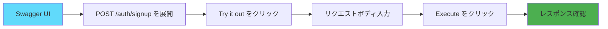

# テストガイド


---

## pytest環境

### ディレクトリ構成

```
backend/
├── test/
│   ├── __init__.py              # テストパッケージ
│   ├── conftest.py              # pytest設定・フィクスチャ
│   ├── test_api.py              # APIエンドポイントテスト
│   └── db/
│       ├── initialize.py        # DB初期化スクリプト
│       └── create_user_table.py # テーブル作成スクリプト
├── pytest.ini                   # pytest設定ファイル
└── pyproject.toml               # プロジェクト設定
```

### 依存関係

テストに必要なパッケージ（`pyproject.toml` で管理）:

```toml
dependencies = [
    "pytest>=9.0.0",           # テストフレームワーク
    "httpx>=0.28.0",           # HTTPクライアント（FastAPI TestClient用）
    "email-validator>=2.3.0",  # メールバリデーション
]
```

### pytest設定（pytest.ini）

```ini
[pytest]
testpaths = test                    # テストディレクトリ
python_files = test_*.py            # テストファイルのパターン
python_classes = Test*              # テストクラスのパターン
python_functions = test_*           # テスト関数のパターン
addopts =
    -v                              # 詳細表示
    --strict-markers                # マーカーの厳格チェック
    --tb=short                      # トレースバックを短く表示
    --disable-warnings              # 警告を無効化
markers =
    unit: Unit tests                # ユニットテスト
    integration: Integration tests  # 統合テスト
    slow: Slow running tests        # 低速なテスト
```

---

## テスト実行方法

### 基本的な実行

```bash
# 全テスト実行
docker exec finalwork-backend-1 python -m pytest test/ -v

# 特定のテストファイル実行
docker exec finalwork-backend-1 python -m pytest test/test_api.py -v

# 特定のテスト関数のみ実行
docker exec finalwork-backend-1 python -m pytest test/test_api.py::test_root_endpoint -v
```

### オプション

```bash
# 詳細表示（-v, --verbose）
pytest test/ -v

# 非常に詳細な表示（-vv）
pytest test/ -vv

# 失敗時に即座に停止（-x, --exitfirst）
pytest test/ -x

# 最初のN個の失敗で停止（--maxfail=N）
pytest test/ --maxfail=2

# カバレッジレポート付きで実行
pytest test/ --cov=app --cov-report=html

# マーカーでフィルタリング
pytest test/ -m unit          # ユニットテストのみ
pytest test/ -m integration   # 統合テストのみ
pytest test/ -m "not slow"    # 低速テストを除外
```

### 出力形式

```bash
# 短い出力
pytest test/ -q

# 成功したテストも表示
pytest test/ -v

# 失敗したテストの詳細表示
pytest test/ --tb=long

# トレースバック非表示
pytest test/ --tb=no
```

---

## 既存テストの説明

### test_api.py の構成

```python
import pytest
from fastapi.testclient import TestClient

def test_root_endpoint(client):
    """ルートエンドポイントのテスト"""
    pass

def test_health_check_endpoint(client):
    """ヘルスチェックエンドポイントのテスト"""
    pass

def test_openapi_spec(client):
    """OpenAPI仕様のテスト"""
    pass

def test_docs_available(client):
    """Swagger UIの可用性テスト"""
    pass
```

### 1. test_root_endpoint

**目的**: ルートエンドポイント (`GET /`) が正常に動作するか確認

```python
def test_root_endpoint(client):
    """Test the root endpoint"""
    response = client.get("/")
    assert response.status_code == 200
    data = response.json()
    assert "message" in data
    assert data["status"] == "running"
```

**検証項目**:
- HTTPステータスコード 200
- レスポンスに `message` フィールドが存在
- `status` フィールドが `"running"` であること

**実行例**:
```bash
$ docker exec finalwork-backend-1 python -m pytest test/test_api.py::test_root_endpoint -v

test/test_api.py::test_root_endpoint PASSED                              [100%]
```

### 2. test_health_check_endpoint

**目的**: ヘルスチェックエンドポイント (`GET /health`) が正常に動作するか確認

```python
def test_health_check_endpoint(client):
    """Test the health check endpoint"""
    response = client.get("/health")
    assert response.status_code == 200
    data = response.json()
    assert data["status"] == "healthy"
```

**検証項目**:
- HTTPステータスコード 200
- `status` フィールドが `"healthy"` であること

### 3. test_openapi_spec

**目的**: OpenAPI仕様が正しく生成されているか確認

```python
def test_openapi_spec(client):
    """Test that OpenAPI spec is available"""
    response = client.get("/openapi.json")
    assert response.status_code == 200
    spec = response.json()
    assert spec["openapi"] == "3.1.0"
    assert "title" in spec["info"]
```

**検証項目**:
- OpenAPI仕様が取得可能
- OpenAPIバージョンが 3.1.0
- タイトルが設定されている

### 4. test_docs_available

**目的**: Swagger UI が利用可能か確認

```python
def test_docs_available(client):
    """Test that Swagger UI documentation is available"""
    response = client.get("/docs")
    assert response.status_code == 200
    assert "swagger-ui" in response.text.lower()
```

**検証項目**:
- `/docs` にアクセス可能
- HTMLに `swagger-ui` が含まれている

---

## 新しいテストの追加方法

### ステップ1: テストファイル作成

```bash
# backend/test/ ディレクトリに新しいテストファイルを作成
touch backend/test/test_auth.py
```

### ステップ2: テストコード記述

```python
# backend/test/test_auth.py
import pytest
from fastapi.testclient import TestClient


def test_signup_success(client):
    """ユーザー登録が成功することを確認"""
    response = client.post(
        "/auth/signup",
        json={
            "username": "testuser",
            "email": "test@example.com",
            "password": "password123",
            "kategori": "学生",
            "gakuseki_bango": "B2024001",
            "faculty": "工学部"
        }
    )
    assert response.status_code == 201
    data = response.json()
    assert data["username"] == "testuser"
    assert data["email"] == "test@example.com"
    assert "id" in data


def test_signup_duplicate_username(client):
    """重複したユーザー名で登録が失敗することを確認"""
    # 1回目の登録
    client.post(
        "/auth/signup",
        json={
            "username": "testuser",
            "email": "test1@example.com",
            "password": "password123",
            "kategori": "学生",
        }
    )

    # 2回目の登録（同じユーザー名）
    response = client.post(
        "/auth/signup",
        json={
            "username": "testuser",
            "email": "test2@example.com",
            "password": "password123",
            "kategori": "学生",
        }
    )
    assert response.status_code == 400
    assert "already exists" in response.json()["detail"].lower()


def test_login_success(client):
    """ログインが成功することを確認"""
    # ユーザー登録
    client.post(
        "/auth/signup",
        json={
            "username": "testuser",
            "email": "test@example.com",
            "password": "password123",
            "kategori": "学生",
        }
    )

    # ログイン
    response = client.post(
        "/auth/token",
        data={
            "username": "testuser",
            "password": "password123"
        }
    )
    assert response.status_code == 200
    data = response.json()
    assert "access_token" in data
    assert data["token_type"] == "bearer"


def test_login_wrong_password(client):
    """間違ったパスワードでログインが失敗することを確認"""
    # ユーザー登録
    client.post(
        "/auth/signup",
        json={
            "username": "testuser",
            "email": "test@example.com",
            "password": "password123",
            "kategori": "学生",
        }
    )

    # ログイン（間違ったパスワード）
    response = client.post(
        "/auth/token",
        data={
            "username": "testuser",
            "password": "wrongpassword"
        }
    )
    assert response.status_code == 401
```

### ステップ3: フィクスチャの活用

**問題**: テスト間でデータが共有されてしまう

**解決策**: 各テストの前後でデータベースをリセット

```python
# backend/test/conftest.py に追加

import pytest
from sqlalchemy import create_engine
from sqlalchemy.orm import sessionmaker
from app.models import Base

@pytest.fixture(scope="function")
def db_session():
    """テスト用データベースセッション"""
    # テスト用データベースURL
    TEST_DATABASE_URL = "sqlite:///./test.db"

    engine = create_engine(TEST_DATABASE_URL)
    TestingSessionLocal = sessionmaker(bind=engine)

    # テーブル作成
    Base.metadata.create_all(bind=engine)

    session = TestingSessionLocal()

    yield session

    # テスト後にクリーンアップ
    session.close()
    Base.metadata.drop_all(bind=engine)
```

### ステップ4: テスト実行

```bash
# 新しいテストファイルを実行
docker exec finalwork-backend-1 python -m pytest test/test_auth.py -v

# 全テスト実行
docker exec finalwork-backend-1 python -m pytest test/ -v
```

---

## Swagger UIでの手動テスト

### アクセス方法

```bash
# Swagger UIを開く
open http://localhost:8000/docs

# または、ブラウザで以下にアクセス
# http://localhost:8000/docs
```

### 1. ユーザー登録テスト



**手順**:

1. Swagger UIで `POST /auth/signup` を展開
2. "Try it out" をクリック
3. リクエストボディを入力:

```json
{
  "username": "testuser",
  "email": "test@example.com",
  "password": "password123",
  "kategori": "学生",
  "gakuseki_bango": "B2024001",
  "faculty": "工学部"
}
```

4. "Execute" をクリック
5. レスポンス確認（期待: 201 Created）

### 2. ログインテスト

**手順**:

1. `POST /auth/token` を展開
2. "Try it out" をクリック
3. パラメータ入力:
   - `username`: `testuser`
   - `password`: `password123`
4. "Execute" をクリック
5. レスポンスから `access_token` をコピー

```json
{
  "access_token": "eyJhbGciOiJIUzI1NiIsInR5cCI6IkpXVCJ9...",
  "token_type": "bearer"
}
```

### 3. 認証が必要なエンドポイントのテスト

**手順**:

1. Swagger UI右上の "Authorize" ボタンをクリック
2. `access_token` を貼り付け
3. "Authorize" をクリック
4. `GET /users/me` を展開
5. "Try it out" → "Execute"
6. レスポンス確認（期待: 200 OK + ユーザー情報）

```json
{
  "id": "550e8400-e29b-41d4-a716-446655440000",
  "username": "testuser",
  "email": "test@example.com",
  "kategori": "学生",
  "gakuseki_bango": "B2024001",
  "faculty": "工学部",
  "tags": []
}
```

---

## テストのベストプラクティス

### 1. AAA パターン

テストは以下の3つのセクションに分ける：

```python
def test_example(client):
    # Arrange（準備）
    user_data = {
        "username": "testuser",
        "email": "test@example.com",
        "password": "password123",
        "kategori": "学生"
    }

    # Act（実行）
    response = client.post("/auth/signup", json=user_data)

    # Assert（検証）
    assert response.status_code == 201
    assert response.json()["username"] == "testuser"
```

### 2. テストの独立性

各テストは独立して実行可能であるべき：

```python
# 悪い例：前のテストに依存
def test_login(client):
    # test_signup が先に実行されることを期待している
    response = client.post("/auth/token", ...)

# 良い例：自己完結
def test_login(client):
    # まず自分でユーザーを作成
    client.post("/auth/signup", json=...)
    # それからログイン
    response = client.post("/auth/token", ...)
```

### 3. 意味のあるテスト名

```python
# 悪い例
def test_1(client):
    ...

# 良い例
def test_signup_with_valid_data_returns_201(client):
    ...
```

### 4. エッジケースのテスト

```python
def test_signup_with_empty_username(client):
    """空のユーザー名でエラーが返されることを確認"""
    response = client.post(
        "/auth/signup",
        json={"username": "", "email": "test@example.com", ...}
    )
    assert response.status_code == 422


def test_signup_with_invalid_email(client):
    """無効なメールアドレスでエラーが返されることを確認"""
    response = client.post(
        "/auth/signup",
        json={"username": "test", "email": "invalid-email", ...}
    )
    assert response.status_code == 422


def test_signup_with_short_password(client):
    """8文字未満のパスワードでエラーが返されることを確認"""
    response = client.post(
        "/auth/signup",
        json={"username": "test", "email": "test@example.com", "password": "short", ...}
    )
    assert response.status_code == 422
```

---

## カバレッジ測定

### pytest-cov インストール

```bash
# pyproject.toml に追加
# dependencies = [
#     ...
#     "pytest-cov>=4.0.0"
# ]

# イメージ再ビルド
docker-compose build backend
```

### カバレッジレポート生成

```bash
# カバレッジ測定
docker exec finalwork-backend-1 python -m pytest test/ --cov=app --cov-report=html

# HTMLレポート生成（backend/htmlcov/index.html）
open backend/htmlcov/index.html
```

---

**作成日**: 2025-11-09
**作成者**: worker3
**バージョン**: 1.0.0
