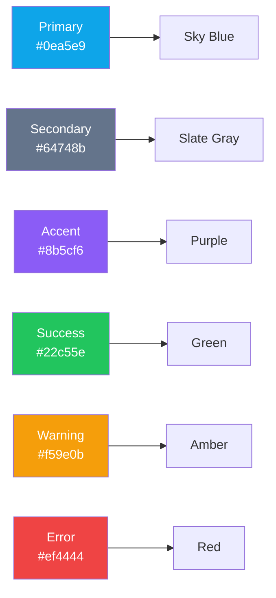

# UI/UXデザインガイド

## 概要

本ドキュメントでは、Miscatフロントエンドアプリケーションのデザインシステムについて説明します。shadcn/uiとTailwind CSSをベースとした、フォーマルで統一感のあるデザインを採用しています。


---

## デザイン原則

### 1. フォーマル＆プロフェッショナル

ビジネス用途を想定し、洗練されたフォーマルなデザインを採用。

**特徴:**
- シンプルで明確なUI
- 落ち着いたカラースキーム
- 読みやすいタイポグラフィ
- 適切な余白

### 2. ユーザビリティ優先

**原則:**
- 直感的な操作性
- 明確なフィードバック
- アクセシビリティ準拠
- 一貫性のあるインタラクション

### 3. レスポンシブファースト

**対応デバイス:**
- デスクトップ (1920px〜)
- ラップトップ (1024px〜1919px)
- タブレット (768px〜1023px)
- モバイル (〜767px)

---

## カラーパレット

### 基本カラー



### カラーコード

| 色名 | 用途 | Hex | Tailwind Class |
|------|------|-----|----------------|
| **Primary** | メインアクション | `#0ea5e9` | `bg-sky-500` |
| **Secondary** | サブアクション | `#64748b` | `bg-slate-500` |
| **Accent** | 強調 | `#8b5cf6` | `bg-purple-500` |
| **Success** | 成功メッセージ | `#22c55e` | `bg-green-500` |
| **Warning** | 警告 | `#f59e0b` | `bg-amber-500` |
| **Error** | エラー | `#ef4444` | `bg-red-500` |

### グレースケール

| 用途 | Hex | Tailwind Class |-|
|------|-----|----------------|-|
| **Black** | テキスト | `#1f2937` | `text-gray-800` |
| **Dark Gray** | サブテキスト | `#4b5563` | `text-gray-600` |
| **Medium Gray** | ボーダー | `#d1d5db` | `border-gray-300` |
| **Light Gray** | 背景 | `#f3f4f6` | `bg-gray-100` |
| **Off White** | カード背景 | `#f9fafb` | `bg-gray-50` |
| **White** | ページ背景 | `#ffffff` | `bg-white` |

### 使用例

```tsx
// Primaryカラーのボタン
<Button className="bg-sky-500 hover:bg-sky-600">
  Submit
</Button>

// Errorメッセージ
<div className="p-3 text-sm text-red-600 bg-red-50 border border-red-200 rounded-md">
  エラーメッセージ
</div>

// Successメッセージ
<div className="p-3 text-sm text-green-600 bg-green-50 border border-green-200 rounded-md">
  成功メッセージ
</div>
```

---

## タイポグラフィ

### フォントファミリー

```typescript
// tailwind.config.ts
export default {
  theme: {
    extend: {
      fontFamily: {
        sans: ['var(--font-geist-sans)', 'Inter', 'system-ui', 'sans-serif'],
        mono: ['var(--font-geist-mono)', 'Fira Code', 'monospace'],
      },
    },
  },
}
```

### 見出しスタイル

| レベル | サイズ | 用途 | Tailwind Class |
|-------|-------|------|----------------|
| H1 | 36px | ページタイトル | `text-4xl font-bold` |
| H2 | 30px | セクション見出し | `text-3xl font-bold` |
| H3 | 24px | サブセクション | `text-2xl font-semibold` |
| H4 | 20px | カード見出し | `text-xl font-semibold` |
| H5 | 18px | サブ見出し | `text-lg font-medium` |
| H6 | 16px | 小見出し | `text-base font-medium` |

### 本文スタイル

| 種類 | サイズ | 用途 | Tailwind Class |
|------|-------|------|----------------|
| Large | 18px | リード文 | `text-lg` |
| Base | 16px | 標準テキスト | `text-base` |
| Small | 14px | 補助テキスト | `text-sm` |
| XSmall | 12px | キャプション | `text-xs` |

### 使用例

```tsx
// ページタイトル
<h1 className="text-4xl font-bold text-gray-900">
  Welcome to Miscat
</h1>

// セクション見出し
<h2 className="text-3xl font-bold text-gray-800 mb-4">
  Latest Posts
</h2>

// カード見出し
<h4 className="text-xl font-semibold text-gray-900">
  Card Title
</h4>

// 本文
<p className="text-base text-gray-700 leading-relaxed">
  Lorem ipsum dolor sit amet...
</p>

// キャプション
<span className="text-xs text-gray-500">
  Posted 2 hours ago
</span>
```

---

## shadcn/ui コンポーネント

### インストール済みコンポーネント

#### 1. Button

**バリエーション:**

```tsx
import { Button } from '@/components/ui/button';

// Default
<Button variant="default">Default</Button>

// Destructive (削除など)
<Button variant="destructive">Delete</Button>

// Outline
<Button variant="outline">Cancel</Button>

// Secondary
<Button variant="secondary">Secondary</Button>

// Ghost (透明)
<Button variant="ghost">Ghost</Button>

// Link (リンク風)
<Button variant="link">Link</Button>
```

**サイズ:**
```tsx
<Button size="sm">Small</Button>
<Button size="default">Default</Button>
<Button size="lg">Large</Button>
<Button size="icon">🔍</Button>
```

**ビジュアル:**
| Variant | 背景 | テキスト | ボーダー |
|---------|------|---------|---------|
| default | Sky-500 | White | なし |
| destructive | Red-500 | White | なし |
| outline | Transparent | Gray-700 | Gray-300 |
| secondary | Gray-200 | Gray-900 | なし |
| ghost | Transparent | Gray-700 | なし |
| link | Transparent | Sky-600 | なし (下線) |

#### 2. Card

**基本構造:**
```tsx
import { Card, CardHeader, CardTitle, CardDescription, CardContent, CardFooter } from '@/components/ui/card';

<Card className="w-full max-w-md">
  <CardHeader>
    <CardTitle>Card Title</CardTitle>
    <CardDescription>Card description goes here</CardDescription>
  </CardHeader>
  <CardContent>
    <p>Main content area</p>
  </CardContent>
  <CardFooter>
    <Button>Action</Button>
  </CardFooter>
</Card>
```

**スタイル:**
- 背景: White
- ボーダー: Gray-200
- 角丸: 8px
- シャドウ: Subtle

#### 3. Input

**種類:**
```tsx
import { Input } from '@/components/ui/input';

// Text Input
<Input type="text" placeholder="Enter text" />

// Password
<Input type="password" placeholder="Password" />

// Email
<Input type="email" placeholder="email@example.com" />

// Number
<Input type="number" min="0" max="100" />

// Disabled
<Input disabled placeholder="Disabled" />

// Error state
<Input className="border-red-500" placeholder="Error" />
```

**フォームグループ:**
```tsx
<div className="space-y-2">
  <label htmlFor="username" className="text-sm font-medium">
    Username
  </label>
  <Input
    id="username"
    type="text"
    placeholder="Enter username"
  />
  <p className="text-xs text-gray-500">
    Your unique username
  </p>
</div>
```

#### 4. Select

**基本:**
```tsx
import { Select, SelectContent, SelectItem, SelectTrigger, SelectValue } from '@/components/ui/select';

<Select>
  <SelectTrigger className="w-[180px]">
    <SelectValue placeholder="Select option" />
  </SelectTrigger>
  <SelectContent>
    <SelectItem value="option1">Option 1</SelectItem>
    <SelectItem value="option2">Option 2</SelectItem>
    <SelectItem value="option3">Option 3</SelectItem>
  </SelectContent>
</Select>
```

#### 5. Dialog

**モーダル:**
```tsx
import { Dialog, DialogContent, DialogDescription, DialogHeader, DialogTitle, DialogTrigger } from '@/components/ui/dialog';

<Dialog>
  <DialogTrigger asChild>
    <Button>Open Dialog</Button>
  </DialogTrigger>
  <DialogContent>
    <DialogHeader>
      <DialogTitle>Dialog Title</DialogTitle>
      <DialogDescription>
        Dialog description goes here
      </DialogDescription>
    </DialogHeader>
    <div className="py-4">
      {/* Dialog content */}
    </div>
  </DialogContent>
</Dialog>
```

---

## レイアウト規則

### スペーシングシステム

Tailwind CSSの標準スペーシング（4pxベース）を使用。

| サイズ | px | 用途 | Class |
|-------|-----|------|-------|
| xs | 4px | 最小余白 | `space-1` |
| sm | 8px | 小余白 | `space-2` |
| md | 16px | 標準余白 | `space-4` |
| lg | 24px | 大余白 | `space-6` |
| xl | 32px | セクション間 | `space-8` |
| 2xl | 48px | ページセクション | `space-12` |

### グリッドシステム

```tsx
// 2カラムレイアウト
<div className="grid grid-cols-1 md:grid-cols-2 gap-6">
  <div>Column 1</div>
  <div>Column 2</div>
</div>

// 3カラムレイアウト
<div className="grid grid-cols-1 md:grid-cols-2 lg:grid-cols-3 gap-4">
  <div>Column 1</div>
  <div>Column 2</div>
  <div>Column 3</div>
</div>

// 12カラムグリッド
<div className="grid grid-cols-12 gap-4">
  <div className="col-span-8">Main Content</div>
  <div className="col-span-4">Sidebar</div>
</div>
```

### コンテナ

```tsx
// Full width with max-width
<div className="container mx-auto px-4">
  Content
</div>

// Centered with fixed max-width
<div className="max-w-7xl mx-auto px-4">
  Content
</div>

// Smaller container
<div className="max-w-4xl mx-auto px-4">
  Content
</div>
```

### ページレイアウト例

```tsx
// 標準ページレイアウト
export default function Page() {
  return (
    <div className="min-h-screen bg-gray-50">
      {/* Header */}
      <header className="bg-white border-b border-gray-200">
        <div className="max-w-7xl mx-auto px-4 py-4">
          <h1 className="text-2xl font-bold">Miscat</h1>
        </div>
      </header>

      {/* Main Content */}
      <main className="max-w-7xl mx-auto px-4 py-8">
        <div className="grid grid-cols-1 lg:grid-cols-3 gap-6">
          {/* Sidebar */}
          <aside className="lg:col-span-1">
            <Card>
              <CardContent className="p-4">
                Sidebar
              </CardContent>
            </Card>
          </aside>

          {/* Content */}
          <section className="lg:col-span-2">
            <Card>
              <CardContent className="p-6">
                Main Content
              </CardContent>
            </Card>
          </section>
        </div>
      </main>

      {/* Footer */}
      <footer className="bg-white border-t border-gray-200 mt-12">
        <div className="max-w-7xl mx-auto px-4 py-6">
          <p className="text-sm text-gray-600">© 2025 Miscat</p>
        </footer>
      </footer>
    </div>
  );
}
```

---

## レスポンシブデザイン

### ブレークポイント

| サイズ | 最小幅 | Tailwind Prefix | 用途 |
|-------|--------|-----------------|------|
| Mobile | 0px | (なし) | スマートフォン |
| Tablet | 768px | `md:` | タブレット |
| Laptop | 1024px | `lg:` | ラップトップ |
| Desktop | 1280px | `xl:` | デスクトップ |
| Wide | 1536px | `2xl:` | ワイドディスプレイ |

### レスポンシブパターン

**1. スタッキング → サイドバイサイド**
```tsx
<div className="flex flex-col md:flex-row gap-4">
  <div className="md:w-1/2">Left</div>
  <div className="md:w-1/2">Right</div>
</div>
```

**2. グリッドカラム数の変更**
```tsx
<div className="grid grid-cols-1 sm:grid-cols-2 lg:grid-cols-4 gap-4">
  {items.map(item => (
    <Card key={item.id}>{item.content}</Card>
  ))}
</div>
```

**3. テキストサイズの調整**
```tsx
<h1 className="text-2xl md:text-4xl lg:text-5xl font-bold">
  Responsive Heading
</h1>
```

**4. パディングの調整**
```tsx
<div className="px-4 md:px-6 lg:px-8 py-4 md:py-8">
  Content with responsive padding
</div>
```

**5. 表示/非表示の切り替え**
```tsx
{/* モバイルのみ表示 */}
<div className="block md:hidden">
  Mobile Menu
</div>

{/* デスクトップのみ表示 */}
<div className="hidden md:block">
  Desktop Menu
</div>
```

### モバイルファーストアプローチ

**原則:** デフォルトはモバイル向けスタイル、大画面向けにメディアクエリを追加

```tsx
// Good: モバイルファースト
<div className="w-full md:w-1/2 lg:w-1/3">
  Content
</div>

// Bad: デスクトップファースト
<div className="w-1/3 lg:w-1/2 md:w-full">
  Content
</div>
```

---

## アクセシビリティ

### ARIA属性

```tsx
// ボタン
<button aria-label="Close dialog">
  ✕
</button>

// 入力フィールド
<input
  type="text"
  aria-label="Search"
  aria-describedby="search-hint"
/>
<p id="search-hint" className="text-sm text-gray-500">
  Enter keywords to search
</p>

// ローディング状態
<div role="status" aria-live="polite">
  {isLoading ? 'Loading...' : 'Content loaded'}
</div>
```

### キーボードナビゲーション

- Tab: フォーカス移動
- Enter/Space: ボタン・リンクの実行
- Esc: ダイアログ閉じる

### カラーコントラスト

WCAG AA準拠（コントラスト比 4.5:1以上）

---

## まとめ

Miscatのデザインシステムは、shadcn/uiとTailwind CSSをベースとした、フォーマルで統一感のあるUIを提供します。

**主要なポイント:**
- フォーマルなカラーパレット
- 明確なタイポグラフィ階層
- 再利用可能なshadcn/uiコンポーネント
- モバイルファーストのレスポンシブデザイン
- アクセシビリティ準拠