# ユーザー操作フロー図

## 概要

本ドキュメントでは、Miscatフロントエンドアプリケーションにおけるユーザー操作フローを説明します。主要な画面遷移、認証フロー、およびユーザーストーリーをMermaid記法で視覚化しています。


---

## 認証フロー

### 1. 基本認証フロー

未認証ユーザーがログインして認証済みになるまでの流れです。

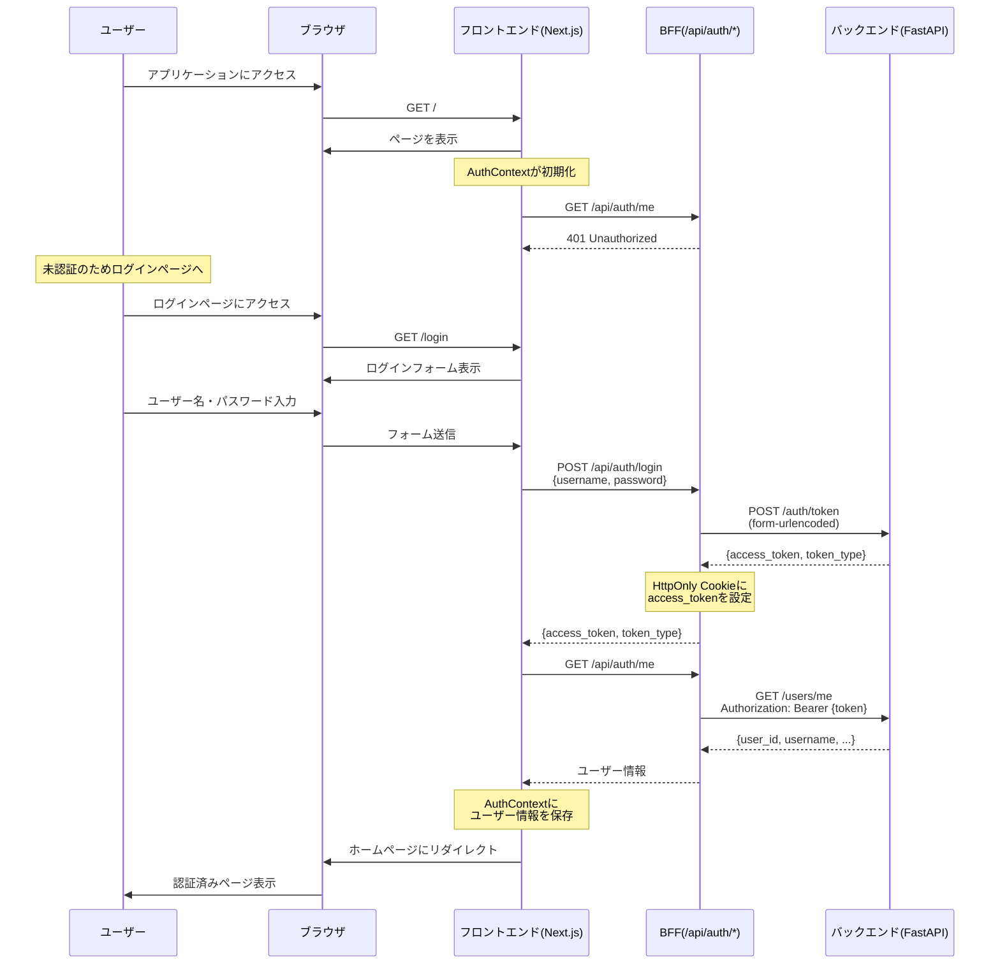

### 2. 認証状態の確認フロー

アプリケーション起動時やページリロード時の認証確認です。

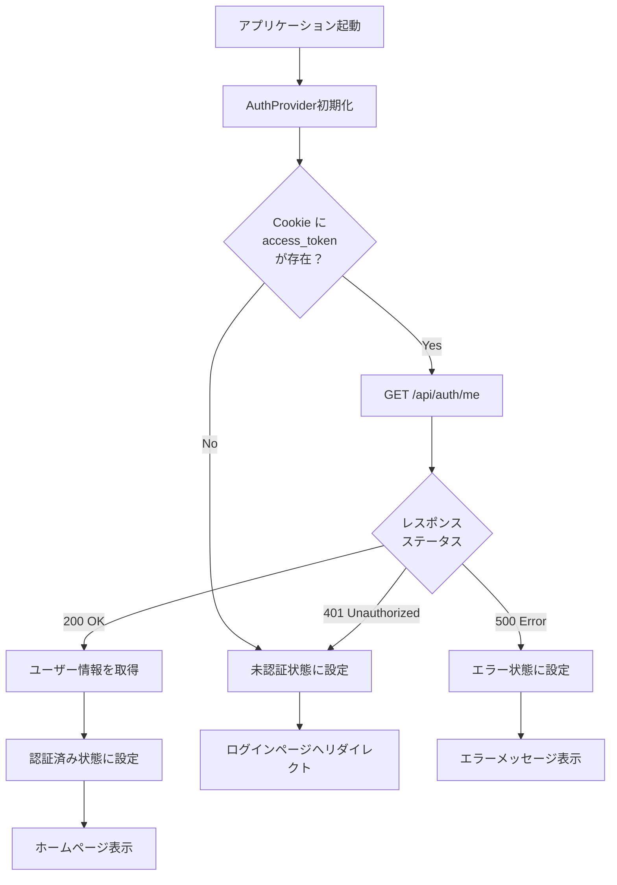

### 3. ログアウトフロー

認証済みユーザーがログアウトする流れです。

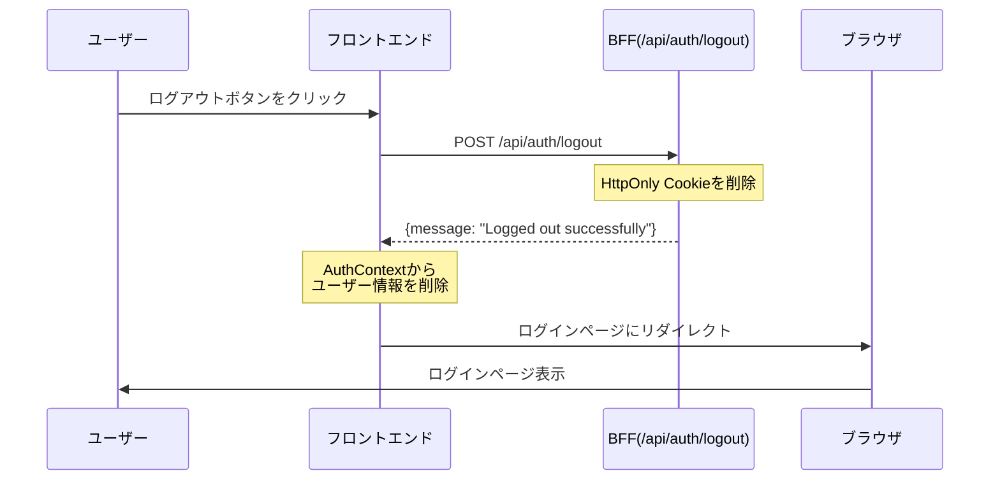

---

## 画面遷移図

### 全体画面遷移

```mermaid
graph LR
    A[/ ルートページ] --> B{認証済み？}
    B -->|No| C[/login ログインページ]
    B -->|Yes| D[/ ホームページ<br/>認証済み]

    C --> E[ログインフォーム入力]
    E --> F{認証成功？}

    F -->|Yes| D
    F -->|No| G[エラーメッセージ表示]
    G --> C

    D --> H[メイン機能]
    D --> I[ログアウト]

    I --> C

    style C fill:#e1f5ff
    style D fill:#d4edda
    style G fill:#f8d7da
```

### 認証前後の画面状態

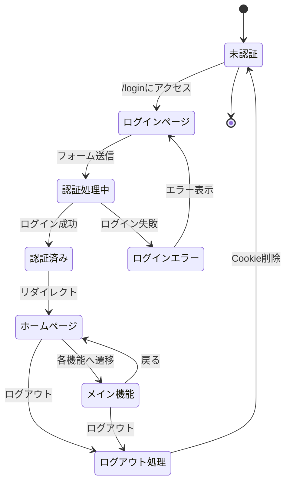

---

## 主要なユーザーストーリー

### Story 1: 初回ログイン

**ユーザー:** 新規ユーザー
**目的:** アプリケーションにログインする

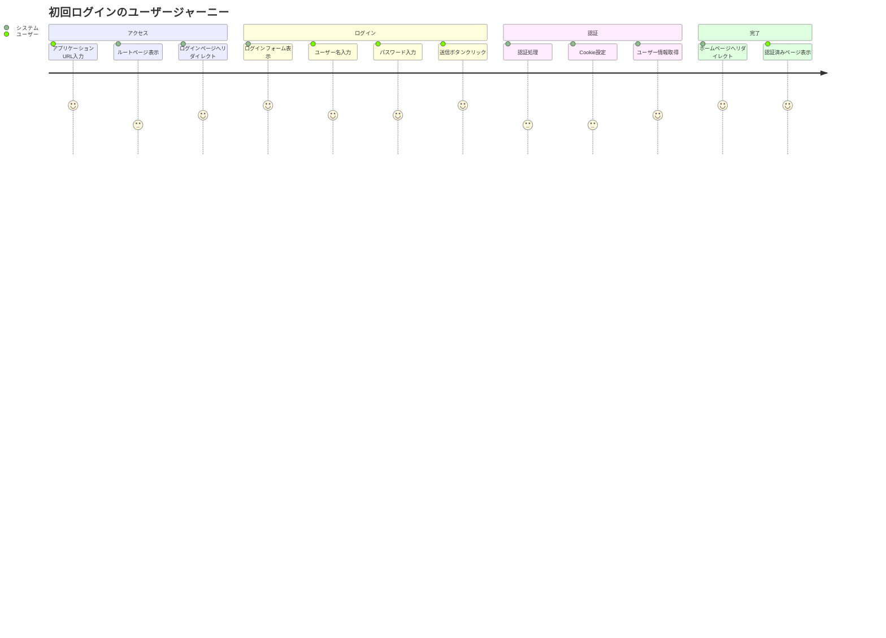

**ステップ詳細:**

1. ユーザーがアプリケーションにアクセス (`http://localhost:3000`)
2. AuthContextがユーザー情報取得を試みる → 未認証
3. ログインページ (`/login`) にリダイレクト
4. ユーザー名とパスワードを入力
5. 「ログイン」ボタンをクリック
6. BFFがバックエンドに認証リクエスト
7. 認証成功 → HttpOnly Cookieにトークン保存
8. ユーザー情報を取得してAuthContextに保存
9. ホームページ (`/`) にリダイレクト
10. 認証済みコンテンツを表示

### Story 2: ログインエラー処理

**ユーザー:** 既存ユーザー
**シナリオ:** パスワードを間違えた場合

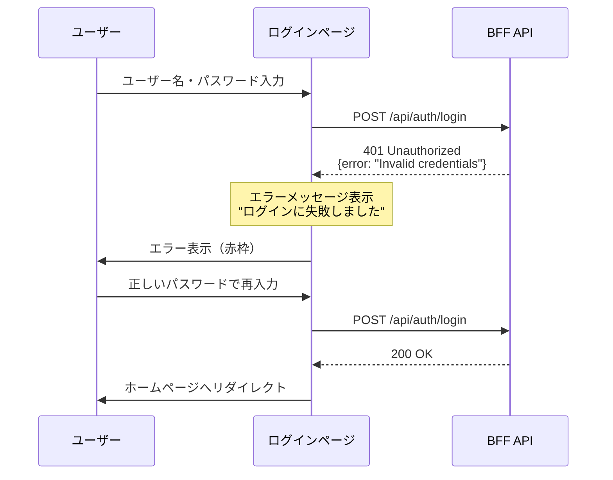

### Story 3: セッション復元

**ユーザー:** 既存ユーザー
**シナリオ:** ブラウザをリロードした場合

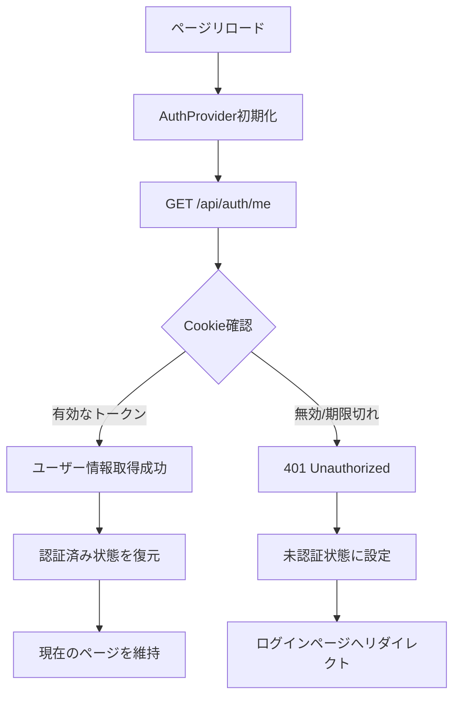

---

## エラーハンドリングフロー

### 1. ログイン時のエラーハンドリング

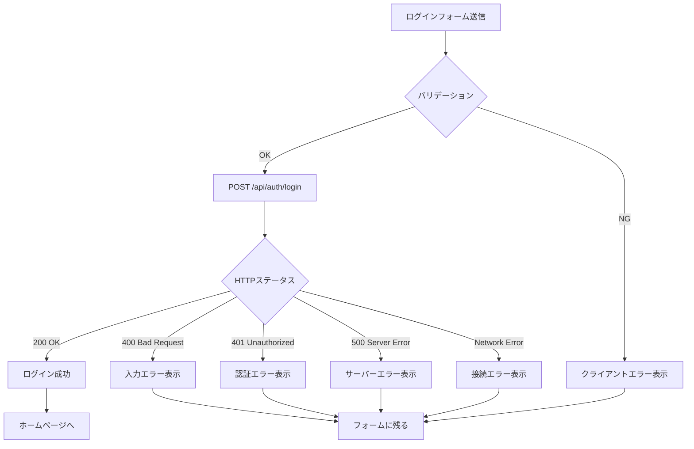

**エラーメッセージ例:**

| エラー種別 | メッセージ | 対応 |
|-----------|----------|------|
| バリデーションエラー | "ユーザー名とパスワードを入力してください" | フォーム入力を促す |
| 認証エラー | "ログインに失敗しました" | 再入力を促す |
| サーバーエラー | "サーバーエラーが発生しました" | 時間をおいて再試行 |
| ネットワークエラー | "接続に失敗しました" | 接続状態を確認 |

### 2. 認証状態確認時のエラーハンドリング

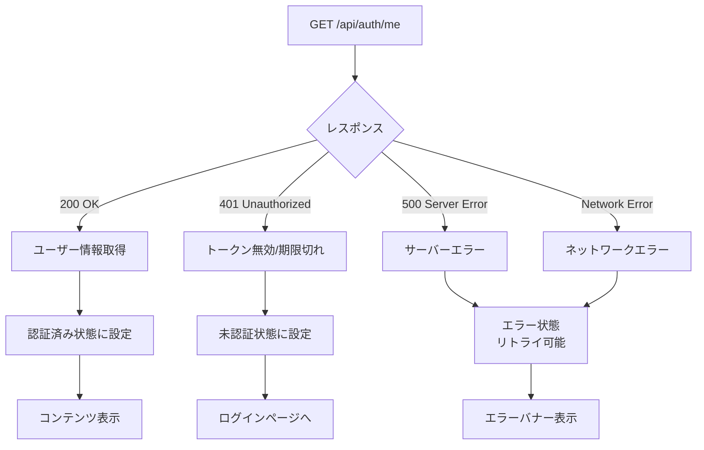

---

## API呼び出しフロー詳細

### POST /api/auth/login

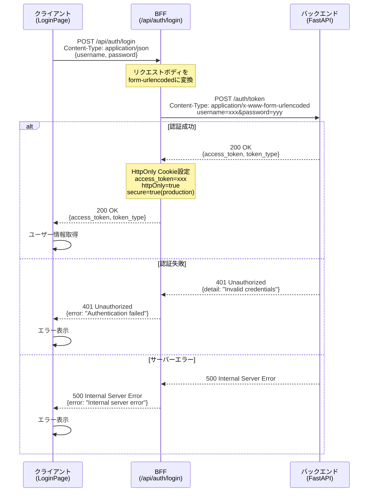

### GET /api/auth/me

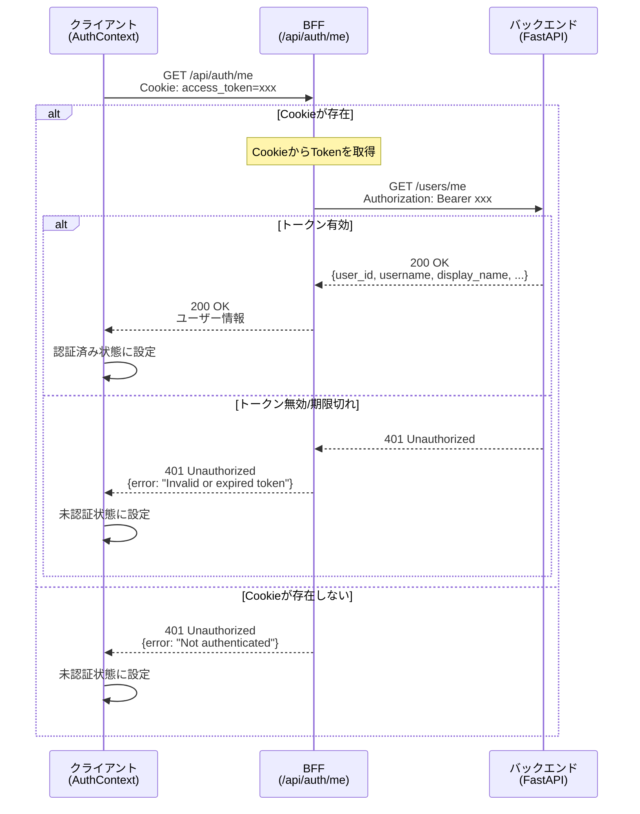

---

## まとめ

本ドキュメントでは、Miscatフロントエンドアプリケーションの主要なユーザー操作フローを視覚化しました。

**主要なポイント:**

1. **認証フロー**: HttpOnly Cookieベースのセキュアな認証
2. **画面遷移**: シンプルで直感的な遷移設計
3. **エラーハンドリング**: ユーザーフレンドリーなエラー表示
4. **セッション管理**: ページリロード時の自動セッション復元

次のドキュメント:
- [フロントエンド関数リファレンス](./functions/frontend.md)
- [フロントエンドアーキテクチャ](./frontend-architecture.md)
